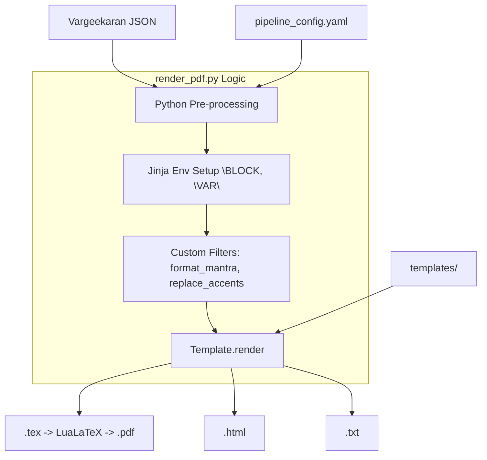

# Jaimineeya Samavedam Digitalization Project - Developer Guide

This guide provides a comprehensive overview of the Jaimineeya Samavedam digitalization project, focusing on the workflows for data correction, website generation, and PDF document creation.

## 1. Project Overview

The goal of this project is to digitize the Jaimineeya Samavedam Samhita, providing:
1.  A **Modern Website** for easy browsing and listening.
2.  **Print-ready PDF** documents (LaTeX-based) for physical publication.
3.  **Specialized Views** like the *Rik* or *Samam* of Samhita for traditional chanting verification.

The system is built on a custom text-to-JSON parsing engine that handles the specific structural requirements of the Samaveda (Parva > Kandah > Arsheyam > Samam) and supports a robust **Correction Cycle** for iterative data improvement.

*   **Parva**: Top-level super-section.
*   **Kandah**: Section level.
*   **Arsheyam**: The titular grouping (Subsection header), which can contain one or more Samams.
*   **Samam**: The actual mantra unit containing text with swara markings.
*   **Rik**: Individual verses associated with an Arsheyam/Samam (extracted and classified individually).

## 2. Architecture & Core Components

The system is modular, with distinct scripts handling data parsing, rendering, and export.

### 2.1 `src/generate_json.py`
**Role**: The central parser and "Source of Truth". It converts raw text files (with custom markup) into a structured JSON database.
*   **`RikMetadataParser` (Class)**: Responsible for parsing the auxiliary metadata file (`rishi_devata_chandas_for_rik.txt`). It handles complex logic for mapping Rishi/Devata/Chandas to Rik IDs, including range-based assignments `(1-10)` and specific overrides.
*   **`convert_corrections_to_json`**: The main driver function for the "Correction Mode". It reads the processed Unicode text file, extracts hierarchy (SuperSection > Section), and embeds metadata.
*   **Robust Parsing Logic**: The parser now uses a space-tolerant, multi-line regex system for markers (e.g., `# Start of SuperSection Title -- ID ## DO NOT EDIT`). It correctly handles markers regardless of whether there are zero, one, or many spaces before the `##` marker, making it robust against manual editing variations.
*   **`parse_unicode_text_file`**: Handles the reading of the main input file, ensuring encoding safety and stripping invisible characters.
*   **Closing Mantras Support**: Automatically extracts and centers prayer blocks enclosed in `# Closing Mantras` tags.
*   **Strict Inheritance (Rule 3)**: Implements logic to break metadata inheritance whenever new Rik text appears. If a subsection contains Rik text but no metadata tags, it will NOT inherit from the previous subsection, ensuring data integrity across distinct verses.

### 2.2 `src/generate_website.py`
**Role**: Generates the static HTML website for GitHub Pages.
*   **`JSVParser` (Class)**: A robust parser that reads the JSON output and populates python objects (`Parva`, `Kandah`, `Arsheyam`). It abstracts the JSON structure into a workable Object Model.
    *   **Deterministic Numbering**: Includes `_post_process_numbering()` which recalculates the sequential `sama_number` for every mantra in a Kandah. This ensures that P.K.S references (e.g., `1.3.5`) always point to the correct mantra in the sequence, regardless of how mantras are grouped into blocks.
*   **`WebsiteGenerator` (Class)**: Takes the `JSVParser` objects and orchestrates the HTML creation. It handles:
    *   Template rendering (Jinja2).
    *   Navigation generation (Left Sidebar).
    *   Audio filename mapping.
    *   Applying `SITE_CONFIG` settings based on the selected mode (`samhita` or `aranam`).
    *   **Enhanced Indices**: Generates advanced classification pages (Rishi, Devata, Chandas) with a 3-column "Top 20" prominent card section and a single-column, horizontal-flowing alphabetical index (**वर्णानुक्रमण**) designed for maximum density and readability. Includes aggregate unique Rik counting (currently ~587 Riks).
*   **Prayoga Markdown Integration**: Automatically detects and loads `markdown` files configured in `prayoga_index.yaml` to dynamically build standalone procedural webpage layouts accessible through modal popup links embedded next to the respective Vedic verse headings.
*   **`_generate_css`**: Generates a centralized CSS stylesheet for the website.
    *   **Font-Aware Accent Rendering**: Implements the same vertical offset logic as the PDF pipeline. Accents (**Swarita**, **Kampa**, **Trikampa**, **Anudatta**) are positioned relative to the base character with specific offsets that adjust based on the selected `--font` (e.g., higher offsets for Noto Sans).
    *   **CSS Interpolation**: Uses a `.replace()` based interpolation strategy for the huge CSS template to inject user-defined variables (`{self.font}`, `{sw_off}`, etc.) without requiring complex double-bracing for native CSS brackets.
*   **format_rik_text_html**: Handles the specific HTML formatting for Rik text, including accent rendering (`<span>` classes) and footnote linking.

### 2.3 `src/render_pdf.py`
**Role**: Converts JSON data into high-quality LaTeX (for PDFs) and HTML documents.
*   **`CreatePdf` / `CreateHtmlFile`**: Main orchestration functions for PDF and HTML generation.
*   **`format_dandas_html`**: Handles the formatting of mantra and metadata text for HTML. Now supports a `preserve_spaces` flag to maintain manual whitespace alignment in Rishi/Devata metadata blocks.
*   **`process_footnotes_latex`**: A specialized processor that converts `(sN)` text markers into true LaTeX footnotes (`\footnote{...}`), resolving them against the metadata dictionary.
*   **`replace_accents`**: The core rendering engine for Vedic Accents. It maps ASCII markers `(1)` to zero-width, raised LaTeX glyphs. 
    *   **AdishilaVedic**: Uses `\raisebox` + `\accentmark` (now raised to `0.6ex` for Swarita).
    *   **Noto Sans Devanagari**: Implements an NBSP (\char"00A0) base inside a zero-width `\makebox` to suppress the "dotted circle" placeholder while allowing precise `\raisebox` control (`0.7ex` for Swarita, `-0.1ex` for Anudatta).
*   **Custom Output Pathing**: Supports a `--output` / `-o` flag to override default filenames and directories. Implements suffix preservation (e.g., `_Rik`, `_Samam`) for separate rendering modes.
*   **Terminal Encoding Fix**: Forces UTF-8 console output to correctly display Sanskrit document titles during processing on Windows.
*   **Prayoga Appendix Generation**: Recursively intercepts YAML configuration arrays pointing to nested markdown text, compiles them efficiently into internal `PhantomSection` structural LaTeX logic without massive external package reliance, and aggregates all referenced manuals inside an overarching `\chapter*{... Appendix ...}` tail. It then intelligently appends `hyperref` click anchors inside dynamic footnotes directly onto the respective Samams.
*   **`TOC Configuration`**: Supports a configurable Table of Contents level (`section`, `subsection`, or `both`) for both PDF (using `\addcontentsline`) and HTML (using conditional template rendering).
*   **`remove_mantra_spaces`**: Implements the *scriptio continua* logic (removing space between words) while preserving formatting lines.
*   **`split_rik_lines_text`**: A specialized filter for Unicode text export that ensures multi-verse Rik mantras are separated by newlines. It uses regex to detect verse markers (`॥ N ॥`) and inserts a `\n` to maintain a clean, readable layout in plain text.

### 2.4 `src/generate_Rik_for_samhita.py`
**Role**: A specialized reporting tool that generates the "Rik Samhita" (Continuous Text) view.
*   **`generate_and_compile_latex`**: Generates a standalone PDF focused purely on Recitation Text, bypassing the complex layout of the main book.
*   **`step_preprocess_visarga_accent`**: A critical utility (shared logic) that handles the visual swapping of Visarga and Accents (`Wordः(1)` $\rightarrow$ `Word(1)ः`) to ensure correct rendering.

### 2.5 `src/generate_granular_table.py`
**Role**: The "Exporter" for the Correction Cycle.
*   **`parse_metadata_str`**: A smart parser that breaks down raw metadata strings (e.g., "Rishi... Devata... Chandas") into structured fields.
*   **`normalize_key`**: logic to clean up inconsistencies in Rishi/Devata names (whitespace, punctuation) to ensure better grouping in the CSV export.

### 2.6 `src/generate_rik_table.py`
**Role**: The "Bridge Builder" that integrates external classification (Rishi, Devata, Chandas) into the Samhita.
*   **Unique Rik Extraction**: Iterates through the hierarchical JSON and extracts unique Riks, splitting multi-verse Arsheyams into individual rows using positional markers (e.g., `॥ ९ ॥`).
*   **Classification Integration**: Loads mapping data from the **Reconciliation Excel** (`Rik Reconciliation table (JSV-KSV).xlsx`). It maps each unique verse to its <Rishi, Devata, Chandas> tuple using the `Global_Rik_Num`.
*   **Accent Normalization**: Converts ASCII markers (e.g., `(1)`) into literal Unicode Swaras (e.g., `U+0951`) for clean CSV representation.
*   **Sequential Mapping Logic**: Uses an `excel_pointer` to synchronize JSON occurrences with the master Reconciliation Excel. To maintain a strict 1:1 mapping with a unique-Rik Excel sheet, the pointer only increments for **new unique Riks** (determined by ID, Text, and Section) and each null placeholder.
*   **Premium Excel Export**: Generates `.xlsx` files using `pandas` and `openpyxl` with:
    *   **Adishila Font**: All cells (including metadata and text) use the project's signature Adishila font.
    *   **Metadata Sheet**: A dedicated sheet documenting Project, Version, Filename, and Generation Timestamp.
    *   **Auto-Formatting**: Bold headers and intelligent column width adjustment.
*   **Structure Injection**: Dynamically injects a `rik_classifications` list into each Arsheyam (Subsection) in the JSON. This list identifies the Riks associated with that Arsheyam and their respective classifications.
*   **Output**:
    *   `JSV_Rik_Table.csv`: A flattened, deduplicated verse-level table.
    *   `Vargeekaran.json`: The **Enhanced Source of Truth** used by the website generator for classification-based navigation.

### 2.7 `src/generate_missing_metadata_report.py`
**Role**: Data quality validation tool that identifies missing metadata.
*   Checks for Riks without metadata or metadata without associated Rik text.
*   Checks for Samams without metadata.
*   Supports configurable modes (`rik`, `samam`, `combined`) via CLI arguments.
*   Output: `data/output/JSV_Missing_Metadata_Report.md` and `.csv`.

### 2.8 Collection Utilities (`src/curate_jsv.py`, `src/tools/build_collection.py`)
**Role**: Utilities to create curated selections (सूक्तमाला) from existing Samhita or Aaranam datasets.
*   **`curate_jsv.py`**: Merges data from multiple JSON sources based on a text filter containing Parva.Kandah.Samam (P.K.S) identifiers.
*   **`build_collection.py`**: Extracts specific Samams using P.K.S identifiers from a single source JSON and bundles them into a structured Collection format.

---

## 3. Workflows (Main Use Cases)

### 3.1 Workflow A: Core Data Pipeline (Initial & Corrections)

This workflow covers the full lifecycle of the Samhita data: from importing new Unicode text for the first time to iteratively refining it and its metadata.

#### Phase 1: Initial Import (New Text)

Use this mode when you have a fresh text file (containing `SuperSection` / `Section` markers) and want to generate the baseline JSON. This mode combines your main text with the auxiliary data files.

**Prerequisites**:
*   Main input text file (e.g., `data/input/Agneyam-Pavamanam_corrected.txt`)
*   Auxiliary files present in `data/input/`:
    *   `vedic_text.txt` (Rik text source)
    *   `rishi_devata_chandas_for_rik.txt` (Rik metadata)
    *   `sama_rishi_chandas_out.txt` (Samam metadata)

**Command**:
```bash
# 1. Generate JSON (Baseline)
python src/generate_json.py "data/input/Agneyam-Pavamanam_corrected.txt" --input-mode initial

# 2. Generate Master Correction File (Unicode Text)
python src/render_pdf.py data/output/Agneyam-Pavamanam_corrected_out.json
```
*Outputs*: 
*   **JSON**: `data/output/Agneyam-Pavamanam_corrected_out.json`
*   **Correction File**: `data/output/txt/Devanagari/Samhita_Devanagari_Unicode.txt`
*   **LaTeX Source**: `data/output/pdf/Devanagari/Samhita_Devanagari.tex`

> **Next Step**: Move the generated `..._Unicode.txt` file to your `data/input/` folder (e.g., rename to `Agneyam-Pavamanam_corrected.txt`) to use it as the source for Phase 2.

#### Phase 2: The Correction Cycle (Iterative Updates)

The generated Unicode text from Phase 1 is taken up for further corrections by Vedic scholars. This is the daily maintenance workflow. It allows one to fix Rik/Samam text errors or metadata (Rishi, Devata, Chandas) by editing the text file or Excel/csv files and then feed those changes back into the system.

**Prerequisite**: You have the updated Unicode Text File in `data/input/`.

**Steps:**

**Option A: Direct Correction (Text & Metadata) - *Primary Workflow***
1.  **Edit the Text File**:
    *   Open `data/input/Agneyam-Pavamanam_corrected.txt` (or your renamed correction file) in an editor of your choice.
    *   Fix mantra text errors, Rik headers, or metadata (lines starting with `(s1)...`).
    *   The text file should be in UTF-8 encoded text format.   
2.  **Regenerate JSON**:
    ```bash
    python src/generate_json.py "data/input/Agneyam-Pavamanam_corrected.txt" --input-mode correction
    ```

**Option B: Bulk Metadata Correction (Excel / CSV) - *Additional Workflow***
1.  **Generate Editable Table**:
    ```bash
    python src/generate_granular_table.py
    ```
    *Output*: `data/output/JSV_Samam_Granular_Table.xlsx` and `data/output/JSV_Samam_Granular_Table.csv`
2.  **Edit Table**: Update `Rik_Rishi`, `Samam_Devata`, etc. in the `.xlsx` or `.csv` file.
3.  **Regenerate JSON (with Metadata overlay)**:
    ```bash
    # Using Excel
    python src/generate_json.py "data/input/Agneyam-Pavamanam_corrected.txt" --input-mode correction --metadata-file "data/output/JSV_Samam_Granular_Table.xlsx"
    
    # Or using CSV
    python src/generate_json.py "data/input/Agneyam-Pavamanam_corrected.txt" --input-mode correction --metadata-file "data/output/JSV_Samam_Granular_Table.csv"
    ```

**Final Step (Common): Regenerate Artifacts**
Update the Website, PDF, HTML, and Text outputs to reflect the changes.

1. **Integrate Classifications** (Required for Website):
   This step maps the Riks to their Rishi, Devata, and Chandas from the Excel sheet and generates the `Vargeekaran.json`.
   ```bash
   python src/generate_rik_table.py data/output/Agneyam-Pavamanam_corrected_out.json
   ```

2. **Regenerate Site & Book**:
   ```bash
   # Website (uses the Vargeekaran JSON generated above)
   python src/generate_website.py --source-file data/output/Vargeekaran.json
   
   # PDF, HTML, and Unicode Text
   python src/render_pdf.py data/output/Agneyam-Pavamanam_corrected_out.json
   ```
*   *PDF Source*: `data/output/pdf/Devanagari/Samhita_Devanagari.tex`
*   *HTML Output*: `data/output/html/Devanagari/Samhita_Devanagari.html`
*   *Text Output*: `data/output/txt/Devanagari/Samhita_Devanagari_Unicode.txt`

### 3.2 Workflow B: Website Generation & Publishing

This workflow generates the static HTML site for `jaimineeyasamavedam.org`.

#### Site Architecture

The website uses a **common landing page** (`docs/index.html`) that links to two independent sub-sites:

```
docs/
├── index.html              ← Common landing page (gateway)
├── samhita/                ← Samhita sub-site
│   ├── index.html
│   ├── css/, js/, kandah/
│   ├── classification/
│   └── metadata.json
└── aranam/                 ← Aaranam (Aranya Ganam) sub-site
    ├── index.html
    ├── css/, js/, kandah/
    ├── classification/
    └── metadata.json
```

The landing page is a static HTML file maintained manually. Each sub-site is generated independently using `generate_website.py` with the appropriate mode flag.

#### Steps

1.  **Generate Samhita Website**:
    ```bash
    python src/generate_website.py --source-file data/output/Agneyam-Pavamanam_latest_out.json -o docs/samhita
    ```

2.  **Generate Aaranam Website**:
    ```bash
    python src/generate_website.py --source-file data/output/Aaranam_latest_out.json -o docs/aranam -a
    ```

3.  **Preview Locally**:
    ```bash
    python -m http.server 8080 --directory docs
    ```
    Visit `http://localhost:8080` — the landing page will link to both sub-sites.

4.  **Publish (Deploy)**:
    Commit and push the `docs/` folder to the `format-mantras` branch. GitHub Pages will automatically deploy it.
    ```bash
    git add docs/
    git commit -m "Update website content"
    git push origin format-mantras
    ```

### 3.3 Workflow C: PDF Book Generation

This workflow creates the high-quality PDF for the physical book.

1.  **Generate LaTeX Source**:
    ```bash
    # For Samhita (default bw)
    python src/render_pdf.py data/output/Agneyam-Pavamanam_latest_out.json --output-mode combined
    
    # For Aaranam (color printout)
    python src/render_pdf.py data/output/Aaranam_latest_out.json --output-mode combined --type aaranam --pdf-color-mode color
    ```
    *Output*: `data/output/pdf/Devanagari/Samhita_Devanagari.tex` or `data/output/pdf/Devanagari/Aaranam_Devanagari.tex` (and associated HTML/text files). 
    *Note*: Use `--pdf-color-mode color` to enable colored metadata and Swara marks, or let it default to `bw` (black/white) for book typesetting.

2.  **Compile PDF**:
    Use LuaLaTeX (required for HarfBuzz font rendering). Run from the project root.
    ```bash
    # For Samhita
    lualatex data/output/pdf/Devanagari/Samhita_Devanagari.tex
    
    # For Aaranam
    lualatex data/output/pdf/Devanagari/Aaranam_Devanagari.tex
    ```

### 3.4 Workflow D: Rik Samhita Generation

This extracts the "Rik" (verses) in a continuous format (*scriptio continua*) for recitation verification.

1.  **Generate**:
    ```bash
    # Generates both PDF and HTML
    python src/generate_Rik_for_samhita.py -i data/input/vedic_text.txt
    ```

### 3.5 Workflow E: Collection Generation (Sooktam / Sūkta Māla)

This workflow handles publishing a **curated collection** of samams from a Unicode Devanagari text input. Unlike the Samhita/Aaranam workflows, a collection is a standalone selection of mantras with its own sequential numbering.

#### Input Format

The input file (e.g., `data/input/Sooktam.txt`) uses the same markup conventions:
*   `# SuperSection Title` / `# End of SuperSection Title` — Top-level grouping
*   `# Section Title` / `# End of Section Title` — Khanda-level grouping (e.g., Sūktam names)
*   `# SubSection Title` / `# End of SubSection Title` — Samam headers (Atha/Iti)
*   `# Start of Mantra Sets` / `# End of Mantra Sets` — Mantra content
*   `# Closing Mantras` / `# End of Closing Mantras` — Optional closing prayers (centered in output)

#### Closing Mantras

A special section at the end of the input file enclosed in `# Closing Mantras` / `# End of Closing Mantras` markers. Each line becomes a centered mantra in the output:
*   **HTML**: Rendered in a centered block with a "Muted Slate" theme (`#f8fafc` background, `#475569` text) and no horizontal separators.
*   **PDF**: Rendered contiguously on the last content page in bold centered text (no separate page)
*   **Text**: Preserved with round-trip markers for re-editing

#### Steps

1.  **Parse Input to JSON**:
    ```bash
    python src/generate_json.py data/input/Sooktam.txt --input-mode initial --output data/output/Sooktam_out.json
    ```

2.  **Generate Outputs** (HTML, LaTeX, Text):
    ```bash
    python src/render_pdf.py data/output/Sooktam_out.json --type collection --pdf-color-mode color
    ```

3.  **Compile PDF** (optional):
    ```bash
    lualatex data/output/pdf/Devanagari/Collection_Devanagari.tex
    ```

*Outputs*:
*   **HTML**: `data/output/html/Devanagari/Collection_Devanagari.html`
*   **LaTeX**: `data/output/pdf/Devanagari/Collection_Devanagari.tex`
*   **Text**: `data/output/txt/Devanagari/Collection_Devanagari_Unicode.txt`

#### Utility Scripts

*   **`src/tools/renumber_sooktam.py`**: A vital utility for managing IDs and sequential numbering in JSV files.
    *   **Robust Renumbering**: Sequentially updates all IDs (`supersection_N`, `section_N`, `subsection_N`) and mantra numbers (`॥N॥`) based on header anchors (`# Start of ... Title`).
    *   **Custom Offsets**: Supports starting numbers for SuperSection, Section, and Subsection via CLI arguments.
    *   **Type-Aware Config**: Automatically loads mode-specific settings (Samhita vs Aaranam) from `pipeline_config.yaml`.
    *   **Pre-Flight Validation**: Includes a structural integrity scanner that detects orphans or mismatched `# Start` and `# End` tags before processing, aborting early to prevent file corruption.
    *   **Preserve Modes**: `preserve-super` only skips renumbering SuperSections, while `--preserve-all` preserves all section/supersection structure IDs and only renumbers the Samams within them.

### 3.6 Workflow F: Prayoga Procedures (Markdown Integration)

This dynamic architecture allows one to build procedural ritual guides alongside the textual Samam datasets, guaranteeing platform-independent portability and single-source management. 

#### Setup & Integration Schema
1. **Markdown Files**: Write rituals and Prayoga implementations dynamically inside `data/input/prayoga/` using native Markdown (Titles, Bolding, Unordered Lists).
2. **YAML Index Mapping**: Hook these texts into specific JSON structural nodes (be it Supersection or Subsection) by populating `data/input/prayoga/prayoga_index.yaml`.
   * The scope and ID specify *where* in the hierarchy the Prayoga logically applies. 
   * Subsequent Samams implicitly inherit procedures located above them.
   * Scope can be: `supersection`, `section`, or `subsection`
3. **Execution Effects**:
   * **JSON Generation**: Use `--procedures` flag to inject procedure references into JSON:
     ```bash
     python src/generate_json.py <input.txt> --procedures data/input/prayoga/prayoga_index.yaml --output output.json
     ```
     If omitted, no procedures are linked (default: no procedure).
   * **Website**: Web Generation reads procedure_ref from JSON, exports formatted links at header level based on scope:
     * `supersection` scope → link at supersection header
     * `section` scope → link at section (Kandah) header
     * `subsection` scope → link at individual sama level
   * **PDF Toolkit**: PDF logic reads procedure_ref from JSON and adds footnote links to appendix.

---

## 4. CLI Reference

### `src/generate_json.py`
*Parses input text to JSON.*

```bash
python src/generate_json.py <input_file> [OPTIONS]
```
| Option | Description |
| :--- | :--- |
| `--input-mode` | `initial` (raw text) or `correction` (default). |
| `--metadata-file` | Path to `.xlsx`, `.csv`, or `.txt` file to enrich metadata. |
| `--output` | Custom output path (optional). |
| `--initial-json` | Path to a trusted initial JSON file (for re-mapping Rik IDs). |
| `--procedures` | Path to procedure index YAML file. If omitted, no procedure links are added. |

### `src/render_pdf.py`
*Generates LaTeX (PDF), single-page HTML, and Unicode Text from JSON.*
Note: The HTML output automatically generates both a Table of Contents (Anukramanika) and an Alphabetical Index (Varnanukramanika).

```bash
python src/render_pdf.py [INPUT_JSON] [OPTIONS]
```
| Option | Description |
| :--- | :--- |
| `[INPUT_JSON]` | Path to source JSON (optional, auto-selected if omitted). |
| `--output`, `-o` | Override default output basename or specify full output path. |
| `--output-mode` | `combined` (default), `separate` (split Rik/Samam), or `nometa`. |
| `--type` | Type of Samaveda text: `samhita` (default), `aaranam`, or `collection`. |
| `--pdf-font` | Custom font name for LaTeX (default: `AdishilaVedic`). |
| `--html-font` | Font family string for HTML output (default: `'AdishilaVedic', 'AdishilaSanVedic'`). |
| `--pdf-color-mode` | `color` (colored metadata/swara marks) or `bw` (default, black/white for book typesetting). |
| `--toc-level` | TOC hierarchy: `section` (default), `subsection`, or `both`. Controls both PDF and HTML TOC. |
| `--title` | Custom Sanskrit title for the document. |

> **Dynamic Title**: The document title on the PDF title page, HTML header, and text output is determined by `--type`:
> *   `samhita` → **जैमिनीय साम संहिता**
> *   `aaranam` → **जैमिनीय साम आरण्य गानम्**
> *   `collection` → **जैमिनीय साम सूक्त माला**
>
> The output file prefix also changes accordingly (`Samhita_`, `Aaranam_`, vs `Collection_`).
>
> **Section Counts**: Section headers in the TOC and document body automatically aggregate counts. For mixed content (Riks and Samams), the format is **(ऋ-N, सा-M)**.

### `src/generate_website.py`
*Generates the static website. Each mode generates an independent sub-site; the common landing page (`docs/index.html`) is maintained manually.*

```bash
python src/generate_website.py [OPTIONS]
```
| Option | Description |
| :--- | :--- |
| `--source-file`, `-s` | Path to the input JSON file. |
| `--output-dir`, `-o` | Output directory (default: `docs`). Use `docs/samhita` or `docs/aranam` for the dual-site layout. |
| `--audio-dir`, `-d` | Directory for audio placeholder folders (default: `data/input/Audio_Placeholders`). |
| `--samhita`, `-m` | Generate for Samhita / Prakruti Ganam. This is the default and uses the `samhita` configuration key. |
| `--aranam`, `-a` | Generate for Aaranam / Aranya Ganam mode (uses `aranam` configuration key). |
| `--collection`, `-c` | Generate for Collection/Sama Sangraha mode (uses `collection` configuration key). |
| `--title` | Custom Sanskrit title for the collection (used with `--collection`). |

#### Collection Mode

The website supports multiple collections (Sooktamala, Prayogamala, etc.) accessible from the gateway homepage. To generate a collection sub-site:

```bash
# Generate Sooktamala collection
python src/generate_website.py -s data/output/Sooktamala.json -o docs/collection/sooktamala -c --title "साम सूक्तमाला"

# Generate Prayogamala collection  
python src/generate_website.py -s data/output/PrayogamalaPurva.json -o docs/collection/prayogamala-purva -c --title "प्रयोगमाला पूर्वभागः"
```

The gateway homepage (`docs/index.html`) automatically lists all collections configured in `docs/collection_config.yaml`.

### `src/generate_Rik_for_samhita.py`
*Generates continuous Rik text document.*

```bash
python src/generate_Rik_for_samhita.py [OPTIONS]
```
| Option | Description |
| :--- | :--- |
| `-i`, `--input` | Input text file. |
| `-f`, `--format` | Output format: `pdf`, `html`, or `all`. |

### `src/generate_granular_table.py`
*Generates a fine granular table listing every individual Samam with Rik mapping.*

```bash
python src/generate_granular_table.py [OPTIONS]
```
| Option | Description |
| :--- | :--- |
| `-i`, `--input` | Path to the input JSON file (default: `data\output\Samhita_with_Rishi_Devata_Chandas_out.json`). |
| `-o`, `--output` | Path to the output CSV file (default: `data\output\JSV_Samam_Granular_Table.csv`). |
*Output*: CSV and XLSX files with per-Samam rows including Global_Rik_Num, Patha, Khanda, metadata fields.

### `src/generate_rik_table.py`
*Generates the Rik-level CSV and the Vargeekaran JSON.*

```bash
python src/generate_rik_table.py [INPUT_JSON] [OPTIONS]
```
| Option | Description |
| :--- | :--- |
| `INPUT_JSON` | Path to the source JSON file (default: `data\output\Samhita_corrected_out.json`). |
| `-o`, `--output` | Path to the output CSV table (default: `data\output\JSV_Rik_Table.csv`). |
| `-e`, `--excel` | Path to the Reconciliation Excel (mapping Riks to R/D/C). (default: `data\output\Rik Reconciliation table (JSV-KSV).xlsx`) |
| `-j`, `--json_out` | Path to save the enriched/Vargeekaran JSON (default: `data\output\Vargeekaran.json`). |

*Output*: A UTF-8-sig CSV for metadata reconciliation and the **Vargeekaran JSON** required for the website's classification logic.

### `src/generate_missing_metadata_report.py`
*Generates a report of missing Rik and Samam metadata.*

```bash
python src/generate_missing_metadata_report.py [OPTIONS]
```
| Option | Description |
| :--- | :--- |
| `--mode` | `rik` (Rik issues only), `samam` (Samam issues only), or `combined` (default, both). |

### `src/curate_jsv.py`
*Curates a subset of JSV JSON (Samhita/Aaranam) by combining sources based on P.K.S filters.*

```bash
python src/curate_jsv.py --sources <file1> <file2> --filter <txt_file> --output <json_file>
```
| Option | Description |
| :--- | :--- |
| `--sources` | Source JSON files to look up identifiers from. |
| `--filter` | Filter text file containing P.K.S identifiers. |
| `--output` | Curated JSON output file. |
| `--title` | Collection title (default: जैमिनीय साम सूक्तमाला). |

### `src/tools/build_collection.py`
*Extracts Samams by P.K.S IDs from a JSON file and constructs a standalone Collection JSON.*

```bash
python src/tools/build_collection.py [OPTIONS]
```
| Option | Description |
| :--- | :--- |
| `--ids` | List of IDs (e.g., 1.1.1 1.1.2). |
| `--file` | Plain text file containing IDs to extract. |
| `--source` | Source JSON file (default: `data/output/Vargeekaran.json`). |
| `--output` | Output JSON file (default: `data/output/Collection_latest_out.json`). |
| `--title` | Title for the collection (default: जैमिनीय साम सूक्तमाला). |

### `src/tools/renumber_sooktam.py`
*Renumbers IDs and Samam markers in TXT or JSON files with custom offsets.*

```bash
# Renumber a text file (in-place) with custom offsets
python src/tools/renumber_sooktam.py data/input/Aaranam_latest.txt --start-super 7 --start-section 65 --start-subsection 728

# Renumber a JSON file (outputs to a new file)
python src/tools/renumber_sooktam.py data/output/Sooktam_out.json --preserve-super
```
| Option | Description |
| :--- | :--- |
| `input_file` | Path to the `.txt` or `.json` file to renumber. |
| `--jsv-version` | Manual version override (e.g. 5.0). Updates src/VERSION. |
| `--no-increment` | Use current version from src/VERSION without bumping. |
| `--no-renumber` | Inject-Only mode: update metadata header but skip renumbering content. |
| `--preserve-super` | If set, preserves existing SuperSection IDs. |
| `--preserve-all` | If set, preserves all SuperSection, Section, and SubSection IDs (only resets Samam numbering). |
| `--start-super` | Starting number for SuperSections (default: 1). |
| `--start-section` | Starting number for Sections (default: 1). |
| `--start-subsection` | Starting number for SubSections (default: 1). |
| `--type`, `-t` | Mode: `samhita` or `aaranam`. Loads offsets/resets from config. |
| `--reset-per-super` | Reset section and subsection counters at each SuperSection boundary. |
| `--contiguous-samams` | Do NOT reset Samam numbering at SuperSection boundaries (contiguous throughout file). |

---

### `src/tools/copy_rik_ids.py`
*Utility to safely duplicate a Rik and its metadata within the source JSON based on a specific position.*

```bash
python src/tools/copy_rik_ids.py [OPTIONS]
```
| Option | Description |
| :--- | :--- |
| `input_json` | JSON file containing the source Rik data. |
| `--source-id` | Original `rik_id` identifying the block to duplicate. |
| `--target-subsection` | Destination subsection where the duplicate should be added. |
| `--position` | Index pos (0-based) to insert the copied block within the subsection. |

---

## 5. Technical Reference

### Data Normalization
*   **Danda Standardization**: All pipe variations (`||`, `| |`, `॥`) are normalized to standard Devanagari Dandas (`॥`, `।`). Specifically, double pipes (`||`) are explicitly replaced with double dandas (`॥`) in the input source for uniformity.
*   **Section Markers**: The `RikTextParser` supports both `खण्डः` (Khanda) and `पर्वा` (Parva) markers as section boundaries, ensuring accurate extraction across different Samaveda portions.
*   **Continuous Text**: `remove_mantra_spaces()` creates continuous text for Samhita views, preserving structure lines (Colophons).

### Advanced Indexing & Renumbering (Technical)
*   **Ordinal Section Indexing**: In `curate_jsv.py`, the system no longer parses section numbers from JSON keys (like `section_37`). Instead, it sorts the keys and assigns an **ordinal index** (1-based position) to each section within its parent SuperSection. This prevents "broken links" in filter files when source JSONs are regenerated with different key names.
*   **Set-Based Component Grouping**: In `renumber_sooktam.py`, the logic was upgraded from simple state-based tracking to **Set-based tracking**. Each structural component (`Metadata`, `Text`, `Title`) is added to a "seen" set for the current subsection. The counter is **only** incremented if a component is repeated (e.g., a new `Metadata` block starts). This allows verses with staggered parts (e.g., Metadata followed by a delayed Title) to be correctly unified under a single `subsection_ID`.

### Visual Rendering Logic
*   **Visarga-Accent Swap**: A rendering fix handles the Vedic convention where an accent marked *after* a Visarga (`ः`) must visually appear on the preceding vowel. The implementation always swaps `Wordः(1)` $\rightarrow$ `Word(1)ः` regardless of input order or font.
    *   *Logic*: Swaps `Wordः(1)` $\rightarrow$ `Word(1)ः` just before rendering. Pattern: `([ः])\s*(\([^)]+\))` → `\2\1`
    *   *Function*: Uses `step_preprocess_visarga_accent()` from `utils.py` - shared across all generators
    *   *Applied To*: **Mantra/Samam text only** (not Rik text)
    *   *Applied In*: 
        *   `generate_json.py`: `step_preprocess_visarga_accent()` for mantra_set_content, full_saman_text, and mantra_text
        *   `generate_website.py`: `step_preprocess_visarga_accent()` in `format_rik_text_html()` and `format_mantra_text_html()`
    *   *Not Applied*: Rik text processing in `render_pdf.py` and the RikTextParser in `generate_json.py`
    *   *Note*: This ensures accent appears on the character before the visarga for correct Vedic rendering in all fonts (Adishila, NotoSansDevanagari, etc.).
*   **Font-Specific Accent Scaling (Website)**: The website renderer (`_generate_css`) implements font-specific vertical shifts (`bottom` relative positioning) to ensure consistent accent alignment across disparate font metrics.
    *   **AdishilaVedic**: Swarita/Kampa/Trikamba @ `0.06em`, Anudatta @ `-0.25em`.
    *   **NotoSansDevanagari**: Swarita/Kampa/Trikamba raised to `0.1em`, Anudatta @ `-0.1em`.
*   **Accent Collision**: `handle_consecutive_accents()` allows fine-tuning (kerning) when two accents might overlap visually (e.g. Swarita + Anudatta).
*   **Sankhya Table Logic**: The summary table ("Sankhya") correctly counts unique Rik IDs by processing the `rik_ids` list in each subsection.
*   **Multi-Rik Deduplication (Unicode Export)**: To ensure that subsections sharing a base Rik but adding new ones (e.g., [7] followed by [7, 8]) are not incorrectly deduplicated and skipped, the rendering pipeline compares the `max(rik_ids)` against the `prev_rik_id`. This ensures that every new verse added to a block triggers a re-render of the metadata and text in the Unicode export.
*   **Aggregate Counting**: Section headers in `collection` mode support mixed-content aggregation. If a section contains both Riks and Samams, it displays a combined count `(ऋ-N, सा-M)`. This ensures accurate statistics for diverse collections like the *Sooktamala*.
*   **HTML Metadata Formatting**: To preserve scholar-aligned metadata in HTML, the renderer selectively skips whitespace normalization for `rik_metadata` and `saman_metadata` fields, paired with `white-space: pre-wrap` in CSS.
*   **Font Path Configuration**: To support flexible compilation environments, absolute font paths are calculated in Python and passed to LaTeX templates, allowing `fontspec` to locate project-local fonts.

### 5.3 Footnote Syntax
Footnotes in the source text must follow the `(sN)` pattern **immediately following** the swara, with no space.
*   **Correct**: `इ(श)(s1)`
*   **Incorrect**: `इ(श) (s1)` (Space creates detachment)

```

This synchronization between the sidebar's listed verse numbers and the content's internal anchors ensures that `P.K.S` jumps are always handled by the browser's native ID resolution on the first attempt.

#### Relative Path Calculation

The function calculates the correct `../` prefix based on the current page's depth:

| Page Type | Depth | Prefix |
|-----------|-------|--------|
| Homepage / Index | 0 | `./` |
| Classification pages | 1 | `../` |
| Kandah pages | 2 | `../../` |

```javascript
const path = window.location.pathname;
let depth = 0;
if (path.includes('/kandah/')) depth = 2;
else if (path.includes('/classification/') || path.includes('/vargeekaran/')) depth = 1;
const prefix = '../'.repeat(depth);
```

#### Dynamic Parva ID Mapping

Parva IDs in URLs use internal names (e.g., `supersection_6`) rather than numbers. The function builds a dynamic map from the sidebar's `.parva-link` elements:

```javascript
const parvaMap = {};
document.querySelectorAll('.parva-link').forEach(link => {
    const href = link.getAttribute('href') || '';
    const ssMatch = href.match(/kandah[/]([^/]+)[/]/);
    if (ssMatch) {
        parvaMap[parseInt(link.textContent.trim())] = ssMatch[1];
    }
});
```

**Files**: `src/generate_website.py` (`_generate_js()` method), `docs/*/js/main.js`

---

### 5.5 Full-Text Search — Technical Details

The search system provides full-text search across all Samam content, including mantra text, Rik text, Rishi, Devata, and Chandas metadata.

#### Architecture Overview

```
generate_website.py
    ├── _generate_search_index()  →  search-index.js (global SEARCH_INDEX)
    ├── _clean_text_for_search()  →  strips HTML for matching
    └── _generate_js()            →  search modal logic in main.js

Page templates (all)
    ├── <script src="search-index.js"></script>  (loaded before main.js)
    └── search modal HTML + overlay div
```

#### Search Index Generation (`search-index.js`)

The index is generated as a **JavaScript file** (not JSON) to avoid CORS issues when opening HTML files directly via `file://` protocol.

```python
def _generate_search_index(self):
    index = []
    for parva in self.parvas:
        for kandah in parva.kandahs:
            for sama in kandah.samas:
                entry = {
                    "ref": "P.K.S",           # e.g., "1.3.7"
                    "link": "kandah/...",     # relative URL with anchor
                    "parva_num": 1,
                    "parva_title": "आग्नेयपाठः",
                    "kandah_num": 3,
                    "sama_num": 7,
                    "rik_html": "...",         # HTML with swara marks (display)
                    "mantra_html": "...",      # HTML with swara marks (display)
                    "title_html": "...",
                    "metadata_html": "...",
                    "rik_clean": "...",        # plain text (matching)
                    "mantra_clean": "...",     # plain text (matching)
                    "title_clean": "...",
                    "metadata_clean": "...",
                    "classifications": [...]   # Rishi, Devata, Chandas
                }
                index.append(entry)
    
    # Write as JS variable, not JSON
    with open(self.output_dir / 'search-index.js', 'w', encoding='utf-8') as f:
        f.write('const SEARCH_INDEX = ')
        json.dump(index, f, ensure_ascii=False)
        f.write(';')
```

#### Permissive Search Features

The search system supports multiple matching modes for flexible searching:

1. **Exact Match** - Standard substring matching with whitespace removed.
2. **Permissive (Matching) Logic** - Uses a `stripAll` function to remove accents, dandas, numbers, and matras before comparison.
   - **Vedic Range**: Specifically strips the full range of **Vedic Extensions** (`\u1CD0` to `\u1CFF`) and swara marks (`\u0951` to `\u0957`).
   - **Punctuation Aagnostic**: Ignores `।` and `॥` in both query and text.
3. **English-to-Devanagari Match** - Converts IAST/Latin input to Devanagari. Example: "agni" converts to "अग्नि" and matches.

The `performSearch` function in `main.js` orchestrates this by checking a field's exact match first, followed by a permissive match using the `stripAll` utility.

#### Text Cleaning for Search

The `_clean_text_for_search()` method strips all HTML tags to produce plain text for matching:

```python
def _clean_text_for_search(self, html_text: str) -> str:
    if not html_text:
        return ""
    text = re.sub(r'<[^>]+>', ' ', html_text)  # strip all tags
    text = re.sub(r'\s+', ' ', text).strip()   # normalize whitespace
    return text
```

This means a user can type `पावस्वामाधूमक्तमः` (without swara marks) and it will match against the underlying text even though the displayed HTML contains `<span class="accent-swarita">` tags.

#### Scoring System

Results are scored by field relevance (higher = more relevant):

| Field | Score |
|-------|-------|
| Mantra text | 10 |
| Rik text | 8 |
| Rishi | 7 |
| Devata | 6 |
| Title | 5 |
| Chandas | 4 |
| Metadata | 3 |

Results are sorted by score descending and limited to 50 entries.

#### Search Result Interaction

The search results support flexible user interaction:

| Action | Behavior |
|--------|----------|
| Single click (no selection) | Navigate to result using `window.resolveJump` |
| Double click | Always navigate to result |
| Drag/Select text | Allows text selection without navigation |
| Right click | Opens context menu for copy (no navigation) |

This is implemented by tracking mouse movement and selection state in the `mouseup` handler. Clicking a result now calls `window.resolveJump(entry.ref)`, which ensures the browser scrolls precisely to the specific mantra block even if it is part of a range.

#### Search Modal JavaScript

The search logic in `main.js` works as follows:

1. **Modal open** — triggered by sidebar button, top nav link, or pressing `/`
2. **Index loading** — `SEARCH_INDEX` global is already available (loaded via `<script>` tag)
3. **Debounced input** — 250ms debounce to avoid excessive processing
4. **Search execution** — iterates all entries, checks each field with `String.includes()`
5. **Result rendering** — displays HTML with `<mark>` highlighting around matched text
6. **Navigation** — clicking a result navigates to the `link` URL (e.g., `kandah/supersection_1/3.html#sama-7`)

```javascript
const loadSearchIndex = () => {
    if (typeof SEARCH_INDEX !== 'undefined') {
        searchIndex = SEARCH_INDEX;
        if (searchResults) searchResults.innerHTML = '';
    }
};

const performSearch = (query) => {
    if (!query || query.length < 2 || !searchIndex) return [];
    const q = query.toLowerCase().trim();
    const results = [];
    for (const entry of searchIndex) {
        let score = 0;
        if (entry.mantra_clean.toLowerCase().includes(q)) score += 10;
        if (entry.rik_clean.toLowerCase().includes(q)) score += 8;
        // ... more fields
        if (score > 0) results.push({ ...entry, score, matchField, matchText });
    }
    results.sort((a, b) => b.score - a.score);
    return results.slice(0, 50);
};
```

#### Highlighting Logic

The `highlightText()` function uses a sophisticated **Permissive Regex Generator**. Instead of simple index matching, it constructs a complex regular expression that skip Vedic "noise" (accents, dandas, viralma) in the text.

1. **Vowel-Matra Equivalence**: Maps independent vowels (e.g., `अ`) to their matra forms (e.g., `ा`) ensuring high-precision cross-script highlighting.
2. **Filler Pattern (`fillerPat`)**: Inserts a non-capturing group `(?:\s|[noise]|<tags>)*` between every character of the search query. This allows the highlighter to find a match even if the underlying HTML has `<span>` tags or the text has swara markings.
3. **Query Sanitization**: Strips dandas and extra whitespace from the user's search box query before building the regex to prevent literal punctuation from breaking the match.

```javascript
const regex = createPermissiveRegex(effectiveQuery);
return text.replace(regex, (match) => "<mark>" + match + "</mark>");
```

#### Post-Processing & Build Automation
To resolve browser escaping issues with complex regex patterns, the website uses a **Post-Processing Pass**.
- **`src/patch_highlight_js.py`**: Injects the sophisticated `highlightText` and `createPermissiveRegex` logic into the generated `main.js` files.
- **Automation**: This script is automatically called by `generate_website.py` at the end of the build.

#### CSS Structure

The modal uses a flex column layout for proper scrolling:

```css
.search-modal {
    max-height: 80vh;
    display: flex;
    flex-direction: column;
    overflow: hidden;
}

.search-modal-content {
    display: flex;
    flex-direction: column;
    height: 100%;
    min-height: 0;          /* allows flex child to shrink */
}

.search-results {
    overflow-y: auto;       /* scrollable */
    flex: 1;                /* takes remaining space */
}

.search-result-text mark {
    background: #fff3cd;    /* yellow highlight */
    padding: 0 2px;
    border-radius: 2px;
}
```

#### Keyboard Shortcuts

| Key | Action |
|-----|--------|
| `/` | Open search modal (when not in an input) |
| `Escape` | Close search modal |
| Click overlay | Close search modal |

#### Script Loading Order

Each page template includes scripts in this order:

```html
<script src="../../search-index.js"></script>  <!-- defines SEARCH_INDEX -->
<script src="../../js/main.js"></script>       <!-- uses SEARCH_INDEX -->
```

The path depth varies by page type:
- Homepage: `search-index.js` (same directory)
- Classification: `../search-index.js`
- Kandah pages: `../../search-index.js`

**Files**: `src/generate_website.py` (`_generate_search_index()`, `_clean_text_for_search()`, CSS, JS template, all page templates), `docs/*/search-index.js` (generated)

---

### 5.6 Rik Identification & Global Mapping (Vargeekaran.json)
The `src/generate_rik_table.py` script generates the `Vargeekaran.json`, which acts as the **Enriched Source of Truth** for the website.
*   **Sequential verse numbering**: It maintains a global counter as it traverses the Samhita hierarchy. This counter matches the row index in the Reconciliation Excel and becomes the `Global_Rik_Num` used for classification lookups.
*   **Verse Extraction**: The parser looks for Devanagari verse numbers (e.g., `॥ ७ ॥`) within Arsheyam text blocks. It converts these Devanagari digits to standard integers to determine the relative `Rik_ID`.
*   **Classification Injection**: Instead of modifying the core JSON schema, it adds a `rik_classifications` list to each Arsheyam (Subsection).
    *   **Structure**: Each entry in `rik_classifications` contains: `Global_Rik_Num`, `Rishi`, `Devata`, and `Chandas`.
    *   **Purpose**: This allows the `JSVParser` and `WebsiteGenerator` to group Samams by their associated Riks and display accurate metadata on the individual classification pages.
*   **Sorting**: All data is processed using a strict numerical sort on SuperSection and Section keys to ensure the global counter remains stable across runs.

### 5.7 Deterministic P.K.S Navigation (v2.1)
The website uses a unified navigation system to resolve `Parva.Kandah.Sama` references consistently across the entry points (Jump box and Search result).

1.  **Invisible Samam Anchors**: Every mantra block in the generated HTML contains a set of `<span>` tags with IDs in the format `id="sama-N"`. If a block covers mantras 8, 9, and 10, it will contain three anchors so that a jump to any of these numbers scrolls to the same block.
2.  **Centralized Resolver**: The `window.resolveJump(ref, smooth)` function in `main.js` parses the numeric reference, identifies the correct Parva/Kandah subfolder, and uses the `#sama-N` hash to trigger the scroll.
3.  **Smooth Scrolling**: The system uses `element.scrollIntoView({ behavior: 'smooth' })` when navigating within the same page, or standard hash-based navigation when jumping across pages.

**Files**: `src/generate_website.py` (`_generate_js()`), `docs/*/js/main.js`

### 5.5 Typography System
The website's visual hierarchy is driven by a two-font system designed to balance traditional aesthetics with modern readability.
*   **Adishila Vedic (Serif)**: Used for all traditional Sanskrit content, mantra text, and metadata labels.
*   **Adishila San Vedic (Sans-serif)**: Used for numerals, counts, and interactive navigation elements.

Detailed mapping of CSS classes to font families and fine-tuning instructions can be found in the **[Typography Guide](docs/typography_guide.md)**. Changes to the typography are made in the CSS fragments within `src/generate_website.py`.

---

## 6. Modifying Website Styles (CSS)

The website styles are not stored in a separate `.css` file but are dynamically generated by the `WebsiteGenerator._generate_css` method in `src/generate_website.py`.

### 6.1 Indirection Layers
To maintain a consistent theme, colors follow a three-layered indirection system:

1.  **Core Palette (Hex Codes)**: Defined at the top of `:root` (e.g., `--color-accent: #FF6B35`).
2.  **Theme Mapping (Semantic Names)**: Core variables are mapped to functional names (e.g., `--primary-maroon: var(--color-accent)`).
3.  **Component Styles (Classes)**: Individual CSS rules use these semantic variables.

### 6.2 Example: Changing "Indices" Header to Blue
If you want to change the color of the "Indices" section title on the Home page (which uses the `.anya-vargeekaran-card h2` selector):

**Step 1: Locate the Rule**
Open `src/generate_website.py` and search for `.anya-vargeekaran-card h2`. You will find:
```css
.anya-vargeekaran-card h2 {
    color: var(--color-secondary);
    ...
}
```

**Step 2: Decide the Scope of Change**
*   **To change only this specific header**: Edit line 1981 directly:
    `color: #0000FF; /* Blue */`
*   **To change all secondary text (Global)**: Locate line 839 in the `:root` section:
    `--color-secondary: #0000FF;`

**Step 3: Update the Source**
Modify the string inside the `_generate_css` method in `src/generate_website.py`.

**Step 4: Regenerate**
Run the generator to see the changes:
```bash
python src/generate_website.py --source-file data/output/Vargeekaran.json -o docs
```
Usage of `!important` should be minimized and reserved for situations where global hierarchy rules (like the numeral group) conflict with specific component needs.

---

## 7. Template-Driven Asset Rendering (`render_pdf.py`)

The `render_pdf.py` script follows the **Template-Based Asset Generation** design pattern. It decouples the complex Vedic logic (accent alignment, numbering, classification) from the final document layout (LaTeX, HTML, or Text).

### 7.1 Architectural Workflow

The following diagram illustrates how raw JSON data flows through the rendering engine to produce multiple target formats:



### 7.2 Custom Jinja2 Delimiters

To prevent syntax collisions with the target languages (especially LaTeX and HTML, which both use curly braces `{}` and percent signs `%`), `render_pdf.py` initializes a custom Jinja2 environment with the following delimiters:

| Delimiter | Default | Custom | Example |
| :--- | :--- | :--- | :--- |
| **Block Start** | `` | `}` | `\BLOCK{ endif }` |
| **Variable Start** | `{{` | `\VAR{` | `\VAR{ title }` |
| **Variable End** | `}}` | `}` | `\VAR{ title }` |

This allows LaTeX code to be written naturally without escaping every bracket, making templates much easier to maintain.

### 7.3 Design Decisions: Logic vs. Layout

The pipeline uses a **Hybrid Rendering** approach:

1.  **Lightweight Layout (Jinja)**: Templates handle the macroscopic structure—loops over sections, page-level metadata, and document headers.
2.  **Heavyweight Logic (Python Filters)**: Complex Vedic formatting is handled by Python functions registered as Jinja filters:
    *   **`format_mantra_sets`**: Orchestrates the multi-layered rendering of mantra text and swaras.
    *   **`replace_accents`**: Sophisticated regex-based replacement of ASCII markers with font-specific LaTeX raisebox commands.
    *   **`preprocess_html_data`**: To avoid global state issues and complex loops inside HTML templates, the renderer builds complete HTML subsections in memory *before* the template is rendered. The template then simply outputs the pre-built strings.

### 7.4 Target Output Specifics

*   **PDF (.tex)**: Uses `lualatex` as the compiler to support the HarfBuzz font engine required for complex Devanagari ligatures and stacked swaras.
*   **HTML (.html)**: Generates a single-page document with an embedded sidebar-to-content mapping.
*   **Text (.txt)**: Produces a "Round-trip" Unicode file designed to be re-imported as a source file after manual corrections.

**Files**: `src/render_pdf.py` (Engine), `templates/pdf/` (LaTeX), `templates/html/` (HTML), `templates/text/` (Unicode)
