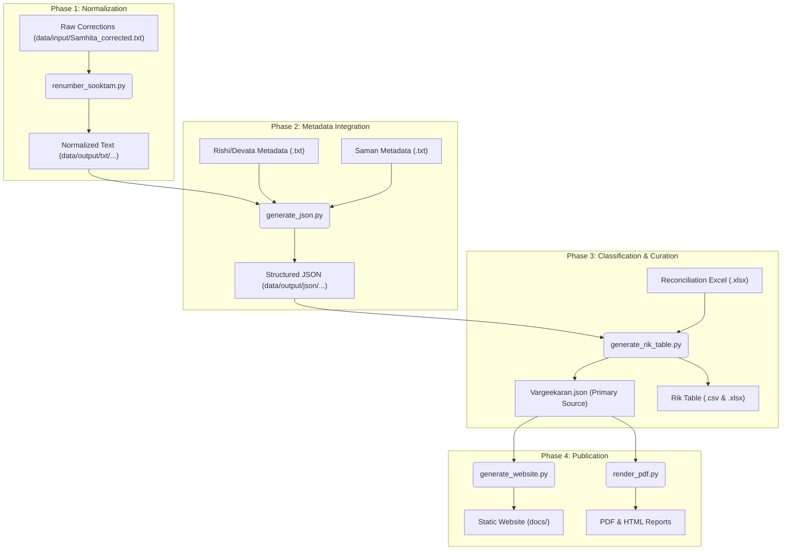
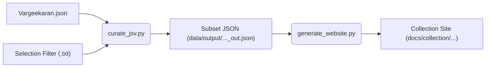
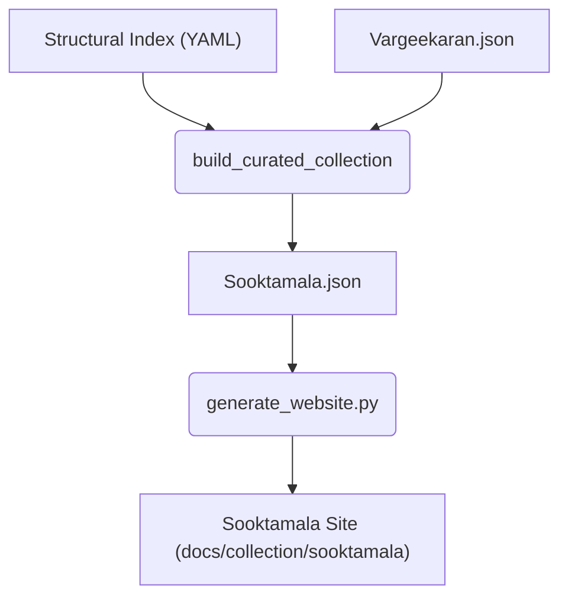
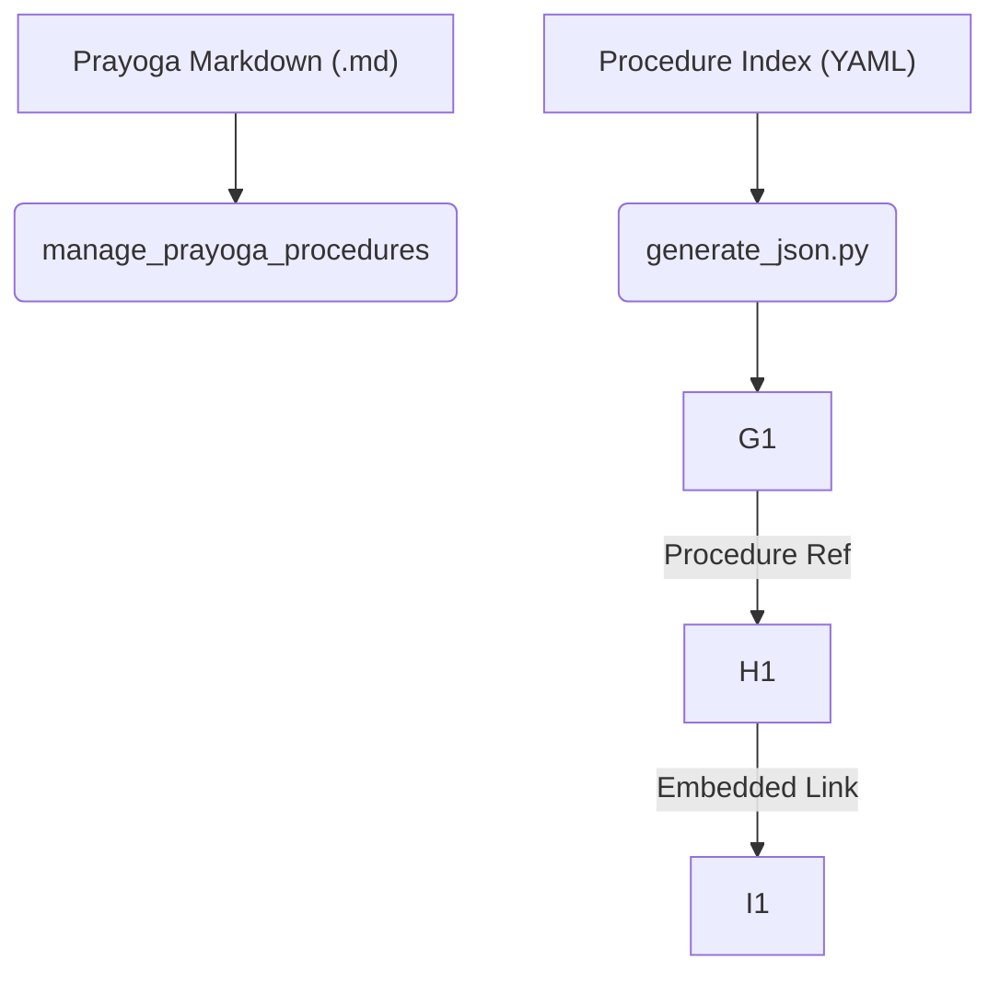

# Jaimineeya Samavedam Pipeline Architecture

This document provides a diagrammatic overview of the various workflow pipelines used to process, curate, and publish the Jaimineeya Samavedam text and metadata.

## 1. Core Data Processing Pipeline

This is the primary flow for transforming raw manuscript corrections into the final "Vargeekaran" JSON and the main website.

---

## 2. Collection & Curation Workflow

This secondary pipeline is used to create specific subsets or thematic collections (like Sooktamala or Ashirvachana Samani).

---

## 3. Custom Sooktamala Pipeline

For independent collections using the P.K.S (Parva.Kandah.Samam) identifier system.

---

## 4. Prayoga & Procedure Integration

How ritual instructions are embedded into the Samam display.

---

## Key Maintenance Commands

| Pipeline | Command Example |
| :--- | :--- |
| **Core JSON** | `python src/generate_json.py --type samhita` |
| **Rik Table** | `python src/generate_rik_table.py --type samhita` |
| **Website** | `python src/generate_website.py --samhita` |
| **Curation** | `python src/curate_jsv.py` |
| **PDF** | `python src/render_pdf.py data/output/Vargeekaran.json` |
