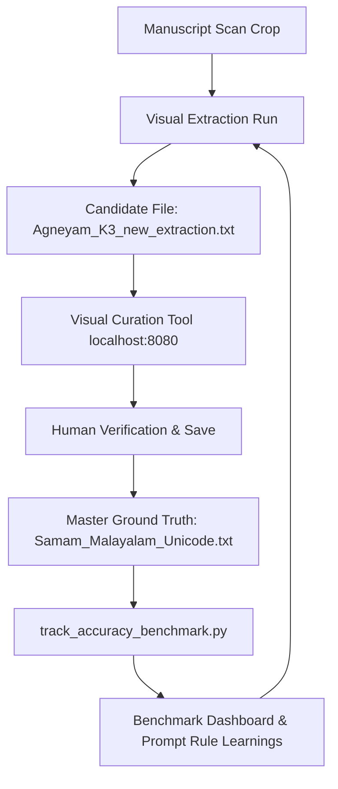

# Visual Curation Tool & Active-Learning Workflow

The **Jaimineeya Sama Veda (JSV) Visual Curation Tool** is a split-screen interactive web application designed for high-precision validation, editing, and active-learning benchmarking of Malayalam Vedic text against handwritten palm-leaf/paper manuscript page scans.

---

## 1. Quick Start & Server Launch

The curation tool runs locally as a lightweight Python HTTP server on port `8080`.

### Starting the Server
```bash
python Malayalam_JSV/curation_tool/server.py
```
Open your browser at: **[http://localhost:8080/](http://localhost:8080/)**

---

## 2. Core Architecture & Components

```text
┌─────────────────────────────────────────────────────────────────────────┐
│                      VISUAL CURATION WORKSPACE                          │
├────────────────────────────────────┬────────────────────────────────────┤
│         LEFT PANE                  │             RIGHT PANE             │
│   Handwritten Manuscript Scan      │      Live Curation & Preview       │
│                                    │                                    │
│ • Deep Pan & Zoom (10% to 500%)    │ • Quick-Modifier Toolbar Chips     │
│ • High-Res Contrast / Inversion 🌓 │ • Live Unicode Vedic Textarea      │
│ • Page Navigation (◀ Page ▶)       │ • Real-time Accent Renderer (SVG)  │
│ • Section Anchored Page Sync       │ • Split / Stacked Layout Toggle    │
│                                    │ • Font Switcher (Noto / Rachana)   │
└────────────────────────────────────┴────────────────────────────────────┘
```

### Key Files in `Malayalam_JSV/curation_tool/`
- **`server.py`**:
  - Serves static assets and REST API endpoints.
  - Directly streams page scans from `scans/` as PNGs.
  - Automatically parses and updates `data/input/Malayalam/Samam_Malayalam_Unicode.txt`.
  - Runs zero-regression parser to regenerate `Malayalam_JSV/malayalam/Samam_Malayalam_json.json` upon saving.
- **`static/index.html`**: Semantic HTML5 layout with split/stacked views, toolbars, and modal feedback.
- **`static/app.js`**: Core client controller managing state, viewport pan/zoom, hotkeys, and real-time glyph stacking.
- **`static/style.css`**: Professional dark/gold Vedic theme, HSL color tokens, and crisp typography.

---

## 3. Server REST API Endpoints

| Endpoint | Method | Description |
| :--- | :--- | :--- |
| `/api/samams` | `GET` | Returns full hierarchical tree of all Supersections, Khandas, Subsections, and Samams with line positions. |
| `/api/page/<pageNum>.png` | `GET` | Streams the high-resolution scanned manuscript image for page `<pageNum>`. |
| `/api/save` | `POST` | Atomically updates a specific Samam in `Samam_Malayalam_Unicode.txt` and triggers pipeline JSON rebuild. |
| `/api/benchmark` | `GET` | Returns accuracy metrics and Ground-Truth coverage statistics. |

---

## 4. UI Features & Functionality

### 1. High-Resolution Scan Viewer (Left Pane)
- **Deep Zoom & Pan**:
  - Mouse wheel zoom in/out centered at cursor.
  - Click-and-drag panning.
  - `Fit Width` and `100%` reset buttons.
- **Contrast & Inversion (`🌓`)**:
  - Toggles high-contrast dark mode on handwritten manuscript scans to reveal faint pencil/ink swaras.
- **Intelligent Page Sync**:
  - Pinned to exact section anchors across all 6 Parvas (Agneyam, Tadva, Bruhati, Asaavi, Aindram, Pavamanam).
  - Automatically navigates to starting scan pages when changing subsections, while keeping your manual page view locked during samam edits.

### 2. Live Vedic Curation & Accent Preview (Right Pane)
- **Direct Subsection Jump**:
  - Jump directly to any subsection across the corpus by typing its number (e.g., `32`, `127`, `1413`) and pressing `Jump`.
- **1-Click Modifier Chips**:
  - Click any modifier badge above the textarea to insert tokens at the cursor:
    - **`(H)`**: Overhead Swarita Bar (`|`)
    - **`(G)`**: Low Descending Under-Slash (`\`)
    - **`(C)`**: Pause Shoulder Dot (`.`)
    - **`(A)` / `(A1)`**: Syllable Slur Arc (`⌒`) / Danda Arc (`⌒|`)
    - **`(B)` / `(B1)`**: Peak Caret Roof (`^`) / Diagonal Slash (`/`)
    - **`(D)` / `(D1)` / `(D2)`**: Chevron Roof (`Ʌ`) / Hooked Rise (`⋀`) / Tick (`✓`)
    - **`(E)` / `(F)`**: Tone Column (`‖`) / Light Tick (`'`)
    - **`_` / `.` / `,`**: Underbar connector / Pause dot / Cadence comma
- **Live Accent Preview**:
  - Renders the exact visual composition in real-time above Malayalam aksharas in blue, matching the LaTeX output.
- **Font Switching**:
  - Switch between **Noto Serif Malayalam** and **RIT Rachana Traditional Orthography**.
- **Layout Toggle**:
  - Switch between **Side-by-Side Split** (wide screens) and **Stacked Top/Bottom** (compact laptop screens).

---

## 5. Keyboard Shortcuts Reference

| Action | Hotkey | Description |
| :--- | :--- | :--- |
| **Save to Master** | `Ctrl + S` / `Cmd + S` | Saves edits directly to `Samam_Malayalam_Unicode.txt` and rebuilds JSON. |
| **Previous Samam** | `Ctrl + [` or `Alt + ◀` | Moves to the previous Samam. |
| **Next Samam** | `Ctrl + ]` or `Alt + ▶` | Moves to the next Samam. |
| **Insert Swarita `(H)`** | `Alt + H` | Inserts overhead vertical swarita bar. |
| **Insert Slash `(G)`** | `Alt + G` | Inserts low descending baseline under-slash. |
| **Insert Dot `(C)`** | `Alt + C` | Inserts upper-right shoulder pause dot. |
| **Insert Arc `(A)`** | `Alt + A` | Inserts melodic slur arc. |
| **Insert Danda Arc `(A1)`** | `Alt + 1` | Inserts slur arc positioned over verse danda. |
| **Insert Caret `(B)`** | `Alt + B` | Inserts peak caret roof. |
| **Insert Hooked `(D)`** | `Alt + D` | Inserts hooked rise / chevron. |
| **Insert Column `(E)`** | `Alt + E` | Inserts tone column mark. |
| **Insert Underbar `_`** | `Alt + U` | Inserts connector underbar. |

> [!TIP]
> **Windows IME / Alt Key Tip**: If typing special Malayalam characters in Windows leaves the `Alt` key logically stuck (showing `^H` on backspace), simply tap **both `Left Alt` and `Right Alt`** (or `Ctrl + Alt`) once to immediately release the modifier lock.

---

## 6. Active-Learning & Accuracy Tracking Cycle

The curation tool powers our **active-learning feedback loop**:



### Running Accuracy Benchmarks
To compare candidate extractions against the curated Ground Truth:
```bash
python Malayalam_JSV/extraction/track_accuracy_benchmark.py \
  --kandah "Agneyam_K3" \
  --initial-cand Malayalam_JSV/stage_output/candidates/Agneyam_K3_candidate_v1.txt \
  --reprocessed-cand Malayalam_JSV/stage_output/candidates/Agneyam_K3_new_extraction.txt \
  --gt data/input/Malayalam/Samam_Malayalam_Unicode.txt
```
The history is automatically persisted to [`Malayalam_JSV/stage_output/benchmark_history.json`](file:///c:/Users/sekha/OneDrive/Documents/GitHub/jaimineeyasamavedam/Malayalam_JSV/stage_output/benchmark_history.json).

---

## 5. Swara Modifier & Font File Synchronization Protocol

> [!IMPORTANT]
> **The positioning of the swara modifiers in the JSV Curation tool should be reflected to the font file as well.**
> Whenever any modifier geometry is adjusted in CSS (`style.css`), update the corresponding vector contour in [`scripts/build_swara_font.py`](file:///c:/Users/sekha/OneDrive/Documents/GitHub/jaimineeyasamavedam/scripts/build_swara_font.py) and run:
> ```bash
> python scripts/build_swara_font.py
> ```
> This ensures that PDF LaTeX typesetting, static web exports, and the live curation tool render with 100% identical typographic baseline and shoulder alignment.
