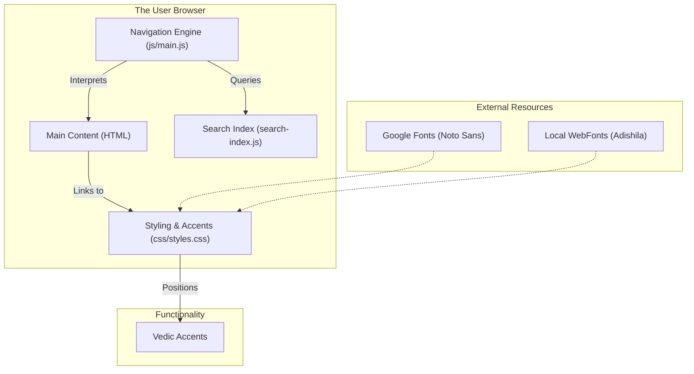

# Website Architectural Components

This diagram explains how the various files generated by `src/generate_website.py` interact in the user's browser to provide the final experience.

---

## 1. The Content Engine (HTML)
The website is structured across multiple HTML files:
- **`index.html`**: The portal/homepage for a collection.
- **`kandah/`**: A folder containing individual sub-sections (Khandas).
- **`classification/`**: Contains Rishi, Devata, and Chandas index pages.

## 2. The Styling Engine (`css/styles.css`)
As we discussed, this file is "baked" for each site. It contains:
- **Font-Specific Offsets**: The `{an_off}` and `{sw_off}` values we just adjusted. These tell the browser exactly how many pixels to shift an accent mark (like the Anudatta number) so it aligns perfectly with the Devanagari characters.
- **Visual Design**: Parchment backgrounds, Adishila typography, and responsive layouts.

## 3. The Navigation & Interactivity Engine (`js/main.js`)
This is the "Brain" of the site. It handles:
- **Deterministic Jumping**: When you type `1.1.1` in the Jump box, this script calculates the relative path and navigates the browser.
- **Search Logic**: It opens the search modal and displays results from the search index.
- **Smooth Scrolling**: It ensures that clicking a link smoothly positions the verse at the top of the screen (with an offset for the fixed header).

## 4. The Search Index (`search-index.js`)
This is essentially a **client-side database**. 
- It contains every word/verse in the Jaimineeya text.
- When the JS engine performs a search, it queries this local object instead of calling a server. This makes the search nearly instantaneous and allows the website to function completely offline.

---

> [!TIP]
> **Why it's "Static"**: Every decision about where an accent mark sits or where a link points is pre-calculated by our Python script. This means the browser doesn't have to "think"—it just renders the final data, making the site extremely fast and stable.
