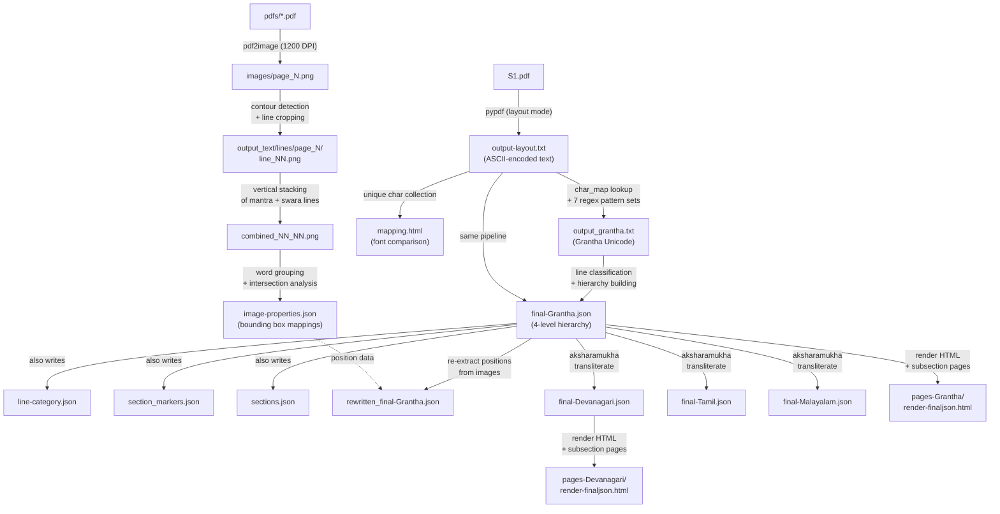
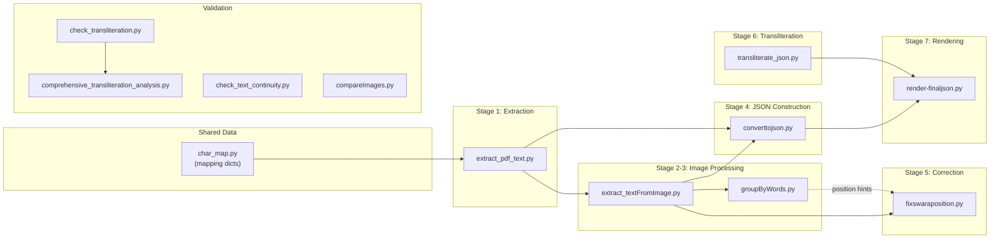
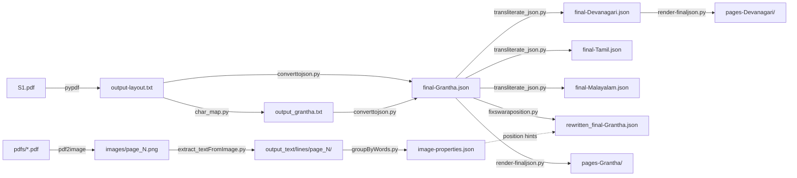

# S1.pdf → JSON Pipeline: Deprecated Implementation Reference

This document traces the complete data processing pipeline that ingests `S1.pdf` (a Sanskrit Vedic text encoded with a custom ASCII-to-Grantha character mapping) and produces a structured 4-level JSON hierarchy (`final-Grantha.json`) with mantra/swara alignment, plus an interactive HTML viewer. All scripts described here reside in `deprecated/` and `deprecated/main/`.

---

## Pipeline Stages at a Glance

```
S1.pdf ──────────────────────────────────────────────────────────────────────────┐
  ├── [Stage 0] converttoimage.py      ──▶ images/page_N.png                     │
  │                                                                              │
  ├── [Stage 1] extract_pdf_text.py    ──▶ output-layout.txt                     │
  │        + char_map.py               ──▶ output_grantha.txt                    │
  │                                    ──▶ mapping.html                          │
  │                                                                              │
  ├── [Stage 2] extract_textFromImage.py ◀── images/page_N.png + output-layout.txt
  │                                    ──▶ output_text/lines/page_N/line_NN.png  │
  │                                    ──▶ output_text/lines/page_N/combined_NN_NN.png
  │                                                                              │
  ├── [Stage 3] groupByWords.py        ◀── combined_NN_NN.png                    │
  │                                    ──▶ image-properties.json                 │
  │                                                                              │
  ├── [Stage 4] converttojson.py       ◀── output-layout.txt + output_grantha.txt│
  │                                    ──▶ final-Grantha.json                    │
  │                                    ──▶ line-category.json                    │
  │                                    ──▶ section_markers.json                  │
  │                                    ──▶ sections.json                         │
  │                                                                              │
  ├── [Stage 5] fixswaraposition.py    ◀── final-Grantha.json + image-properties │
  │                                    ──▶ rewritten_final-Grantha.json          │
  │                                                                              │
  ├── [Stage 6] transliterate_json.py  ◀── final-Grantha.json                    │
  │                                    ──▶ final-Devanagari.json                 │
  │                                    ──▶ final-Tamil.json                      │
  │                                    ──▶ final-Malayalam.json                  │
  │                                                                              │
  └── [Stage 7] render-finaljson.py    ◀── final-*.json                          │
                                       ──▶ pages-*/render-finaljson.html         │
                                       ──▶ pages-*/subsection-X-XX-XXX.html      │
```

---

## Stage Details

### Stage 0: PDF → High-Resolution Images

| | |
|---|---|
| **Script** | `deprecated/main/converttoimage.py` |
| **Purpose** | Converts each PDF in `pdfs/` to a high-resolution (1200 DPI) PNG image for downstream image-based processing |
| **Input** | `pdfs/*.pdf` |
| **Output** | `images/<basename>.png` (first page of each PDF) |
| **External Dependency** | `pdf2image` (requires `poppler`) |

#### Key Logic

This script contains no function definitions. The `__main__` block:

1. Iterates over all `.pdf` files in `pdfs/`.
2. Calls `pdf2image.convert_from_path(pdf_path, dpi=1200)` to render each page.
3. Saves only the first page (`images[0]`) as `<basename>.png` in the `images/` directory.

---

### Stage 1: PDF Text Extraction & ASCII → Grantha Conversion

| | |
|---|---|
| **Script** | `deprecated/main/extract_pdf_text.py` |
| **Purpose** | Extracts raw text from the PDF using layout-mode extraction, then converts every ASCII/Latin-1 code point to proper Grantha Unicode using the `char_map.py` lookup table |
| **Input** | `S1.pdf`, `char_map.py` (mapping tables: `char_map`, `ascii_combination_letters`, `equivalent_letters`, `missing_maps_list`) |
| **Output** | `output_text/output-layout.txt` (raw ASCII text with `__N__` page markers), `output_text/output_grantha.txt` (converted Grantha Unicode), `output_text/mapping.html` (font comparison reference) |

#### Key Functions

**`extract_text_from_pdf(pdf_path, output_file)`**

- Opens `pdf_path` with `pypdf.PdfReader`.
- Iterates pages, calling `page.extract_text(extraction_mode="layout", layout_mode_space_vertically=False)`.
- Injects `__page_number__` markers between pages.
- Also extracts font metadata from the PDF's `/Resources` dictionary.
- Writes raw text to `output_file`.

**`process_text(texts)`** — the core conversion function. Applies transformations in strict order:

1. **Literal replacements** — fixes known PDF extraction artifacts:
   - `"\u00cd\u00cd"` → `"\u00ce"`
   - `"\u0024"` (dollar sign) → `"\U00011328\U0001134D\U00011335"` (Grantha conjunct)
   - `"\u006f\u00c0"` → `"\u006f"`
   - `"\u00cd\u0053\u00dc\u00c0"` → `"\u00cd\u0053\u00c0\u00dc"`

2. **Pattern Set 1 — E, ai, jE, jai with vo-subscripts** (5 regex patterns):
   - Matches 3-character sequences like `(marker)(consonant)(o-vowel-marker)`.
   - Reorders to `consonant + vowel_marker` (with virama where needed).
   - Uses `char_map` to look up Grantha values for each ASCII code point.

3. **Pattern Set 2 — ravattu with vowel** (1 regex pattern):
   - Matches 4-character sequences and reorders to proper Grantha ordering: `first + second + fourth + third`.

4. **Pattern Set 3 — ravattu with subscript** (1 regex pattern):
   - Matches 3-character sequences, reorders to `third + virama + first + second`.

5. **Pattern Set 4 — jE and jai** (1 regex pattern):
   - Matches 2-character sequences, swaps order: `second + first`.

6. **Pattern Set 5 — consonant + vowel + subscript** (1 regex pattern):
   - Matches 3-character sequences, reorders to `first + third + second`.

7. **Pattern Set 6 — yaphala/repala/ravattu with vowel** (1 regex pattern):
   - Matches 3-character sequences with complex reordering depending on the third character.

8. **Pattern Set 7 — yaphala/repala/ravattu without vowel** (1 regex pattern):
   - Matches 2-character sequences, inserts virama appropriately.

After all pattern sets, iterates over the processed string character-by-character, mapping each ASCII index through `char_map` to produce the final Grantha Unicode string. Returns the converted string.

**`write_html_table(outfile, uniq_chars, char_map)`**

- Generates an HTML comparison table showing each unique character rendered in three Grantha fonts (Krishna Vedic, Noto Sans Grantha, Noto Serif Grantha).
- Includes ASCII hex code, Unicode code point, and Unicode name.

**`process_mapping_table(texts)`**

- Collects all unique characters from `texts`.
- Calls `write_html_table()` to generate `mapping.html`.

**`process_missing_maps(texts)`**

- Searches for characters listed in `missing_maps_list`.
- Reports the line number, surrounding text context, and hex values of each occurrence.

**`write_grantha_files(output_dir, recreated_output)`**

- Writes the converted Grantha text to `output_grantha.txt` and `output_grantha.html` (with Noto Sans Grantha font styling).

**`read_file_to_list(file_path)`**

- Reads a file and returns its full content as a string.

**`main()`** — orchestrates the full pipeline:

1. Reads `output-layout.txt` (or extracts it from `S1.pdf` if uncommented).
2. Normalizes equivalent letters via `equivalent_letters` dict.
3. Expands combination letters via `ascii_combination_letters` dict.
4. Generates the mapping table (`mapping.html`).
5. Processes each line through `process_text()`.
6. Writes final Grantha files.

---

### Stage 2: Line Image Extraction & Pairing

| | |
|---|---|
| **Script** | `deprecated/main/extract_textFromImage.py` |
| **Purpose** | Crops individual text lines from page images using contour detection, then pairs mantra lines with their corresponding swara (accent) lines by stacking them vertically |
| **Input** | `images/page_N.png`, `output_text/output-layout.txt` |
| **Output** | `output_text/lines/page_N/line_NN.png`, `output_text/lines/page_N/combined_NN_NN.png` |

#### Key Functions

**`natural_sort_key(s)`**

- Splits a filename into alternating text/integer segments for correct numerical sorting (e.g., `page_10` sorts after `page_9`).

**`extract_lines_from_image(image_path, output_dir, text_lines, num_iterations=10)`**

- Reads a page PNG, converts to grayscale, applies Otsu thresholding (binary inverse).
- Dilates with a horizontal kernel `(width//30, 5)` for `num_iterations` to connect characters into text-line blobs.
- Finds contours, filters by arc-length (>100), aspect ratio (>5 or <0.2), and height (>100) to identify text lines.
- Warns if a contour height exceeds 500px (likely two lines merged).
- Merges boxes with y-coordinates within 100px of each other.
- Crops each line to full page width and saves as `line_NN.png`.
- Warns if detected line count doesn't match the expected `text_lines` count.

**`combine_images(image_path, output_dir, text_lines, images_to_combine)`**

- Pairs consecutive line images and stacks them vertically via `np.vstack()`.
- Names output as `combined_NN_NN.png` (using the original line numbers).
- Skips the first image if an odd count is provided.

**`process_line_images(image_path, output_dir, text_lines)`**

- Reads all `line_*.png` files from the page directory.
- Translates each text line using `process_text()` from `extract_pdf_text.py`.
- Filters out: header lines (start with digit), page numbers, lines in `pattern_to_ignore` (generic Sanskrit titles without swaras).
- Collects remaining line images and calls `combine_images()`.

**`get_char_position(word_img, box, word_position, word, num_chars, image_path)`**

- Takes a cropped word image, dilates it (3×3 kernel, 5 iterations), finds character contours.
- Sorts character boxes left-to-right.
- For each character whose bounding box falls within the word box, maps the pixel-index to a grapheme position using `grapheme.graphemes(word)`.
- Returns a 1-based grapheme position index. Used by `extract_words_from_image()` in Stage 5.

**`extract_words_from_image(image_path, output_dir, mantra_word_lengths=[], swara_word_lengths=[])`**

- Parses the combined image filename to resolve mantra and swara line image paths.
- Validates that detected word counts match the expected `mantra_word_lengths` and `swara_word_lengths`.
- Detects word bounding boxes in both mantra and swara images via dilation + contour detection.
- Extends each swara box vertically to span the full image height (`newboxes`).
- For each extended swara box, finds the mantra word box it overlaps horizontally (≥50% overlap).
- Calls `get_char_position()` to determine the exact character position within the mantra word where the swara applies.
- Returns a list of `(word_position, character_position)` tuples.
- Saves a visualization image `boxed_combined_NN_NN.png`.

**`read_text_file_to_dict(file_path)`**

- Parses `output-layout.txt` by detecting `__N__` page markers.
- Returns `{page_number: [list_of_lines]}`.

**`draw_box_around_second_line_char(image_path)`**

- Debug utility: separates characters into two lines by median y-coordinate.
- For each character in line 2 whose x-center falls within a character in line 1, draws a full-height red rectangle.

**`__main__` block**

- Reads `output-layout.txt` into a page→lines dictionary.
- Iterates over `images/page_*.png`, skipping pages in `exclude_list` (known problematic pages).
- Uses per-page `num_iterations` tuning from `page_hash_map_and_iterations`.
- Calls `extract_lines_from_image()` for each page.
- Then iterates over `combine_images_dict` (hardcoded line-pair definitions for pages where automatic pairing fails) and calls `combine_images()` for each pair.

---

### Stage 3: Word-Level Bounding Box Analysis

| | |
|---|---|
| **Script** | `deprecated/main/groupByWords.py` |
| **Purpose** | Groups individual character contours into word-level bounding boxes for both mantra and swara lines, then computes spatial intersections to determine which mantra characters each swara marker aligns with |
| **Input** | `output_text/lines/page_N/combined_NN_NN.png` |
| **Output** | `output_text/image-properties.json` |

#### Key Functions

**`extract_words_from_image(image_path)`**

- Parses the combined image filename to resolve:
  - Page number from the directory name.
  - Mantra line image (`line_N.png`) and swara line image (`line_M.png`) paths.
  - Handles cross-page references (when the swara line is on the next page).
- Loads the mantra and swara images via OpenCV; resizes to the same width if needed.

- **Mantra word grouping:**
  1. Converts mantra image to grayscale, applies Otsu thresholding (binary inverse).
  2. Finds contours of individual character components.
  3. Sorts bounding boxes by x-coordinate.
  4. Iterates through boxes, merging nearby ones into word-level boxes:
     - Vertically stacked contours (one under another, horizontally overlapping) → merge.
     - Horizontally adjacent contours within `NEARNESS_THRESHOLD=85` pixels → merge.
  5. Draws alternating red/green rectangles on the output image.
  6. Creates `mantra_word_to_char_mapping`: maps each combined word box index to the list of original character box indices it contains.

- **Swara word grouping:** applies the same contour-based word grouping to the swara image.
  - Filters out "ghost swaras" (merged boxes with height < 20px) at every merge stage.
  - Creates `swara_word_to_char_mapping` similarly.

- **Intersection computation (`swara_mantra_intersections`):**
  - For each swara word box, finds which mantra word boxes it intersects (standard rectangle overlap test).
  - For mantra words containing more than 3 characters, further determines which specific characters within the word are intersected by the swara box.
  - Stores results as either a plain integer `(mantra_index)` or a tuple `(mantra_index, {"intersecting_characters": [relative_char_indices]})`.

- Returns a hash with keys: `swara_mantra_intersections`, `swara_word_char_mapping`, `mantra_word_char_mapping`, `image_name`.
- Saves a stacked visualization image `boxed_swara_combined_NN_NN.png`.

**`reg_test()`**

- Runs `test_specific_image()` on a hardcoded list of test images from page 243.

**`test_specific_image(image_path)`**

- Runs `extract_words_from_image()` on a single image and prints the JSON result.

**`main()`**

- Globs all `combined_*.png` files under `output_text/lines/`.
- Sorts by page number and line number using regex extraction.
- Calls `extract_words_from_image()` on each file.
- Aggregates all results into `output_text/image-properties.json`.

---

### Stage 4: Hierarchical JSON Construction

| | |
|---|---|
| **Script** | `deprecated/main/converttojson.py` |
| **Purpose** | Parses the processed Grantha text, classifies each line into a semantic category, builds the 4-level hierarchy (supersection → section → subsection → mantra_sets) with mantra words, swara strings, and image references |
| **Input** | `output_text/output-layout.txt`, `output_text/lines/` (line images) |
| **Output** | `output_text/final-Grantha.json`, `output_text/line-category.json`, `output_text/section_markers.json`, `output_text/sections.json` |

#### Key Functions

**`read_text_file_to_dict(file_path)`**

- Duplicated from Stage 2. Parses `output-layout.txt` into `{page_number: [lines]}`.

**`combine_images(images_to_combine)`**

- Duplicated from Stage 2. Vertically stacks mantra+swara line pairs.

**`main` loop** — a long inline processing block (no enclosing function):

1. Reads `output-layout.txt` via `read_text_file_to_dict()`.
2. Defines detection patterns:
   - `header_pattern_1`: section headers starting with a digit.
   - `section_end_pattern_1`: lines matching `X+Y=Z` count format.
   - `section_end_pattern_2`: hardcoded section-ending line.
   - `header_pattern_3`: lines containing `……` (section end markers).
   - `super_section_titles_start` / `super_section_titles_end`: lists of Grantha title strings.
   - `pattern_to_ignore`: lines to pass through unchanged (generic titles).
   - `pattern_to_retrofit`: lines that should remain classified as "mantra" even in swara positions.
3. Iterates through every page and line, classifying each as:
   - `page_number` — purely numeric lines.
   - `generic` — lines in `pattern_to_ignore`.
   - `count` — lines matching section-end patterns.
   - `section-end` — lines containing `……`.
   - `header` — lines matching `header_pattern_1`.
   - `super-section-start` / `super-section-end` — lines containing supersection title markers.
   - `mantra` / `swara` — alternating categories after a header (toggled per line).
4. Tracks boundaries:
   - When a header is encountered while `in_section=True`, closes the current subsection (records page/line end in `subsection_markers`), starts a new subsection.
   - When a supersection-end marker is found, closes the current subsection and section, starts a new supersection.
   - When a count line is found while `in_section=True`, closes the current subsection and increments section number.
5. After processing all lines, builds the final JSON structure:
   - Parses count text `X+Y=Z` into `prev_count`, `current_count`, `total_count`.
   - Groups mantra+swara line pairs into `mantra_sets`.
   - Each mantra_set contains:
     - `mantra-words`: array of `{word, swara_positions}` objects. Instance counts `(N)` and `।।N।।` patterns are stripped from words.
     - `swara`: space-separated swara string (for paired mantra+swara lines).
     - `image-ref`: path to `line_NN.png` (mantra-only) or `combined_NN_NN.png` (mantra+swara).
     - `instance`: repetition count if found.
   - Handles cross-page mantra/swara pairs by calling `combine_images()`.
   - Extracts header number and title via regex `(\d+)(.*)`.
6. Writes four output files:
   - `line-category.json` — page-level categorized line data.
   - `section_markers.json` — subsection boundary markers (page/line start-end).
   - `sections.json` — intermediate supersection structure.
   - `final-Grantha.json` — the complete hierarchical JSON output.

---

### Stage 5: Swara Position Correction

| | |
|---|---|
| **Script** | `deprecated/main/fixswaraposition.py` |
| **Purpose** | Re-extracts precise character-level swara positions from images using the Stage 3 analysis, then re-embeds swara markers into mantra words in the format `prefix(swara)suffix` |
| **Input** | `final-Grantha.json` (CLI argument), image files referenced therein |
| **Output** | `rewritten_final-Grantha.json` (in the same directory as the input) |

#### Key Functions

This script has no function definitions. The inline `main` logic:

1. Loads the input JSON file specified via CLI argument.
2. Walks the supersection → section → subsection → mantra_sets hierarchy.
3. For each mantra_set:
   - Computes grapheme lengths of all mantra words and swara words using `grapheme.length()`.
   - Calls `extract_words_from_image()` from `extract_textFromImage.py`, passing `mantra_word_lengths` and `swara_word_lengths` as validation parameters.
   - Removes existing `swara_positions` from each mantra word.
   - For each extracted position `(word_position, character_position)`:
     - Splits the mantra word at the character position using `grapheme.slice()`.
     - Reconstructs the word as `prefix(swara)suffix`.
     - Stores the new `swara_positions` dictionary `{"word_position": word_position, "character_position": character_position}`.
4. Writes the modified JSON to `rewritten_<input_filename>`.

**Import:** `from extract_textFromImage import extract_words_from_image`

---

### Stage 6: Transliteration

| | |
|---|---|
| **Script** | `deprecated/transliterate_json.py` |
| **Purpose** | Recursively transliterates all text strings in the JSON from one script to another (Devanagari → Grantha/Tamil/Malayalam, or Grantha → Devanagari/Tamil/Malayalam) |
| **Input** | `output_text/updated-final-Devanagari.json` (hardcoded) |
| **Output** | `output_text/updated-final-{Grantha,Tamil,Malayalam}.json` |

#### Key Functions

**`transliterate_text(text, src_script, target_script)`**

- Wraps `aksharamukha.transliterate.process(src_script, target_script, text, False, post_options=flags)`.
- Applies script-specific post-processing:
  - **Tamil/TamilExtended/TamilBrahmi:** adds flags `TamilRemoveApostrophe`, `TamilGranthaVisarga`, `TamilSubScript`.
  - **Devanagari:** replaces `ழா` → `ळा` and `ழ` → `ळ`.
  - **Malayalam:** replaces `ழா` → `ഴാ` and `ழ` → `ഴ`.

**`transliterate_json(obj, src_script, target_script)`**

- Recursive walker:
  - `dict` → recurse over all values.
  - `list` → recurse over all items.
  - `str` → call `transliterate_text()`.
  - Other types → passthrough unchanged.

**`main()`**

- Loads the Devanagari JSON.
- Transliterates to Grantha, Tamil, and Malayalam, writing separate output files.

**`test_transliteration()`**

- Debug helper that transliterates a hardcoded Grantha test string to Devanagari and prints the result.

---

### Stage 7: HTML Viewer Generation

| | |
|---|---|
| **Script** | `deprecated/main/render-finaljson.py` |
| **Purpose** | Generates an interactive HTML viewer with a collapsible navigation tree on the left and per-subsection pages with mantra/swara tables, image previews, and GitHub issue links on the right |
| **Input** | `final-Grantha.json` (or `final-Devanagari.json`, `final-Tamil.json`, `final-Malayalam.json` — specified via CLI) |
| **Output** | `output_text/pages-*/render-finaljson.html` (index), `output_text/pages-*/subsection-X-XX-XXX.html` (one per subsection) |

#### Key Functions

**`my_encodeURL(url, param1, value1, param2, value2)`**

- Uses `requests.models.PreparedRequest` to URL-encode a GitHub issue creation URL with two parameters (typically `title` and `body`).

**Index Page Generation** (inline logic):

- Builds an HTML document with:
  - A collapsible tree: supersection → section → subsection.
  - Clicking a supersection or section title toggles visibility of its children (JavaScript `toggle()` function).
  - Clicking a subsection title loads the corresponding `subsection-X-XX-XXX.html` into an iframe via `showInIframe()`.
  - A two-column layout: navigation table on the left (30% width), iframe on the right (70% width).
  - Font family set based on the input file suffix (Noto Sans Grantha, Devanagari, Tamil, or Malayalam).

**Subsection Page Generation** (inline logic):

- For each subsection, generates a standalone HTML page containing:
  - A clickable header with a toggleable image preview (the header line image).
  - For each mantra_set:
    - A toggleable image preview (the combined mantra+swara line image).
    - A two-row HTML table:
      - Top row (`mantra-cell`): mantra words with swara markers removed from display.
      - Bottom row (`swara-cell`): swara markers positioned under the correct syllable using `grapheme.length()` of the mantra prefix to compute `&nbsp;` padding.
    - If `probableError` is `True`, the table gets class `mantra-table-error` (red border).
    - A "Raise a correction" link that opens a GitHub issue pre-filled with the current swara position.
  - Font family set based on the input file suffix.

---

## Supporting Scripts (Validation, Debug, Utilities)

These scripts are not part of the core pipeline but provide validation, debugging, and one-off data manipulation capabilities.

### Transliteration Analysis

**`deprecated/main/check_transliteration.py`**

- Reads `transliteration-differences.txt` (contains g/t/c lines per subsection).
- `read_transliteration_file()` — groups lines by `subsection_*` headers.
- `extract_words_from_line()` — strips `gN-N`/`tN-N`/`cN-N` prefixes and parenthetical content, splits into words.
- `check_word_counts()` — reports sections where g, t, and c word counts don't all match.
- `check_transliteration()` — for sections with matching g/t counts, transliterates each g word to Devanagari via `aksharamukha` and compares against t.
- `main()` — runs both checks, prints mismatched sections and accuracy summary.

**`deprecated/main/comprehensive_transliteration_analysis.py`**

- An enhanced version of the above.
- `parse_grapheme_units()` — splits text into grapheme clusters, treating parenthesized groups `(X)` as single units.
- `analyze_all_sections()` — compares g, t, c at the grapheme level (not word level). Computes perfect transliteration rate and word-level accuracy.
- `main()` — prints overall statistics, sample mismatches, and word-count issues.

### Image Comparison

**`deprecated/main/compareImages.py`**

- Uses a pretrained ResNet50 model (loaded from local `.pth` file) to visually match swara character crops (`i-word_X_Y.png`) against reference Devanagari character crops (`t-word_Z.png`).
- `extract_features()` — preprocesses an image (resize 224×224, ImageNet normalization) and extracts a feature vector from ResNet50 (without classification head).
- `find_best_match()` — computes cosine similarity between an i-word feature and all reference word features.
- `main()` — loads `mantra_hash.json` (character position mappings), iterates over `combined_*` directories, filters reference files by expected character (from `char_hash`), and prints the best match per swara crop.

### Text Continuity Validation

**`deprecated/main/check_text_continuity.py`**

- Parses `Samhita_with_Rishi_Devata_Chandas.txt` to validate samam number continuity.
- `get_arabic()` — converts Devanagari numerals to integers.
- `check_text_file()` — tracks current Patha (from SuperSection titles) and Khanda (from Section titles), extracts all `॥ N ॥` samam numbers from mantra blocks, then checks each Patha/Khanda for: non-starting-at-1, duplicate numbers, and missing numbers (gaps).
- Writes report to `data/output/Text_Samam_Continuity_Report.txt`.
- Imports `get_generated_metadata` from an external `utils` module.

### Data Extraction & Manipulation

**`deprecated/main/extract_corrected_mantra_sets.py`**

- Walks the JSON hierarchy, extracts `corrected-mantra` and `corrected-swara` fields from mantra_sets, consolidates them into a `corrected-mantra_sets` array at the subsection level.
- Writes to `intermediate-final-Devanagari-with-corrected-mantra_sets.json`.

**`deprecated/main/extract_structure_table.py`**

- Parses the annotated text file for structural markers (`# Start of SuperSection Title`, `# Start of Section Title`, `# Start of SubSection Title`, `#Start of Mantra Sets`).
- Extracts supersection name, section name, subsection ID, subsection header, and all samam numbers from mantra blocks.
- Deduplicates and writes to CSV: `JSV_Samhita_Structure_Table.csv`.

**`deprecated/main/extract_uniquegrapheme.py`**

- `extract_graphemes()` — extracts all unique grapheme clusters from a text file using the `grapheme` library.
- `replace_unexpected_graphemes()` — finds and strips leading spaces from known bad grapheme patterns (e.g., space + vowel matra).
- `main()` — prints each unique grapheme with its Unicode escape representation.

### Character Map & Vocabulary

**`deprecated/main/grantha_vocab.py`**

- Defines the complete Grantha character inventory: `grantha_vowels`, `grantha_consonants`, `grantha_vowel_extender`, `grantha_punctuation`, plus individual constants for `ra`, `ya`, `virama`.
- Iterates over all consonant+vowel extender combinations to print various pattern forms (useful for test vocabulary generation).
- Classifies each entry in `char_map` into categories (vowels, consonants, extenders, subscripts, others) and prints warnings for uncategorized entries.
- **Import:** `from char_map import char_map, ascii_combination_letters`

### Utility Scripts

**`deprecated/main/font-color.py`** — Inspects a TTF/TTC font file's `cmap` table and prints each character's code point and glyph name. Uses `fontTools`.

**`deprecated/main/remove_english_lines.py`** — Removes lines containing English characters (A-Z, a-z) from a text file. Uses `argparse` for CLI.

**`deprecated/main/clean_english.py`** — Keeps only lines containing Devanagari Unicode characters (U+0900–U+097F). Overwrites the input file in-place.

**`deprecated/main/splitinto_pages.py`** — Splits a multi-page PDF into individual single-page PDF files. Uses `PyPDF2`. Expects input PDF as CLI argument.

**`deprecated/main/cleanup_script.py`** — Moves all root-level files and directories into `deprecated/`, except for a whitelist (`src/`, `data/`, `templates/`, `fonts/`, `.git/`, `README.md`, etc.).

**`deprecated/main/reproduce_complex_case.py`** — A mock `RikMetadataParser` that tests conditional content resolution inside parentheses for Rik metadata parsing. `process_text_for_rik()` resolves defaults and overrides for specific Rik IDs.

**`deprecated/main/list_khandas.py`** — Minimal utility: scans a text file and prints every line containing the word "खण्डः" (Khanda marker).

---

## Shared Data Module

**`deprecated/main/char_map.py`**

This module is the backbone of Stage 1. It provides four data structures consumed by `extract_pdf_text.py` and `grantha_vocab.py`:

| Structure | Description | Size |
|---|---|---|
| `char_map` | Dictionary mapping ASCII integer code points (e.g., `0x6a`, `0xc2`, `0x1c3`) to Grantha Unicode strings. Covers consonants, vowel matras, conjunct consonants (with virama), numbers, punctuation, and special characters. | ~200 entries |
| `ascii_combination_letters` | Maps ASCII code points to lists of component ASCII code points that should be expanded before further processing (decomposition rules). | 17 entries |
| `equivalent_letters` | Maps ASCII code points to equivalent code points for normalization before mapping. | 4 entries |
| `missing_maps_list` | Lists characters that currently have no mapping defined (most entries are commented out). | 2 entries active |

The module also defines named constants for all Grantha vowels, consonants, matras, virama, anusvara, visarga, etc. for use in pattern definitions.

---

## Mermaid Diagrams

### Diagram 1: Overall Pipeline Flow



### Diagram 2: File Dependencies & Script Relationships



### Diagram 3: Function Call Graph (Core Pipeline)

```mermaid
flowchart TD
    subgraph "extract_pdf_text.py"
        main1["main()"] --> read_file["read_file_to_list()"]
        main1 --> proc_text["process_text()"]
        main1 --> write_grantha["write_grantha_files()"]
        main1 --> proc_mapping["process_mapping_table()"]
        proc_mapping --> write_html["write_html_table()"]
    end

    subgraph "extract_textFromImage.py"
        main2["main()"] --> extract_lines["extract_lines_from_image()"]
        main2 --> combine["combine_images()"]
        combine --> vstack["np.vstack()"]
    end

    subgraph "groupByWords.py"
        main3["main()"] --> extract_words["extract_words_from_image()"]
        extract_words --> group_mantra["group mantra contours → words"]
        extract_words --> group_swara["group swara contours → words"]
        extract_words --> intersections["compute swara↔mantra intersections"]
    end

    subgraph "converttojson.py"
        main4["main loop"] --> read_dict["read_text_file_to_dict()"]
        main4 --> classify["classify lines: header/mantra/swara/count"]
        main4 --> build_json["build hierarchy"]
        main4 --> combine_images2["combine_images()"]
    end

    subgraph "fixswaraposition.py"
        main5["main loop"] --> extract_pos["extract_words_from_image()"]
        extract_pos --> embed_swara["embed swara into mantra words"]
    end

    subgraph "render-finaljson.py"
        main6["main loop"] --> gen_index["generate index HTML"]
        main6 --> gen_pages["generate subsection HTML pages"]
        gen_pages --> gen_table["build mantra/swara table"]
        gen_pages --> gen_issue["generate GitHub issue link"]
    end

    main1 -.->|"output-layout.txt"| main2
    main2 -.->|"line images"| main3
    main3 -.->|"image-properties.json"| main5
    main1 -.->|"output-layout.txt"| main4
    main2 -.->|"combined images"| main4
    main4 -.->|"final-Grantha.json"| main5
    main4 -.->|"final-Grantha.json"| main6
```



### Diagram 4: Data Artifact Flow



---

## Cross-Reference: Duplicated Code

Several utility functions are duplicated across scripts:

| Function | Defined In | Also Used By |
|---|---|---|
| `read_text_file_to_dict()` | `extract_textFromImage.py` | `converttojson.py` (copied) |
| `combine_images()` | `extract_textFromImage.py` | `converttojson.py` (copied) |
| `extract_words_from_image()` | `groupByWords.py` (image analysis) | `fixswaraposition.py` (imports from `extract_textFromImage.py`) |
| `process_text()` | `extract_pdf_text.py` | `extract_textFromImage.py` (imports) |

These duplications reflect the iterative, exploratory nature of the pipeline's development.
