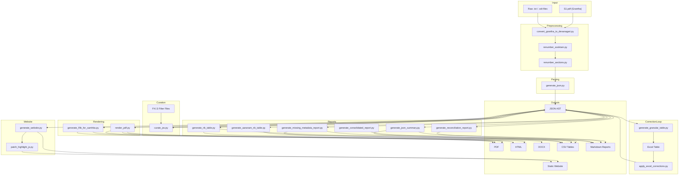
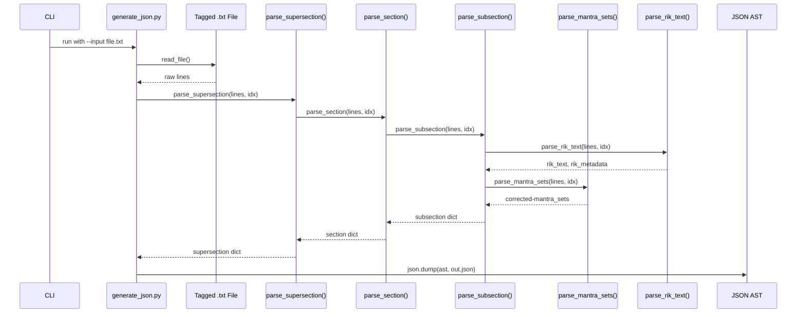
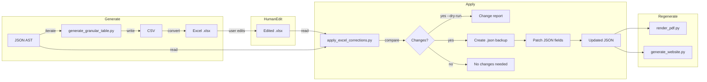
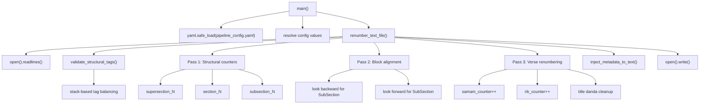
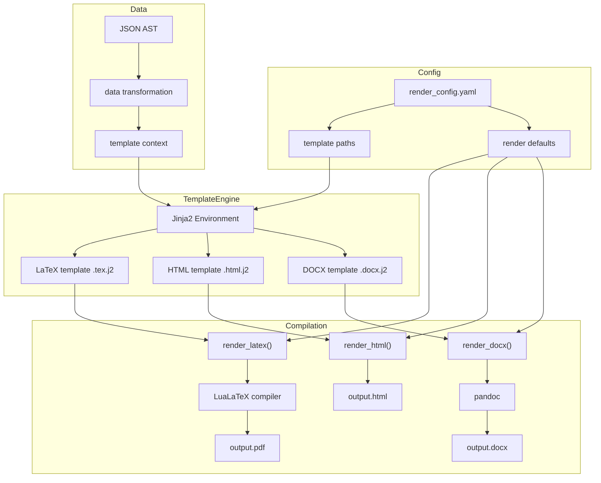

# Jaimineeya Samaveda — Active Pipeline (`src/`) Documentation

> This document covers the **active** processing pipeline in `src/`, which supersedes the deprecated scripts documented in `docs/pipeline.md`.
> The pipeline ingests **transliterated Grantha→Devanagari source text** (e.g., `S1.pdf` output), parses it into a structured JSON AST, curates subsets, and renders multi-format outputs (PDF, HTML, DOCX, static website).

---

## Table of Contents

1. [High-Level Architecture](#1-high-level-architecture)
2. [Configuration](#2-configuration)
3. [Shared Modules](#3-shared-modules)
4. [Stage 1 — Preprocessing & Text Normalisation](#4-stage-1--preprocessing--text-normalisation)
5. [Stage 2 — JSON AST Generation](#5-stage-2--json-ast-generation)
6. [Stage 3 — Curation & Filtering](#6-stage-3--curation--filtering)
7. [Stage 4 — Correction Loop](#7-stage-4--correction-loop)
8. [Stage 5 — Table & Report Generation](#8-stage-5--table--report-generation)
9. [Stage 6 — Multi-Format Rendering](#9-stage-6--multi-format-rendering)
10. [Stage 7 — Static Website Generation](#10-stage-7--static-website-generation)
11. [Tool Scripts](#11-tool-scripts)
12. [Mermaid Diagrams](#12-mermaid-diagrams)

---

## 1. High-Level Architecture

The active pipeline follows a **four-phase** model:

| Phase | Description | Key Scripts |
|---|---|---|
| **Ingestion** | Raw Devanagari text (transliterated from Grantha PDFs) is normalised, renumbered, and validated | `convert_grantha_to_devanagari.py`, `renumber_sooktam.py` |
| **Parsing** | Structured JSON AST is built from tagged text blocks (SuperSection → Section → SubSection → Mantra) | `generate_json.py` |
| **Curation** | Filter files (P.K.S identifiers) carve out curated subsets; corrections flow back via Excel | `curate_jsv.py`, `apply_excel_corrections.py` |
| **Rendering/Export** | Multi-format output: PDF (LaTeX), HTML, DOCX, static website, granular tables, reports | `render_pdf.py`, `generate_website.py`, `generate_rik_table.py`, etc. |

### Pipeline Data Flow Overview

```
S1.pdf (Grantha)
    │
    ▼ [convert_grantha_to_devanagari.py]
Raw Devanagari .txt files
    │
    ▼ [renumber_sooktam.py]
Numbered & validated .txt files
    │
    ▼ [generate_json.py]
JSON AST (Samhita_with_Rishi_Devata_Chandas_out.json)
    │
    ├─► [curate_jsv.py] ──► Curated JSON subsets
    │
    ├─► [generate_granular_table.py] ──► CSV/XLSX granular table
    │       │
    │       ▼ [apply_excel_corrections.py] ◄── User edits Excel
    │       │
    │       ▼ (JSON updated)
    │
    ├─► [generate_json_summary.py] ──► Structure summary (CSV + TXT)
    ├─► [generate_aaranam_rik_table.py] ──► Aaranam Rik table (CSV)
    ├─► [generate_rik_table.py] ──► Samhita Rik table (CSV + PDF)
    │
    ├─► [render_pdf.py] ──► PDF / HTML / DOCX
    │
    └─► [generate_website.py] ──► Static site (docs/samhita/, docs/aaranam/)
            │
            ▼ [patch_highlight_js.py]
        Patched JS for search highlighting
```

---

## 2. Configuration

### 2.1 `pipeline_config.yaml`

Master configuration file at `src/pipeline_config.yaml`. Defines:

- **Global paths** (`data_dir`, `input`, `output`)
- **Versioning** (`version`, `version_file`)
- **Script-specific settings** for every module (`generate_json`, `curate_jsv`, `render_pdf`, `generate_website`, `renumber_sooktam`, `generate_aaranam_rik_table`, etc.)
- **CLI presets** — each script section contains `sources`, `input`, `output`, and mode flags that serve as defaults when CLI args are omitted

### 2.2 `render_config.yaml`

Rendering-specific configuration at `src/render_config.yaml`. Defines:

- **Paths** for templates (`latex_templates`, `website_templates`)
- **Render defaults** (`color_mode`, `font_family`, `font_size`, `page_size`)
- **LaTeX settings** (`compiler`, `passes`, `options`)
- **Website settings** (`include_search`, `include_toc`, `highlight_js`)
- **Export formats** list

### 2.3 `VERSION` file

A plain-text file at `src/VERSION` (currently `3.28`). Read by `utils.get_project_version()` and embedded in all generated outputs (PDF footers, HTML meta, CSV metadata rows, report headers).

---

## 3. Shared Modules

### 3.1 `utils.py` — Pipeline Backbone

The central shared module. Provides:

| Function | Purpose |
|---|---|
| `get_project_version()` | Reads `src/VERSION` file; returns version string |
| `get_generated_metadata()` | Returns `{"version": <str>, "generated_at": "<ISO timestamp>"}` dict |
| `load_pipeline_config()` | Loads and returns `src/pipeline_config.yaml` as dict |
| `load_render_config()` | Loads and returns `src/render_config.yaml` as dict |
| `resolve_path()` | Resolves relative/absolute paths against `data/` root |
| `get_output_path()` | Constructs output file paths with version-aware naming |
| `normalize_text()` | Unicode normalisation (NFC), whitespace cleanup |
| `remove_zero_width_chars()` | Strips U+200B, U+FEFF, etc. |
| `clean_devanagari_text()` | Removes stray ASCII, normalises dandas, strips BOM |
| `fix_visarga_accent_order()` | Ensures accent marks precede visarga (ः) characters |
| `replace_accents_unicode()` | Converts `(1)`→U+0951 (Swarita), `(2)`→U+1CD2 (Anudatta), `(3)`→U+1CF8 (Kampa), `(4)`→U+1CF9 (Trikampa) |
| `convert_devanagari_to_arabic()` | Devanagari digits ०-९ → Arabic 0-9 |
| `convert_arabic_to_devanagari()` | Arabic 0-9 → Devanagari ०-९ |
| `count_lines()` | Line counter for progress reporting |
| `read_file()` / `write_file()` | UTF-8 file I/O wrappers |

### 3.2 `samam_utils.py` — Samam Counting Utilities

A lightweight module dedicated to consistent Samam counting across all scripts.

| Function / Constant | Purpose |
|---|---|
| `SAMAM_PATTERN` | Regex: `(?:॥|\|\|)\s*[\d०-९]+\s*(?:॥|\|\|)` — matches both Devanagari danda and ASCII pipe delimiters |
| `count_samam_markers(text)` | Returns count of Samam markers in text |
| `count_samams_with_fallback(text, min_count=1)` | Returns marker count, or `min_count` if none found |

---

## 4. Stage 1 — Preprocessing & Text Normalisation

### 4.1 `convert_grantha_to_devanagari.py`

**Purpose**: Converts source Grantha script (`.txt` or `.odt`) to Devanagari using the Aksharamukha library. This is the **entry point** of the entire pipeline — the transliterated output feeds all downstream processing.

| Function | Purpose |
|---|---|
| `read_odt(file_path)` | Extracts text from ODT `content.xml` using `xml.etree.ElementTree`, iterating over `text:p` and `text:h` elements |
| `convert_grantha_to_devanagari(input_path, output_path=None)` | Main entry point. Reads input, calls `transliterate.process('Grantha', 'Devanagari', content)`, writes `_devanagari.txt` output |

**Input**: Grantha `.txt` or `.odt` file (e.g., extracted from `S1.pdf`)
**Output**: Devanagari `.txt` file

### 4.2 `renumber_sooktam.py`

**Purpose**: The primary renumbering engine. Performs a 3-pass renumbering of raw text files — structural tags (Pass 1), block alignment (Pass 2), and verse counter renumbering (Pass 3). Includes structural integrity validation and metadata injection.

| Function | Purpose |
|---|---|
| `get_project_version()` | Reads `src/VERSION` |
| `set_project_version(version)` | Writes version to `src/VERSION` |
| `increment_project_version()` | Increments patch number (x.y.z → x.y.z+1) |
| `int_to_devanagari(n)` | Integer → Devanagari numeral string (e.g., `123` → `१२३`) |
| `inject_metadata_to_text(content, version, timestamp)` | Inserts or updates `# [JSV METADATA]` block at top of file |
| `get_generated_metadata()` | Returns version + timestamp dict |
| `validate_structural_tags(lines)` | **Pre-flight check**: validates all `# Start/End of` tags (SuperSection, Section, SubSection, Rik Metadata, Rik Text, Mantra Sets, Footnote) are balanced using a stack-based parser. Exits on mismatch to prevent corruption |
| `renumber_text_file(input_file, output_file, ...)` | Main renumbering engine with flags: `preserve_super`, `reset_per_super`, `reset_samam_per_section`, `start_sup/sec/sub`, `preserve_all`, `no_renumber` |

**3-Pass Architecture:**
- **Pass 1** — Sequential counters for SuperSection, Section, SubSection tags
- **Pass 2** — Multi-directional block alignment: Mantra Sets look backward for SubSection number; Rik Text/Metadata look forward
- **Pass 3** — Samam and Rik verse counter renumbering inside `Mantra Sets` and `Rik Text` blocks; title danda cleanup

**Input**: Raw tagged `.txt` file
**Output**: Renumbered `.txt` file with updated `# [JSV METADATA]` block

### 4.3 `renumber_sections.py`

**Purpose**: Simpler standalone renumberer for SuperSection, Section, and SubSection markers only. Increments SubSection counter after `#End of Mantra Sets` blocks.

| Function | Purpose |
|---|---|
| `main()` | CLI entry point; reads input, applies regex replacements, writes back |

---

## 5. Stage 2 — JSON AST Generation

### 5.1 `generate_json.py`

**Purpose**: Core ingestion engine. Parses raw tagged Devanagari text files into a structured JSON AST with hierarchy: `supersection → sections → subsections → corrected-mantra_sets`.

| Function | Purpose |
|---|---|
| `parse_metadata_line(line)` | Extracts metadata key-value pairs from lines like `Rishi: Agni` or `Devata: Indra` |
| `parse_rik_text(lines, start_idx)` | Parses Rik text block between `# Start of Rik Text` and `# End of Rik Text` tags |
| `parse_mantra_sets(lines, start_idx, subsection_id)` | Parses mantra sets between `# Start of Mantra Sets` and `# End of Mantra Sets`; applies `clean_devanagari_text()` and accent replacement |
| `parse_subsection(lines, start_idx, subsection_id)` | Parses a complete subsection: header, metadata, Rik text, mantra sets |
| `parse_section(lines, start_idx, section_id)` | Parses a section containing multiple subsections |
| `parse_supersection(lines, start_idx, supersection_id)` | Parses a supersection containing multiple sections |
| `parse_text_file(input_file)` | Top-level parser; reads entire file, detects structural tags, delegates to `parse_supersection` |
| `merge_json_files(file_list)` | Merges multiple JSON outputs into a single structure |
| `main()` | CLI entry; resolves config paths, parses input(s), writes `Samhita_with_Rishi_Devata_Chandas_out.json` |

**JSON AST Schema (excerpt):**
```json
{
  "supersection": {
    "supersection_1": {
      "supersection_title": "आग्नेयपाठः",
      "sections": {
        "section_1": {
          "section_title": "प्रथम खण्डः",
          "subsections": {
            "subsection_1": {
              "header": {"header": "...", "header_number": 1},
              "rik_id": 1,
              "rik_text": "...",
              "rik_metadata": "अग्निः । अग्निः । गायत्री",
              "rik_rishi": "अग्निः",
              "rik_devata": "अग्निः",
              "rik_chandas": "गायत्री",
              "saman_metadata": "...",
              "corrected-mantra_sets": [
                {"corrected-mantra": "...॥ १ ॥..."}
              ]
            }
          }
        }
      }
    }
  },
  "closing_mantras": []
}
```

---

## 6. Stage 3 — Curation & Filtering

### 6.1 `curate_jsv.py`

**Purpose**: Curates a subset of JSV JSON based on P.K.S (Parva.Kandah.Samam) filter files. Supports multiple modes (samam, rik, both, rik_nometa) and builds curated collections with custom titles.

| Function | Purpose |
|---|---|
| `to_devanagari_num(n)` | Integer → Devanagari numeral string |
| `get_samam_numbers(sub_data)` | Extracts Samam numbers from `corrected-mantra_sets` using `॥N॥` pattern |
| `build_lookup_index(all_data, filter_type='samam')` | Builds mapping `(p_num, k_num, id) → (ss_key, sec_key, sub_key)` for fast lookup; uses either Samam numbers from text or `rik_id` metadata |
| `parse_p_k_s(content)` | Extracts P.K.S identifiers from text; handles both single IDs (`X.Y.Z`) and ranges (`X.Y.A-X.Y.B`) |
| `parse_filter_file(content)` | Parses filter file with Devanagari section headers (e.g., `१) Title`) and P.K.S IDs; returns list of `{'title': str, 'ids': [(P, K, S, meta), ...]}` |
| `extract_specific_samam(mantra_text, target_s_val)` | Extracts only the mantra text corresponding to a specific Samam number `॥N॥` |
| `main()` | CLI entry; loads config, merges source JSONs, parses filter file, builds lookup index, curates subsections, writes output |

**Modes:**
- **samam** — Extracts specific Samam mantra text; drops Rik fields
- **rik** — Uses `rik_id` metadata; keeps Rik fields, drops mantra sets
- **both** — Keeps both Rik and Samam data
- **rik_nometa** — Keeps only `rik_text` and `rik_id`; strips all metadata; empties headers

**Input**: Source JSON(s) + filter file with P.K.S identifiers
**Output**: Curated JSON with flat single-supersection structure

---

## 7. Stage 4 — Correction Loop

### 7.1 `generate_granular_table.py`

**Purpose**: Generates a fine-granular CSV/XLSX table listing every individual Samam with its full metadata context. This is the bridge between the JSON AST and human-editable Excel.

| Function | Purpose |
|---|---|
| `normalize_key(text)` | Strips whitespace, punctuation, dandas from metadata keys |
| `parse_compound_token(token)` | Detects known compound words (Samasa) like `गायत्र्यग्नि` → `(Rishi='', Devata='अग्निः', Chandas='गायत्री')` |
| `parse_metadata_str(metadata_str)` | Smart parser: splits on `।।` and spaces; detects compounds for Devata/Chandas; falls back to positional logic (Rishi, Devata, Chandas) |
| **Main script body** | Iterates JSON hierarchy; tracks `global_samam_num` and `global_rik_counter`; outputs one row per Samam |

**CSV Columns:**
`Global_Rik_Num, Patha_Name, Khanda, Rik_ID, Rik_Text, Rik_Metadata, Global_Samam_Num, Arsheyam_Num, Patha_Num, Samam_Num, Arsheyam_Name, Saman_Metadata`

**Global Rik Counting Logic**: Uses `(ss_key, sec_key, rik_id)` as unique identifier key; increments `global_rik_counter` when this tuple changes during sequential traversal.

### 7.2 `apply_excel_corrections.py`

**Purpose**: Reads back edited metadata from the granular Excel table and applies corrections to the source JSON. Completes the human-in-the-loop correction cycle.

| Function | Purpose |
|---|---|
| `load_excel_data(excel_path)` | Loads Excel via `openpyxl`; skips metadata row (row 1); returns headers + data rows |
| `load_json_data(json_path)` | Loads JSON |
| `find_subsection(data, patha_num, rik_id, arsheyam_num)` | Finds subsection by `(Patha_Num, Rik_ID, Arsheyam_Num)` tuple |
| `normalize_value(value)` | Strips whitespace, handles None |
| `apply_corrections(data, headers, excel_rows, dry_run=False)` | Iterates Excel rows; finds matching subsections; compares each correction column; only applies non-empty changed values |
| `backup_json(json_path)` | Creates timestamped `.json` backup before modification |
| `save_json(data, json_path)` | Writes JSON with `ensure_ascii=False, indent=2` |
| `main()` | CLI entry with `--dry-run` flag; reports changes by field; suggests next steps |

**Correction Column Mapping:**
| Excel Column | JSON Field |
|---|---|
| `Rik_Rishi` | `rik_rishi` |
| `Rik_Devata` | `rik_devata` |
| `Rik_Chandas` | `rik_chandas` |
| `Samam_Rishi` | `samam_rishi` |
| `Samam_Devata` | `samam_devata` |
| `Samam_Chandas` | `samam_chandas` |
| `Rik_Metadata` | `rik_metadata` |
| `Saman_Metadata` | `saman_metadata` |

---

## 8. Stage 5 — Table & Report Generation

### 8.1 `generate_json_summary.py`

**Purpose**: Generates structure summary (CSV + TXT) counting Samas per Patha/Khanda from the JSON output.

| Function | Purpose |
|---|---|
| **Main script body** | Iterates `supersection → sections → subsections`; uses `count_samams_with_fallback()` from `samam_utils`; writes `JSV_Structure_Summary.csv` and `JSV_Structure_Summary.txt` |

### 8.2 `generate_rik_table.py`

**Purpose**: Generates a Rik-level table for Samhita from the JSON output, producing both CSV and a standalone Rik PDF.

| Function | Purpose |
|---|---|
| `generate_csv(data, output_csv)` | Iterates JSON; extracts Rik text, metadata, IDs; writes CSV with metadata header row |
| `generate_rik_pdf(data, output_base)` | Builds LaTeX table of Riks; compiles with LuaLaTeX |
| `main()` | CLI entry; loads config; generates both CSV and PDF |

### 8.3 `generate_aaranam_rik_table.py`

**Purpose**: Parses the Aaranam Rik text file **directly** (not from JSON) and produces a CSV table. Unlike Samhita processing, this works on raw Unicode text.

| Function | Purpose |
|---|---|
| `devanagari_to_int(text)` | Devanagari numeral string → integer |
| `replace_accents_unicode(text)` | ASCII accent markers → Unicode |
| `parse_aaranam_rik_text(input_file)` | Parses raw text: detects SuperSection title blocks, Khanda headers (`॥ अथ ... खण्डः ॥`), verse delimiters (`॥ N ॥`), colophons; accumulates Rik text in a buffer; returns list of `{'Global_Rik_Num', 'Patha_Name', 'Khanda', 'Rik_ID', 'Rik_Text'}` dicts |
| `main()` | CLI entry; loads config; parses text; writes CSV with UTF-8 BOM |

### 8.4 `generate_reconciliation_report.py`

**Purpose**: Generates `JSV_Samhita_Reconciliation_Report.md` by combining data from the granular table, continuity report, and structure summary.

| Function | Purpose |
|---|---|
| `generate_report()` | Reads granular table CSV (counts Samams, Khandas, Pathas); reads continuity report (checks for ISSUES FOUND/Duplicates/Gaps); generates Markdown with Executive Summary, Patha-wise Breakdown, Continuity Checks, and Output Files table |

### 8.5 `generate_consolidated_report.py`

**Purpose**: Merges the structure summary and reconciliation report into a single consolidated Markdown document.

| Function | Purpose |
|---|---|
| `parse_structure_summary(file_path)` | Parses `JSV_Structure_Summary.txt`; extracts Patha headers, Khanda counts, and totals |
| `read_reconciliation_report(file_path)` | Reads the reconciliation report Markdown |
| `generate_consolidated_report()` | Splits reconciliation report at `## Section 2`; inserts detailed structure breakdown table between intro and remaining sections; writes `JSV_Consolidated_Report.md` |

### 8.6 `generate_missing_metadata_report.py`

**Purpose**: Scans the granular table for Riks and Samams missing metadata fields. Supports `rik`, `samam`, and `combined` modes.

| Function | Purpose |
|---|---|
| `load_granular_table()` | Loads CSV, skips metadata row |
| `find_rik_issues(rows)` | Deduplicates by `(Patha, Khanda, Rik_ID)`; checks for missing Rik_Text or Rik_Metadata |
| `find_samam_issues(rows)` | Checks each row for missing Saman_Metadata |
| `write_markdown_report(rik_issues, samam_issues, mode, timestamp)` | Generates Markdown report with summary and tables |
| `write_csv_report(rik_issues, samam_issues, mode)` | Generates CSV report for filtering |
| `check_missing_metadata(mode='combined')` | Main entry; computes issues; generates both reports |

---

## 9. Stage 6 — Multi-Format Rendering

### 9.1 `render_pdf.py`

**Purpose**: Multi-format rendering engine using Jinja2 templates and LaTeX. Produces PDF, HTML, and DOCX from curated JSON.

| Function | Purpose |
|---|---|
| `render_latex(json_data, template_path, output_path, config)` | Renders Jinja2 LaTeX template with JSON data; compiles with LuaLaTeX (configurable passes) |
| `render_html(json_data, template_path, output_path, config)` | Renders Jinja2 HTML template with JSON data |
| `render_docx(json_data, template_path, output_path, config)` | Renders Jinja2 DOCX template (via pandoc) |
| `main()` | CLI entry; loads `render_config.yaml`; selects format based on `--format` flag; resolves template paths; renders output |

**Rendering Pipeline:**
1. Load JSON data
2. Load Jinja2 template (LaTeX/HTML/DOCX)
3. Render template with data
4. Compile (LuaLaTeX for PDF, pandoc for DOCX)
5. Write output to `data/output/`

### 9.2 `generate_Rik_for_samhita.py`

**Purpose**: Standalone Rik table generator for Samhita with **PDF and HTML** output. Contains a complete LaTeX processing pipeline for Vedic text rendering.

| Function | Purpose |
|---|---|
| `fix_visarga_accent_order_local(text)` | Swaps Visarga + Accent → Accent + Visarga |
| `replace_accents(text)` | ASCII `(1)(2)(3)(4)` → LaTeX accent commands (Adishila font) or Unicode |
| `handle_consecutive_accents(text)` | Inserts `\kern0.15em` between specific accent transitions (Anudatta→Anudatta, Swarita→Anudatta, Anudatta→Kampa/Trikampa) to prevent visual overlap |
| `add_enhanced_linebreaks(text)` | 5-step pipeline: normalise, de-fragment headers, glue mantra numbers, wrap blocks in `\mbox{}`, add `\\` breaks, cleanup |
| `eliminate_trailing_whitespace(text)` | Inserts `\hspace{0pt}` before dandas and mantra numbers |
| `remove_mantra_spaces(text)` | Removes all spaces within mantra lines (Scriptio continua); preserves colophon keywords |
| `get_writable_filename(base_filename)` | Checks if PDF is locked; prompts for new name if open |
| `generate_and_compile_latex(input_text, base_filename)` | Full LaTeX generation: applies text processing pipeline, embeds summary table, writes `.tex`, compiles with LuaLaTeX (2 passes) |
| `replace_accents_html(text)` | ASCII markers → HTML Unicode spans with positioning classes |
| `format_text_html(text)` | Converts text to HTML structure with SuperSections, headers, mantra numbers, TOC entries |
| `generate_html(input_text, base_filename)` | Full HTML generation: pipeline processing, TOC building, color mode selection, writes `.html` |
| **`__main__`** | CLI with `--format pdf|html|all`, `--pdf-font`, `--pdf-color-mode bw|color`, `--draft` |

---

## 10. Stage 7 — Static Website Generation

### 10.1 `generate_website.py`

**Purpose**: Generates a static website from JSON data with Parva → Kandah → Sama hierarchy. Supports both Samhita and Aaranam sites.

| Function | Purpose |
|---|---|
| `generate_site(json_data, output_dir, site_type, config)` | Main generation function; creates HTML pages, CSS, JS for the site |
| `generate_index_page(data, output_dir, config)` | Creates the main landing page with navigation |
| `generate_parva_pages(data, output_dir, config)` | Creates individual Parva pages |
| `generate_search_index(data, output_dir)` | Creates search index JSON for client-side search |
| `main()` | CLI entry; `--samhita` / `--aaranam` flags; loads config; generates site |

### 10.2 `patch_highlight_js.py`

**Purpose**: Post-processes generated `main.js` files to fix search highlighting with permissive Devanagari matching.

| Function | Purpose |
|---|---|
| `patch_file(js_path)` | Applies two independent patches: (A) Fix `wsRegex` to use regex literal; (B) Replace highlighter with permissive regex that handles filler characters (virama, accents, dandas, whitespace, swara labels, HTML tags) and vowel-matra equivalence for cross-script highlighting |
| `run_patcher()` | Main entry; patches both `docs/samhita/js/main.js` and `docs/aaranam/js/main.js` |

**Patch B — Advanced Highlighter:**
- Skips filler: virama (्), accents (U+0951-U+0957), dandas (।॥), whitespace, swara labels in parentheses, HTML tags
- Vowel-matra map: matches independent vowels (अ आ इ ई उ ऊ ऋ ए ऐ ओ औ) with their matra equivalents (ा ि ी ु ू ृ े ै ो ौ)
- Creates permissive regex that tolerates filler between query characters

---

## 11. Tool Scripts

### 11.1 `tools/check_continuity.py`

**Purpose**: Validates Samam numbering continuity within each Khanda. Detects duplicates, gaps, and incorrect starting numbers.

| Function | Purpose |
|---|---|
| `extract_samam_numbers(text)` | Extracts Samam numbers from mantra text using `SAMAM_PATTERN`; converts Devanagari to Arabic |
| `check_continuity(json_file, output_report=None)` | Traverses JSON hierarchy; collects Samam numbers per Khanda; checks: starts at 1, no duplicates, no gaps; writes report |

### 11.2 `tools/copy_rik_ids.py`

**Purpose**: Copies `rik_id`, `rik_ids` (and optionally `rik_metadata`, `rik_text`) from a source JSON to a target JSON, matched by subsection keys.

| Function | Purpose |
|---|---|
| `load_json(path)` / `save_json(data, path)` | JSON I/O |
| `iterate_subsections(data)` | Generator yielding `(path_tuple, subsection_dict)` for every subsection |
| `build_subsection_index(data)` | Builds `(ss_key, sec_key, sub_key) → subsection_dict` lookup |
| `copy_rik_ids(source_path, target_path, ...)` | Walks target; looks up matching source subsection; copies fields; creates `.bak` backup; reports changes |
| `main()` | CLI with `--copy-metadata`, `--copy-text`, `--dry-run`, `--no-backup`, `-o` output |

### 11.3 `tools/convert_docx.py`

**Purpose**: Converts DOCX files to styled HTML pages for the website collection (e.g., Prayoga Mala).

| Function | Purpose |
|---|---|
| `get_version()` | Reads `src/VERSION` |
| `get_relative_paths(output_path)` | Computes relative paths for CSS, home, and index links based on output location |
| `convert_docx_to_html(input_file, output_path)` | Uses `mammoth` with custom style map (Normal (Web), Heading 1/2, accent-swarita/anudatta/kampa, danda, mantra-number); wraps in parchment-themed HTML template |

### 11.4 `tools/renumber_sooktam.py`

(See Section 4.2 — also listed as a core preprocessing script)

### 11.5 `tools/renumber_sections.py`

(See Section 4.3 — simpler standalone renumberer)

### 11.6 `tools/convert_grantha_to_devanagari.py`

(See Section 4.1 — Grantha→Devanagari transliteration)

---

## 12. Mermaid Diagrams

### 12.1 Overall Pipeline Architecture



### 12.2 JSON AST Generation Flow



### 12.3 Correction Loop (Human-in-the-Loop)



### 12.4 Function Call Graph — `renumber_sooktam.py`



### 12.5 Rendering Pipeline Detail



---

## Appendix: File Inventory

| File | Category | Lines | Purpose |
|---|---|---|---|
| `utils.py` | Shared | ~400 | Pipeline backbone: versioning, metadata, config, text utils |
| `samam_utils.py` | Shared | 42 | Samam counting regex and helpers |
| `generate_json.py` | Core | ~500 | JSON AST generation from tagged text |
| `curate_jsv.py` | Core | 505 | P.K.S-based JSON curation |
| `render_pdf.py` | Core | ~400 | Multi-format rendering (PDF/HTML/DOCX) |
| `generate_website.py` | Core | ~600 | Static website generation |
| `generate_rik_table.py` | Report | ~200 | Samhita Rik table (CSV + PDF) |
| `generate_granular_table.py` | Report | 356 | Granular Samam table (CSV + XLSX) |
| `generate_aaranam_rik_table.py` | Report | 260 | Aaranam Rik table from raw text |
| `generate_json_summary.py` | Report | 110 | Structure summary (CSV + TXT) |
| `generate_reconciliation_report.py` | Report | 151 | Reconciliation report (MD) |
| `generate_consolidated_report.py` | Report | 134 | Consolidated report (MD) |
| `generate_missing_metadata_report.py` | Report | 264 | Missing metadata report (MD + CSV) |
| `generate_Rik_for_samhita.py` | Rendering | 943 | Standalone Rik PDF/HTML generator |
| `apply_excel_corrections.py` | Correction | 318 | Excel→JSON metadata correction |
| `patch_highlight_js.py` | Post-process | 122 | JS search highlight patching |
| `tools/renumber_sooktam.py` | Tool | 317 | 3-pass text renumbering |
| `tools/renumber_sections.py` | Tool | 90 | Simple section renumbering |
| `tools/check_continuity.py` | Tool | 197 | Samam numbering continuity check |
| `tools/copy_rik_ids.py` | Tool | 265 | Rik ID copying between JSONs |
| `tools/convert_docx.py` | Tool | 263 | DOCX→HTML conversion |
| `tools/convert_grantha_to_devanagari.py` | Tool | 111 | Grantha→Devanagari transliteration |
| `pipeline_config.yaml` | Config | ~100 | Master pipeline configuration |
| `render_config.yaml` | Config | ~50 | Rendering configuration |
| `VERSION` | Config | 1 | Project version tracking |
