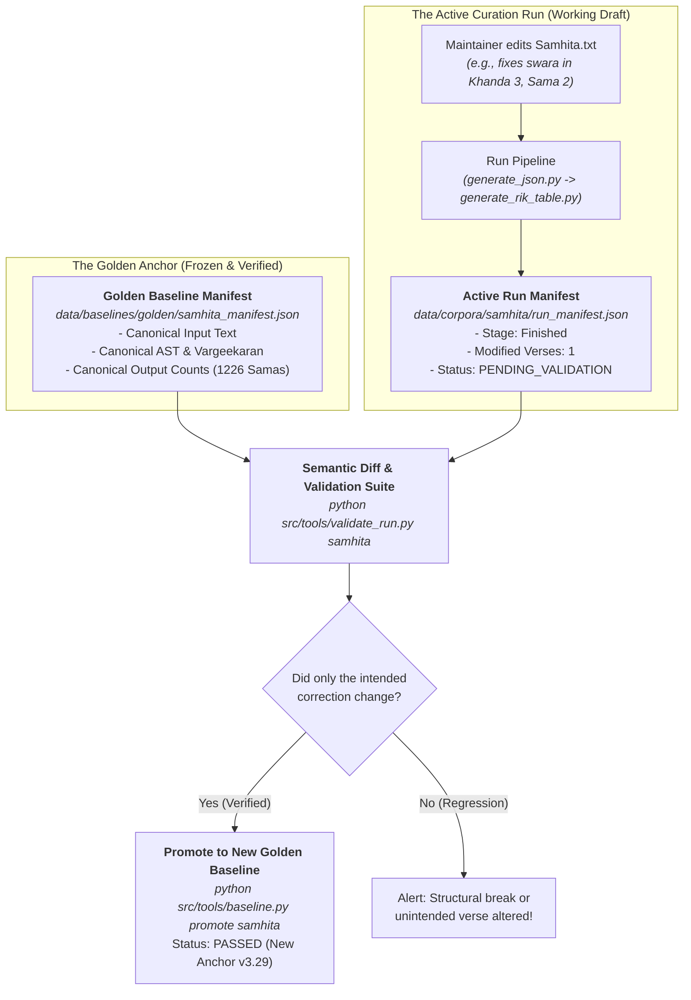

# Jaimineeya Samaveda Pipeline — Verification & Non-Regression Cookbook

**Target Audience**: Developers, maintainers, and reviewers working on the JSV pipeline.  
**Primary Purpose**: Step-by-step verification protocols to guarantee that code refactoring, script updates, or text edits introduce **zero liturgical regressions**, **zero accent drift**, and **zero numbering breaks**.

---

## ⚡ The 10-Second Quick Health Check

Before making any git commit or after pulling changes, run the automated regression suite:

```bash
python src/tools/run_regression_suite.py
```

### Expected Output:
```text
============================================================
  JAIMINEEYA SAMAVEDA - REGRESSION VERIFICATION SUITE
============================================================
  Checking: 1. Domain Invariants (6 Pathas, 59 Khandas, 1226 Samas) [PASS]
  Checking: 2. Typed AST Lossless Roundtrip.............. [PASS]
  Checking: 3. Swara Engine & Visarga-Accent Rules....... [PASS]
  Checking: 4. Structural Tag Balance & Integrity........ [PASS]
  Checking: 5. 3-Tier Version & Build Metadata........... [PASS]
  Checking: 6. Active Baseline Input Checksums........... [PASS]
  Checking: 7. Modular Rendering Engines................. [PASS]

============================================================
  VERIFICATION SUMMARY
============================================================
  ALL 7/7 INVARIANT CHECKS PASSED!
  No regressions detected. Repository is liturigically sound.
============================================================
```

> [!TIP]
> If all 7 checks show `[PASS]`, the fundamental liturgical invariants of the codebase are fully intact.

---

## 🧭 "Where Did We Leave Off?" Dashboard

Whenever you return to the repository after days, weeks, or months, run:

```bash
python src/tools/check_status.py
```

### What It Reports:
1. **Current Git Branch & Commit**: Confirms you are on branch `refactor` and shows if working tree has untracked/dirty files.
2. **Active Baseline Manifest**: Displays the active baseline name, date recorded, and git hash.
3. **Staleness / Drift Check**: Alerts you if master input files (`data/input/Samhita_corrected.txt`, etc.) or output files have changed compared to the active baseline.
4. **Recommended Next Actions**: Suggests immediate CLI commands to execute.

---

## 🔬 Step-by-Step Manual Verification Checklist

For deep regression audits during major refactoring phases (e.g. Phase 2 Renderer decomposition or Phase 4 Renumbering), execute each stage in order:

### Stage 1: Domain Metric & Structural Invariants
Verify that the macro structure matches the liturgical gold standard:

```bash
python src/generate_json_summary.py
```

- [ ] **Pathas**: Exactly **6**
- [ ] **Khandas**: Exactly **59**
- [ ] **Samas**: Exactly **1226** (including compound / split sub-verses)
- [ ] Summary CSV matches: `data/output/JSV_Structure_Summary.csv`

---

### Stage 2: Structural Tag Balance Check
Verify that all `# Start of` and `# End of` tags in master texts are balanced and uncorrupted:

```bash
python src/tools/renumber_sooktam.py data/input/Samhita_corrected.txt --type samhita --no-increment --no-renumber
```

- [ ] Output confirms: `Structural Integrity Check...` with **zero tag mismatches** and **zero unclosed tags**.

---

### Stage 3: JSON AST Invariance & Golden Diff
Regenerate the canonical JSON AST from the source text and verify structural equivalence:

```bash
python src/generate_json.py data/input/Samhita_corrected.txt --type samhita
```

Compare the generated JSON against the active baseline:
```bash
python src/tools/baseline.py status
```

- [ ] `data/output/Samhita_corrected_out.json` shows `[MATCH]`.
- [ ] Round-trip validation via Typed AST:
  ```bash
  python -c "from src.core.models import VedicDocument; import json; doc = VedicDocument.from_dict(json.load(open('data/output/Samhita_corrected_out.json', encoding='utf-8'))); assert len(doc.supersections) == 6; print('VedicDocument AST Valid!')"
  ```

---

### Stage 4: Rik Table & Vargeekaran Reconciliation
Verify that the Rik metadata mapping, Devata/Rishi reconciliation, and Vargeekaran structures build properly:

```bash
python src/generate_rik_table.py --type samhita
```

Check continuity across all 1226 Samas:
```bash
python src/tools/check_continuity.py data/output/Vargeekaran.json
```

- [ ] Generated files exist: `data/output/JSV_Rik_Table.csv` and `data/output/Vargeekaran.json`.
- [ ] Total Samams reported: **1226**.

---

### Stage 5: Multi-Format Rendering (LaTeX, PlainText & Kodunthirapully)
Verify that the rendering layer compiles without template or syntax errors:

```bash
# 1. Standard Devanagari Combined Render (LaTeX + PlainText)
python src/render_pdf.py data/output/Vargeekaran.json --type samhita --output-mode combined

# 2. Kodunthirapully Swara Stacking Mode (-kpully)
python src/render_pdf.py data/output/Vargeekaran.json -kpully
```

- [ ] Generated files exist in `data/output/pdf/Devanagari/` and `data/output/txt/Devanagari/`.
- [ ] `.tex` output compiles without LuaLaTeX/XeLaTeX macro errors.
- [ ] Unicode accents (Swarita `॑`, Anudatta `॒`, Kampa `᳸`) and Visarga-accent ordering (`ः॑` / `(1)ः`) match baseline exactly.

---

### Stage 6: Static Website & Search Index Integrity
Verify that the GitHub Pages documentation site (`docs/`) builds cleanly:

```bash
python src/generate_website.py --samhita
python src/generate_website.py --aaranam
```

- [ ] `docs/samhita/index.html` and `docs/aaranam/index.html` generated.
- [ ] `docs/samhita/search_index.json` generated and valid JSON.
- [ ] P.K.S (Parva.Kandah.Samam) anchor navigation links function in browser.

---

### Stage 7: Automated 3-Tier Versioning Verification
Verify that software modifications do not falsely inflate corpus edition numbers:

```bash
python -c "from src.core.version import get_engine_version, get_corpus_edition, get_build_metadata; print('Engine:', get_engine_version()); print('Edition:', get_corpus_edition('samhita')); meta = get_build_metadata('samhita', 'data/input/Samhita_corrected.txt'); print('Input SHA:', meta['input_sha256'][:16]); assert meta['version'] == '3.28'"
```

- [ ] Engine version reflects git tag & commit (e.g. `v4.0.0+<commit>`).
- [ ] Corpus edition matches `src/pipeline_config.yaml` (`samhita: 3.28`).
- [ ] Input file SHA-256 fingerprint is embedded in metadata.

---

---

## 🏛️ The Two-Manifest Architecture (Golden Anchor vs. Active Run)

In active liturgical curation, source texts are **meant to change**. If verification tools merely flag bitwise hash mismatches, maintainers suffer from **alert fatigue** and begin ignoring warnings.

To provide true confidence without alert fatigue, the pipeline separates the **Golden Baseline Anchor** from the **Active Curation Run**:



---

## 🔁 Two Distinct Verification Workflows

Depending on whether you are **refactoring code** or **curating text**, follow the corresponding protocol:

### Protocol A: Engine Refactoring Verification (Code Changed, Input Unchanged)
Use when modifying parsers, renderers, or build scripts to prove zero regressions against known-good inputs:

1. **Quick Health Check (7 Invariants)**:
   ```bash
   python src/tools/run_regression_suite.py
   ```
2. **Golden AST Replica Check**:
   ```bash
   python src/tools/baseline.py verify
   ```
   - Re-executes `generate_json.py` and `generate_rik_table.py` from scratch on frozen golden inputs.
   - Normalizes volatile build metadata timestamps (`generated_at`).
   - Asserts **100% semantic AST equivalence** against `data/baselines/LATEST.json`.

---

### Protocol B: Active Text Curation Workflow (Input Edited)
Use when correcting accents, modifying swaras, or editing verses in canonical texts:

1. **Edit Source Text**:
   - Edit verse in `data/input/Samhita_corrected.txt` (or `data/corpora/samhita/01_input/Samhita.txt`).
2. **Run Corpus Pipeline**:
   ```bash
   python src/generate_json.py data/input/Samhita_corrected.txt --type samhita
   python src/generate_rik_table.py --type samhita
   ```
3. **Run Semantic Curation Audit**:
   ```bash
   python src/tools/validate_run.py samhita
   ```
   **Expected Output**:
   ```text
   ================================================================================
     SAMHITA CURATION AUDIT vs GOLDEN BASELINE (v3.28)
   ================================================================================
     [MACRO INVARIANTS]
     - Pathas : 6 / 6   [MATCH]
     - Khandas: 59 / 59 [MATCH]
     - Samas  : 1226    [MATCH]

     [CONTENT MODIFICATIONS: 1 VERSE]
     - Khanda 3, SubSection 2 (Sama 2):
         Baseline: अग्नआयाहीवा(तू) इताया(ति)...
         Run     : अग्नआयाहीवा(यू) ता(प) ये(श)...
     - Remaining 1,225 Samas: [IDENTICAL]

     [STATUS]: ALL MACRO INVARIANTS PRESERVED. 1 INTENDED CORRECTION IDENTIFIED.
   ================================================================================
   ```
4. **Promote to New Golden Baseline (Once Verified)**:
   ```bash
   python src/tools/baseline.py promote samhita -m "Corrected swara in K3.S2"
   ```
   - Updates the Golden Baseline Anchor.
   - Sets run manifest status to `PASSED`.
   - Clears alerts for future runs.

---

## 🛠️ Complete Refactoring & Validation Step-by-Step Checklist

When refactoring code or updating input texts, follow this complete 5-step checklist:

### Step 1: Run the Automated 7-Point Health Check
```bash
python src/tools/run_regression_suite.py
```
*Validates 6 Pathas, 59 Khandas, 1226 Samas, Typed AST models, Swara Visarga-accent ordering rules, and tag balance.*

### Step 2: Perform End-to-End Golden Replica Verification
```bash
python src/tools/baseline.py verify
```
*Re-runs the pipeline from scratch on golden inputs and asserts 100% semantic AST parity against `LATEST.json`.*

### Step 3: Check Verse Continuity
```bash
python src/tools/check_continuity.py data/output/Vargeekaran.json
```
*Verifies that Sama numbers within every section run sequentially (`1, 2, 3...`) with zero gaps or duplicate verse numbers.*

### Step 4: Check Domain Metrics Summary
```bash
python src/generate_json_summary.py
```
*Confirms exact macro counts across all 6 Pathas and 59 Khandas.*

### Step 5: Freeze a New Baseline Snapshot (After Verified Milestone Changes)
```bash
python src/tools/baseline.py create baseline-<date>-<milestone> -d "Description of milestone"
```

---

## 🛠️ Regression Troubleshooting Guide

| Symptom | Probable Cause | Action to Resolve |
|---|---|---|
| `Total Samas != 1226` | Verse delimiter tag (`॥ N ॥`) missing, malformed, or split line | Run `python src/tools/check_continuity.py data/output/Vargeekaran.json` and check reported line |
| `Unclosed structural tags` | Missing `# End of SubSection` or Section boundary tag in input text | Run `python src/ingest/renumber.py data/input/Samhita_corrected.txt` to see exact line number |
| `Dotted circle on Visarga (ः) or Anusvara (ं)` | Accent combining mark placed before base character | Run `from src.core.swara_engine import fix_visarga_accent_order` on target text |
| `Baseline status shows [MODIFIED]` | Input or output file changed since last snapshot | Run `python src/tools/baseline.py verify` to check if change was intentional AST edit or unintended regression |

