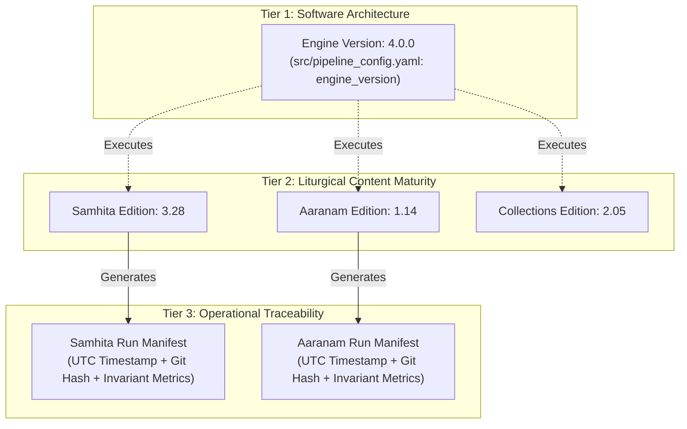
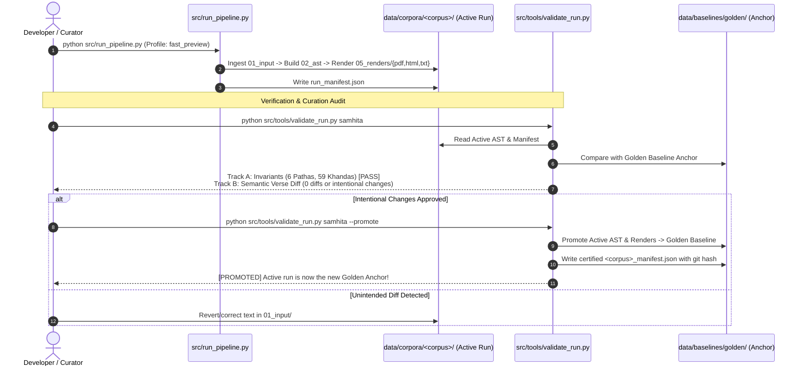

# Jaimineeya Samavedam — Versioning Scheme, Corpus Architecture & Promotion Workflow

---

## 1. Executive Summary

This document serves as the canonical reference for:
1. **The 3-Tier Numbering & Versioning Scheme** (Engine, Corpus Editions, and Active Run Manifests).
2. **The Connection between Active Runs, Corpora, and Golden Baselines**.
3. **The Workflow for Automatic vs. Manual Version Updates and Baseline Promotion**.
4. **How Render Profiles and the Decoupled Renderer fit into this ecosystem**.

---

## 2. The 3-Tier Versioning & Numbering Scheme

The project enforces three strictly decoupled versioning tiers to prevent version coupling between unrelated texts and the software engine:



### Tier 1: Engine Version (`engine_version: "4.0.0"`)
* **Location**: Defined in [`src/pipeline_config.yaml`](file:///c:/Users/sekha/OneDrive/Documents/GitHub/jaimineeyasamavedam/src/pipeline_config.yaml) under `project.engine_version`.
* **Scope**: Represents the software pipeline codebase: parsers (`generate_json.py`), rendering engines (`render_pdf.py`, `html_renderer`, `latex_renderer`), validation tools (`validate_run.py`), and Jinja typography filters.
* **Update Frequency**: Infrequent. Updated when architectural features, AST schema changes, or new export formats are implemented.

### Tier 2: Corpus Editions (`editions:` block in `pipeline_config.yaml`)
* **Location**: Centralized in [`src/pipeline_config.yaml`](file:///c:/Users/sekha/OneDrive/Documents/GitHub/jaimineeyasamavedam/src/pipeline_config.yaml) and mirrored in [`src/VERSION`](file:///c:/Users/sekha/OneDrive/Documents/GitHub/jaimineeyasamavedam/src/VERSION):
  ```yaml
  editions:
    samhita: "3.28"
    aaranam: "1.14"
    collections: "2.05"
  ```
* **Scope**: Represents the editorial and textual maturity of each sacred text corpus independently.
* **Why Decoupled**: Textual curation in Aaranam (e.g., correcting an accent in Aranyaka Samams) should bump Aaranam from `1.14` to `1.15` without artificially bumping Samhita (which remains stable at `3.28`).

### Tier 3: Active Run / Manifest Version (`run_manifest.json`)
* **Location**: Located inside each corpus directory:
  * `data/corpora/samhita/run_manifest.json`
  * `data/corpora/aaranam/run_manifest.json`
  * `data/corpora/collections/run_manifest.json`
* **Scope**: Provides immutable operational provenance for every pipeline build. Contains:
  * Generation UTC timestamp (`ISO 8601`).
  * Exact Git commit hash and working tree dirty status.
  * Active build profile used (`fast_preview`, `standard`, etc.).
  * Liturgical domain metrics (Pathas, Khandas, Samas).
  * Checksums (SHA-256) of input files, generated AST, and render files.

---

## 3. Directory Domains: Golden Baselines, Corpora, and Archives

The repository strictly separates immutable baselines from active working spaces and historical archives:

```text
jaimineeyasamavedam/
│
├── data/
│   ├── baselines/
│   │   └── golden/                     <--- [ANCHOR] Immutable certified peer-reviewed baselines
│   │       ├── Devanagari/
│   │       │   ├── samhita/
│   │       │   │   ├── input/          <--- Canonical Source Text: Samhita_Devanagari_Unicode.txt
│   │       │   │   └── output/         <--- Certified Golden ASTs and Renders
│   │       │   ├── aaranam/
│   │       │   │   └── input/          <--- Canonical Source Text: Aaranam_latest.txt
│   │       │   └── collection/
│   │       │       └── input/          <--- Canonical Filter Sets & Texts
│   │       ├── Malayalam/
│   │       │   └── samhita/
│   │       │       └── input/          <--- Canonical Malayalam Text: Samam_Malayalam_Unicode.txt
│   │       └── samhita_manifest.json   <--- Golden Certification Manifest
│   │
│   ├── corpora/                        <--- [ACTIVE RUNS] Stage-numbered production directories
│   │   ├── samhita/
│   │   │   ├── 01_input/               <--- Working input text and metadata tables
│   │   │   ├── 02_ast/                 <--- Active generated JSON AST (Samhita_corrected_out.json)
│   │   │   ├── 03_reconciliation/      <--- Cross-reference tables & CSVs
│   │   │   ├── 04_curated/             <--- Curated extracts (Ashirvachana, etc.)
│   │   │   ├── 05_renders/             <--- Partitioned strictly by format (NO loose root files!)
│   │   │   │   ├── pdf/
│   │   │   │   ├── html/
│   │   │   │   └── txt/
│   │   │   ├── 06_reports/             <--- Continuity audits and structural reports
│   │   │   └── run_manifest.json       <--- Active Run Manifest
│   │   ├── aaranam/                    <--- Same 6-stage layout for Aaranam
│   │   └── collections/                <--- Same 6-stage layout for Collections
│   │
│   └── archive/
│       └── legacy_2026/                <--- [VAULT] Archived temporary, test, and legacy scratch files
│
└── src/
    ├── pipeline_config.yaml            <--- Master Configuration (profiles, paths, editions)
    ├── run_pipeline.py                 <--- Master Runner with profile support
    ├── render_pdf.py                   <--- Decoupled Renderer (Zero YAML dependency)
    └── tools/
        ├── validate_run.py             <--- Dual-Track Validator & Golden Promotion Tool
        ├── run_regression_suite.py     <--- 8/8 Invariant Health Check Suite
        └── migrate_corpora_and_archive.py
```

---

## 4. Connection Between Active Runs and Golden Baselines



### The Dual-Track Validation Protocol (`validate_run.py`)
When `python src/tools/validate_run.py <corpus>` runs:
1. **Track A (Engine Invariance)**:
   - Validates macro domain counts: Pathas (6 for Samhita, 6 for Aaranam), Khandas (59 for Samhita, 25 for Aaranam).
   - Verifies AST structural tag integrity and absence of malformed tags.
2. **Track B (Semantic Curation Diff)**:
   - Compares the active run AST against the golden anchor verse-by-verse.
   - If 100% identical: reports `[PERFECT GOLDEN MATCH]`.
   - If verses were edited: prints a precise, colored word-level diff of the active verse vs. golden baseline verse.

---

---

## 5. Workflow for Version Changes: Text, Code, and Formatting

### A. The Crucial Distinction: Sacred Text vs. Presentation & Formatting

A foundational principle of the Jaimineeya Samavedam architecture is the **strict separation between liturgical text content and presentation styling**:

1. **Sacred Text Content (Tier 2: Corpus Editions)**:
   - Covers the mantras, padapatha, aksharas, swara characters, and liturgical footnotes located in `data/input/` (and staged in `01_input/`).
   - Represents the editorial correctness of the Vedic text.
   - Bumping an edition (e.g. Samhita `3.28` $\rightarrow$ `3.29`) signals to scholars and practitioners that **textual, orthographic, or swara corrections were made to the liturgical chants**.
   - **Note on `renumber_sooktam.py`**: While this tool has a built-in `--increment` flag, it is designed for specialized indexing workflows (such as custom extracts and curated collections). It is **not** the general automated driver for canonical Samhita/Aaranam edition upgrades. Canonical editions are managed as deliberate editorial milestones.

2. **Presentation & Typography (Tier 1: Engine & Templates)**:
   - Covers files in `templates/html/*_main*template`, `templates/latex/*.template`, `Malayalam_JSV/curation_tool/static/style.css`, and custom Vedic fonts.
   - Modifying CSS, fine-tuning swara modifier coordinates (e.g. `mod-c`, `mod-e`, `mod-comma`), adjusting font scales, or updating page margins is **presentation logic**.
   - **A template or formatting change NEVER increments the Corpus Edition (Tier 2)**. Doing so would falsely imply that the underlying sacred mantra text was edited.

---

### B. Where are Formatting and Template Changes Captured?

When you modify any `*_main*template`, CSS rule, or font configuration, the changes are captured automatically in two places:

1. **In Tier 1: The Engine Version (`get_engine_version()`)**:
   - The template directory (`templates/`) is tracked directly under Git version control.
   - As soon as a template file is edited, `get_engine_version()` automatically detects the uncommitted state:
     $$\text{Engine Version: } \mathbf{v4.0.0+\langle\text{git-commit}\rangle\text{-dirty}}$$
   - Once committed to Git, the commit hash updates automatically:
     $$\text{Engine Version: } \mathbf{v4.0.0+\langle\text{new-commit-hash}\rangle}$$
   - This provides exact cryptographic traceability linking every generated document to the precise Git commit of the template that rendered it.

2. **In Tier 3: The Active Run Manifest (`run_manifest.json`)**:
   - When `python src/run_pipeline.py` executes, it re-renders the output HTML and PDF files in `05_renders/{html,pdf}/`.
   - The operational manifest [`data/corpora/<corpus>/run_manifest.json`](file:///c:/Users/sekha/OneDrive/Documents/GitHub/jaimineeyasamavedam/data/corpora/samhita/run_manifest.json) automatically records:
     - The exact compilation **Timestamp**
     - The active **Git Commit and Dirty Status**
     - The new **SHA-256 Checksums** of the generated render files (`render_checksums`)
   - If someone compares a newly rendered HTML file against an older render, the change is immediately verified through its manifest hash and generation timestamp.

3. **In the Rendered Artifacts (Headers & Footers)**:
   - Output HTML footers and PDF title pages clearly display both dimensions side-by-side:
     > **Samhita Edition 3.28 · Engine v4.0.0+40103cb9 · Generated 28-09-2026**
   - Practitioners can immediately see that the text is **Edition 3.28**, rendered with **Engine revision `40103cb9`**.

---

### C. Version Change Decision Matrix

| Type of Modification | Target Files | Tier 1: Engine | Tier 2: Corpus Edition | Tier 3: Run Manifest |
| :--- | :--- | :--- | :--- | :--- |
| **Mantra / Swara Correction** | `data/input/*.txt`<br/>`01_input/*.txt` | Unchanged (unless code changed) | **Bumped upon milestone** (`3.28` $\rightarrow$ `3.29`) | **Regenerated** (new input & AST SHA-256) |
| **Formatting / CSS / Swara Position** | `templates/*_main*template`<br/>`curation_tool/static/style.css` | **Auto-tagged** (`-dirty` $\rightarrow$ new Git commit SHA) | **Unchanged** (sacred text is identical) | **Regenerated** (new render file SHA-256) |
| **Parser / AST Schema Logic** | `src/generate_json.py`<br/>`src/core/ast_models.py` | **Auto-tagged** (SemVer bumped if breaking: `4.1.0`) | **Unchanged** | **Regenerated** (new AST & render SHA-256) |
| **Routine Pipeline Re-run** | (No source code changes) | Identical | Identical | **Regenerated** (new build timestamp & verified passes) |
| **Baseline Promotion** | `validate_run.py --promote` | Frozen into manifest | Frozen into golden anchor | **Marked `PROMOTED`** in golden manifest |

---

### D. Summary of Automatic vs. Manual Updates

#### 1. Automatic Updates (Occur without manual intervention)
* **Git Hash & Working Tree Dirty Flag**: `get_engine_version()` runs live `git rev-parse` and `git status` on every build and test.
* **Manifest Generation**: `run_manifest.json` is stamped with timestamps, hashes, and metrics on every run of `run_pipeline.py`.
* **Output Staging**: Renders are organized into `05_renders/{pdf,html,txt}/` with zero loose files.
* **Metadata Cascading**: Parsers automatically read `# [JSV METADATA]` from source texts and cascade version numbers into AST JSONs, HTML chips, and PDF metadata.

#### 2. Manual Updates (Intentional human milestones)
* **Corpus Edition Release**: Changing `editions.samhita` in `src/pipeline_config.yaml` after completing an editorial proofreading pass.
* **Baseline Promotion**: Running `python src/tools/validate_run.py samhita --promote` to certify the active run as the new peer-reviewed anchor.
* **Engine Major/Minor Upgrade**: Bumping `project.engine_version` in `pipeline_config.yaml` (e.g. `4.0.0` $\rightarrow$ `4.1.0`) when major software refactoring is completed.

---

## 6. Render Profiles & Decoupled Renderer Integration

### A. Named Render Profiles (`pipeline_config.yaml`)
To eliminate repetitive manual CLI arguments, standard render combinations are encapsulated into named profiles:

```yaml
active_profile: "fast_preview"

render_profiles:
  fast_preview:
    description: "Fast curation iteration in Kodunthirapully mode (HTML & TXT only, skips slow PDF LaTeX)"
    corpora: ["samhita"]
    modes: ["combined"]
    formats: ["html", "txt"]
    kpully: true

  standard:
    description: "Standard publication set (PDF + HTML for active texts)"
    corpora: ["samhita", "aaranam"]
    modes: ["combined"]
    formats: ["pdf", "html"]
    kpully: false

  chanting:
    description: "Practitioner chanting editions (NoMeta, swaras above/below)"
    corpora: ["samhita"]
    modes: ["nometa"]
    formats: ["pdf", "html"]
    kpully: true

  full_release:
    description: "Complete formal release suite (All corpora, all modes, PDF/HTML/TXT)"
    corpora: ["samhita", "aaranam", "collections"]
    modes: ["combined", "separate", "nometa"]
    formats: ["pdf", "html", "txt"]
    kpully: true
```

### B. Command-Line Usage:
* **Run Active Default (`fast_preview`)**:
  ```powershell
  python src/run_pipeline.py
  ```
  *Executes in ~4.8 seconds*, compiling Devanagari and Malayalam KPully HTML and TXT formats without waiting for XeLaTeX.
* **Run Any Profile**:
  ```powershell
  python src/run_pipeline.py -p standard
  python src/run_pipeline.py -p chanting
  python src/run_pipeline.py -p full_release
  ```
* **Inspect Profiles**:
  ```powershell
  python src/run_pipeline.py --list-profiles
  ```

### C. Zero-YAML Decoupling for `render_pdf.py`
* `render_pdf.py` is an independent, pure rendering engine.
* It does **not** read or depend on any `.yaml` configuration files.
* All parameters are passed directly via CLI flags by `run_pipeline.py` or manually by the user, with built-in fallbacks to standard templates and output directories.

---

## 7. Quick Reference: End-to-End Curation Cheatsheet

```powershell
# 1. Edit source text in working directory or 01_input/
# (e.g. data/corpora/samhita/01_input/Samhita_Devanagari_Unicode.txt)

# 2. Run fast preview to check rendering and swaras in browser:
python src/run_pipeline.py

# 3. Check liturgical non-regression:
python src/tools/run_regression_suite.py

# 4. Perform dual-track validation against golden baseline:
python src/tools/validate_run.py samhita

# 5. If curation changes are verified and intended, promote to golden baseline:
python src/tools/validate_run.py samhita --promote

# 6. Generate full release when milestone is complete:
python src/run_pipeline.py -p full_release
```
