# Jaimineeya Samavedam Pipeline — Complete Workflows Guide

**Target Scope**: Comprehensive guide to the data transformation pipelines in `jaimineeyasamavedam`.  
**Audience**: Maintainers, editors, and software developers working on liturgical text curation and publication.  
**Companion Documents**: [`VERIFICATION_COOKBOOK.md`](../VERIFICATION_COOKBOOK.md) · [`refactoring_spec.md`](../src/tools/refactoring_spec.md)

---

## 1. Architectural Overview & Workflow Comparison

The Jaimineeya Samavedam (JSV) toolchain operates under two fundamentally different operational models:

1. **The Initial Ingestion Workflow (`--input-mode initial`)**:
   - Used **only when onboarding or bootstrapping** a brand-new corpus from disparate, unaligned raw source files.
   - Merges fragmented text files, separate Rik metadata lists, and Saman lists into a unified initial AST and a single consolidated Unicode markup text.

2. **The Correction & Publishing Workflow (`--input-mode correction`, DEFAULT)**:
   - The **standard day-to-day production workflow** for maintaining and publishing the canonical corpus.
   - Uses a **single master Unicode text file** as the absolute source of truth.
   - Enriches the parsed text with human reconciliation tables and builds all publication targets (static website, XeLaTeX/LuaLaTeX PDFs, Kodunthirapully swara layouts, and plaintext).

```mermaid
graph TD
    subgraph "WORKFLOW 1: INITIAL INGESTION (--input-mode initial)"
        RawText["Raw Vedic Text<br/><i>data/input/vedic_text.txt</i>"]
        RikMeta["Rik Metadata<br/><i>data/input/rishi_devata_chandas_for_rik.txt</i>"]
        SamaMeta["Sama Metadata<br/><i>data/input/sama_rishi_chandas_out.txt</i>"]
        PrayogaIdx["Prayoga Index<br/><i>data/input/prayoga/prayoga_index.yaml</i>"]
        
        RawText --> InitParser["<b>convert_corrections_to_json()</b><br/><i>src/generate_json.py --input-mode initial</i>"]
        RikMeta --> InitParser
        SamaMeta --> InitParser
        PrayogaIdx --> InitParser
        
        InitParser --> InitialAST["Initial AST JSON<br/><i>data/output/Samhita_corrected_out.json</i>"]
        InitParser --> ConsolidatedText["<b>Consolidated Master Text</b><br/><i>data/input/Samhita_corrected.txt</i>"]
    end

    subgraph "WORKFLOW 2: CORRECTION & PUBLISHING (DEFAULT)"
        MasterText["<b>Master Source of Truth</b><br/><i>data/input/Samhita_corrected.txt</i>"]
        --> Preflight["<b>Stage 2: Tag Integrity Pre-flight</b><br/><i>src/tools/renumber_sooktam.py --no-increment --no-renumber</i>"]
        --> CorrParser["<b>Stage 3: AST Generation</b><br/><i>src/generate_json.py --type samhita (default)</i>"]
        
        CorrParser --> AstJSON["Parsed AST<br/><i>data/output/Samhita_corrected_out.json</i>"]
        
        AstJSON --> ReconEngine["<b>Stage 4: Rik Reconciliation</b><br/><i>src/generate_rik_table.py --type samhita</i>"]
        ReconExcel["Human Reconciliation Asset<br/><i>data/output/Rik Reconciliation table (JSV-KSV).xlsx</i>"] --> ReconEngine
        
        ReconEngine --> Vargeekaran["<b>Canonical AST (Vargeekaran.json)</b><br/>+ JSV_Rik_Table.csv"]
        
        Vargeekaran --> Audit["<b>Stage 5: Macro Verification & Continuity</b><br/><i>src/generate_json_summary.py</i><br/>(Asserts 6 Pathas, 59 Khandas, 1226 Samas)"]
        
        Vargeekaran --> SiteGen["<b>Stage 6A: Website Generator</b><br/><i>src/generate_website.py --samhita</i><br/>-> docs/samhita/ (722 Search Items)"]
        Vargeekaran --> PDFGen["<b>Stage 6B: PDF & PlainText Renderer</b><br/><i>src/render_pdf.py (Combined, -kpully, Separate)</i><br/>-> data/output/pdf/ & data/output/txt/"]
    end
```



---

## 2. Workflow 1: Initial Ingestion Workflow (`--input-mode initial`)

### Purpose
Historically, the Jaimineeya Samavedam materials existed in fragmented, unaligned files: raw text OCR dumps, independent lists of Riks with Rishi/Devata/Chandas, and separate Saman indices. The **Initial Ingestion Workflow** automates the alignment and unification of these independent source assets.

### Input Files Required
| Asset | Default Path | Description |
|---|---|---|
| **Raw Vedic Text** | `data/input/vedic_text.txt` | Unannotated Devanagari verse lines and section delimiters. |
| **Rik Metadata** | `data/input/rishi_devata_chandas_for_rik.txt` | Tabular classification mapping Rik IDs to Rishi, Devata, and Chandas. |
| **Saman Metadata** | `data/input/sama_rishi_chandas_out.txt` | Sequence of Saman names, IDs, and traditional annotations. |
| **Prayoga Linking** | `data/input/prayoga/prayoga_index.yaml` | Hierarchical mapping linking ritual procedure files to Kandas/Samas. |

### Execution Command
```bash
python src/generate_json.py --type samhita --input-mode initial
```

### Internal Processing Steps
1. **`RikMetadataParser`**: Tokenizes multi-attribute lines into structured metadata objects, handling parentheses, ranges, and section overrides.
2. **`RikTextParser`**: Scans the raw Vedic text, identifying section boundaries and mapping isolated verse blocks.
3. **`SamanMetadataParser`**: Correlates the sequential stream of Samans with the underlying Rik text.
4. **`step_preprocess_visarga_accent`**: Corrects Devanagari Unicode combining character order (ensures Halants, Ardhaksharas, and Visargas precede accents).
5. **`extract_closing_mantras`**: Extracts concluding Mangala Shlokas and stamps them into top-level metadata.

### Output Produced
- `data/output/Samhita_corrected_out.json`: The assembled Abstract Syntax Tree (AST).
- `data/input/Samhita_corrected.txt`: A single, consolidated Unicode markup text with all headers, subsections, delimiters (`॥ N ॥`), and embedded metadata.

> [!NOTE]
> Once `Samhita_corrected.txt` is generated, **Workflow 1 is retired for that corpus**. All subsequent editorial and publishing work transitions permanently to **Workflow 2 (Correction Workflow)**.

---

## 3. Workflow 2: Correction & Publishing Workflow (Default)

### Purpose
This is the primary production workflow for the Jaimineeya Samavedam. In this mode, editors edit **one canonical text file** (`data/input/Samhita_corrected.txt`). The pipeline parses this file, merges it with curated reconciliation workbooks, and compiles all downstream publication targets.

### Input Files Required
| Asset | Default Path | Nature | Description |
|---|---|---|---|
| **Canonical Source Text** | `data/input/Samhita_corrected.txt` | Single Source of Truth | 836 KB text file with 5,263 lines of structured Vedic markup. |
| **Reconciliation Workbook** | `data/output/Rik Reconciliation table (JSV-KSV).xlsx` | Human Editorial Asset | 587 curated entries mapping JSV Samams to Kauthuma Samaveda (KSV) parallels. |

---

### Step-by-Step Production Pipeline

#### Stage 1: Source Text Curation
Maintainers make corrections directly in `data/input/Samhita_corrected.txt`:
- Correcting Vedic accents: Swarita (`॑` / U+0951), Anudatta (`॒` / U+0952), Kampa (`᳸` / U+1CF8), Trikampa (`३॑`).
- Adjusting verse delimiters: `॥ १ ॥`, `॥ २ ॥`.
- Modifying subsection headers: `# SubSection: ...`.

#### Stage 2: Structural Tag Integrity Pre-flight Check
Before parsing, verify that all structural tags (`# Start of SuperSection`, `# Start of Section`, `# End of SubSection`) are perfectly balanced:
```bash
python src/tools/renumber_sooktam.py data/input/Samhita_corrected.txt --type samhita --no-increment --no-renumber
```
- **Verification Rule**: Must report `Structural Integrity Check...` with **zero tag mismatches** and **zero unclosed tags**.

#### Stage 3: Generate Canonical JSON AST
Parse the unified markup into the formal AST schema:
```bash
python src/generate_json.py data/input/Samhita_corrected.txt --type samhita
```
- **CLI Options**: `--type samhita` (default), `--output <path>` (optional override).
- **Execution Time**: ~0.4 seconds.
- **Output**: `data/output/Samhita_corrected_out.json` (1.45 MB, 6 Pathas, 59 Khandas, 722 SubSections).

#### Stage 4: Reconcile with Rik Metadata & Build Canonical Vargeekaran
Merge the AST with the human-curated JSV-KSV reconciliation workbook:
```bash
python src/generate_rik_table.py --type samhita
```
- **CLI Options**: 
  - `-e, --excel`: Override reconciliation spreadsheet.
  - `-j, --json_out`: Override Vargeekaran JSON path.
  - `-o, --output`: Override CSV path.
  - `--no-enrich`: Skip Excel lookup and rely only on resident JSON metadata.
- **Execution Time**: ~17 seconds (due to openpyxl Excel parsing).
- **Outputs**:
  - `data/output/Vargeekaran.json`: The fully reconciled canonical AST (2.0 MB).
  - `data/output/JSV_Rik_Table.csv`: Tabular export with 722 unique Rik rows.
  - `data/output/JSV_Rik_Table.xlsx`: Formatted spreadsheet version.

#### Stage 5: Structural Summary & Liturgical Invariant Audit
Audit the generated Vargeekaran to ensure no verses or chapters were dropped or duplicated:
```bash
# 1. Macro counts across all 6 Pathas and 59 Khandas
python src/generate_json_summary.py

# 2. Sequential continuity check across all 1226 Samas
python src/tools/check_continuity.py data/output/Vargeekaran.json
```
- **Mandatory Liturgical Invariants**:
  - **Pathas (SuperSections)**: Exactly **6**
  - **Khandas (Sections)**: Exactly **59**
  - **SubSections**: Exactly **722**
  - **Liturgical Samas**: Exactly **1226**
  - **Continuity**: Zero missing verse numbers, zero duplicate verse numbers.

#### Stage 6: Multi-Target Publishing

##### Target 6A: Static Documentation Website (`docs/samhita/`)
```bash
python src/generate_website.py --samhita
```
- **Outputs**:
  - `docs/samhita/index.html`: Responsive homepage with navigation and Suchi.
  - `docs/samhita/kandah/`: Individual HTML pages for each Khanda.
  - `docs/samhita/search-index.js`: Lunr.js search index containing 722 searchable verse records.
  - `docs/samhita/classification/`: Indices for Rishi, Devata, Chandas, and Anukramanika.

##### Target 6B: XeLaTeX / LuaLaTeX PDF Publication
```bash
# Standard layout (swara markings below mantra text)
python src/render_pdf.py data/output/Vargeekaran.json --type samhita --output-mode combined

# Kodunthirapully paddhati (-kpully: swara markings placed directly ABOVE mantra text)
python src/render_pdf.py data/output/Vargeekaran.json -kpully
```
- **Outputs**:
  - `.tex` source files and compiled `.pdf` documents in `data/output/pdf/Devanagari/`.
  - Supports `--pdf-color-mode bw` or `color`.

##### Target 6C: PlainText Unicode Export
```bash
python src/render_pdf.py data/output/Vargeekaran.json --type samhita --output-mode separate
```
- **Outputs**: Clean `.txt` files in `data/output/txt/Devanagari/` (Combined, Rik-only, Samam-only, and Nometa).

---

## 4. Building & Verifying the Initial Golden Baseline

To establish rigorous non-regression guarantees, the repository maintains an isolated, frozen **Golden Baseline Anchor**:

### Golden Baseline Directory Hierarchy
```text
data/baselines/golden/
├── samhita/
│   ├── inputs/
│   │   ├── Samhita_corrected.txt                  (836,261 bytes | SHA: 737facc9...)
│   │   └── Rik Reconciliation table (JSV-KSV).xlsx (3,019,400 bytes | SHA: fffb8ca9...)
│   └── outputs/
│       ├── Samhita_corrected_out.json              (1,454,233 bytes | SHA: 3b7af797...)
│       ├── Vargeekaran.json                        (2,003,724 bytes | SHA: cbaaaaf3...)
│       ├── JSV_Rik_Table.csv                       (128,886 bytes   | SHA: 5c82d5fd...)
│       ├── JSV_Structure_Summary.csv               (3,859 bytes     | SHA: bf0c33a2...)
│       └── JSV_Structure_Summary.txt               (6,580 bytes     | SHA: 06119830...)
└── aaranam/
    ├── inputs/
    └── outputs/
```

### Automated Equivalence Verification Tool (`src/tools/verify_golden_equivalence.py`)
Run this single command to prove that the pipeline deterministically reproduces the Golden Baseline:
```bash
python src/tools/verify_golden_equivalence.py
```

#### What It Executes:
1. Spawns an isolated sandbox run using `golden/samhita/inputs/`.
2. Executes `generate_json.py` (Correction Mode).
3. Executes `generate_rik_table.py` with Excel reconciliation.
4. Performs AST node-by-node equivalence tests against `golden/samhita/outputs/`.
5. Performs line-by-line CSV equivalence tests (normalizing volatile metadata headers).
6. Audits all 4 macro invariants (6 Pathas, 59 Khandas, 722 SubSections, 1226 Samas).

#### Verified Output:
```text
======================================================================
  JAIMINEEYA PIPELINE: GOLDEN BASELINE EQUIVALENCE VERIFICATION
======================================================================
Corpus       : Samhita
Input Text   : Samhita_corrected.txt (836,261 bytes)
Recon Excel  : Rik Reconciliation table (JSV-KSV).xlsx (3,019,400 bytes)
----------------------------------------------------------------------
[1/4] Running generate_json.py (Correction Mode)...
      -> AST generated successfully.
[2/4] Running generate_rik_table.py with Excel reconciliation...
      -> Vargeekaran and Rik Table generated successfully.
[3/4] Performing node-by-node AST and data equivalence tests...
      - Samhita AST Equivalence   : [PASS] 100% MATCH
      - Vargeekaran Equivalence   : [PASS] 100% MATCH
      - Rik Table CSV Equivalence : [PASS] 100% MATCH
[4/4] Verifying liturgical invariants...
      - Pathas (SuperSections)    : 6 (Expected: 6) -> [PASS]
      - Khandas (Sections)        : 59 (Expected: 59) -> [PASS]
      - SubSections               : 722 (Expected: 722) -> [PASS]
      - Liturgical Samas          : 1226 (Expected: 1226) -> [PASS]
======================================================================
  OVERALL STATUS: 100% GOLDEN EQUIVALENCE VERIFIED [SUCCESS]
  The pipeline run reproduces the Golden Baseline outputs deterministically.
======================================================================
```

---

## 5. Summary Cheat Sheet for Maintainers

| Task | Command |
|---|---|
| **Quick Health Check** | `python src/tools/run_regression_suite.py` |
| **Golden Baseline Equivalence** | `python src/tools/verify_golden_equivalence.py` |
| **Tag Pre-flight Check** | `python src/tools/renumber_sooktam.py data/input/Samhita_corrected.txt --type samhita --no-increment --no-renumber` |
| **Compile Samhita JSON** | `python src/generate_json.py data/input/Samhita_corrected.txt --type samhita` |
| **Compile Samhita Vargeekaran** | `python src/generate_rik_table.py --type samhita` |
| **Check Samhita Continuity** | `python src/tools/check_continuity.py data/output/Vargeekaran.json` |
| **Compile Samhita Website** | `python src/generate_website.py --samhita` |
| **Render Samhita PDF (-kpully)** | `python src/render_pdf.py data/output/Vargeekaran.json -kpully` |
| **Compile Aaranam JSON** | `python src/generate_json.py data/input/Aaranam_latest.txt --type aaranam` |
| **Compile Aaranam Website** | `python src/generate_website.py --aaranam` |
