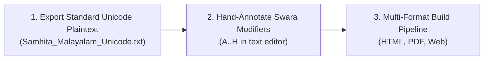

# Revitalizing the Jaimineeya Samaveda in Malayalam Script: Typographic Innovation, Custom Font Engineering, and a Unified Multi-Format Publishing Pipeline

> **By the Jaimineeya Samaveda Digitization Project**  
> *Published: August 2026*  
> *Repository: [github.com/sekharnarayanaswamy-del/jaimineeyasamavedam](https://github.com/sekharnarayanaswamy-del/jaimineeyasamavedam)*

---

## 1. Executive Summary & The Sacred Heritage

The **Jaimineeya Shakha** of the *Samaveda* (*Jaiminīya Sāmavedam*) is one of the most ancient, musically intricate, and geographically endangered oral traditions of Vedic chanting. While the Kauthuma and Ranayaniya traditions are widely published across India, the authentic musical recitation of the Jaimineeya tradition has been preserved almost exclusively through the guru-shishya lineages of the **Namboodiri tradition of Kerala** and select Tamil Nadu lineages.

Unlike standard Vedic texts that employ simple accent strokes (Udatta / Anudatta / Svarita), the Jaimineeya Samaveda employs a sophisticated two-dimensional notation system:
1. **Primary Svara Pitch Markers:** Subscript letters (traditionally Grantha or Malayalam characters) that specify the exact pitch movements (such as *Avaroham*, *Anvangulyam*, *Udgamam*, *Yanam*, and *Plutam*).
2. **Svara Modifiers:** Structural performance indicators that qualify the chant—including multi-syllable spanning melodic arches, peak carets, upper shoulder dots, descending tone slashes, and phrasing dandas.

Until today, producing a faithful, publication-grade digital edition in **Malayalam script** remained an unsolved challenge. Traditional typesetting engines suffered from severe character overlapping, missing manuscript ligatures, clipping of tone markers, and an inability to represent multi-syllable musical bridges cleanly.

Today, we are proud to announce the **complete, end-to-end digital publishing ecosystem for the Jaimineeya Samaveda in Malayalam Script**, delivering high-fidelity outputs across:
- 🌐 **Interactive Web Edition (HTML5)** with responsive flexbox stacking and live word-bridging modifiers.
- 📄 **Archival Print Edition (LuaLaTeX / PDF)** with mathematical sub-point kerning and vector-perfect typography.
- 📝 **Universal Unicode Plaintext (.txt)** with standard Grantha codepoints and intuitive non-combining modifier symbols.

---

## 2. The Typographic & Technical Challenge

Transliterating Jaimineeya Samavedam from traditional palm-leaf manuscripts and Devanagari baselines into digital Malayalam presented three fundamental hurdles:

### Hurdle 1: The Grantha-Malayalam Hybrid Conundrum
Traditional Kerala Jaimineeya manuscripts write the base sacred text (*Mantrakshara*) in **Malayalam script**, while the overhead pitch markers (*Svaras*) are rendered in archaic **Grantha script** with specific regional overrides:
- **Vedic *Pla* (പ്ല):** A custom composite base glyph combining Grantha *Pa* with a Malayalam subscript *La*, distinct from standard classical Grantha.
- **Manuscript *Sha* (ശ):** The Jaimineeya tradition specifically employs the Malayalam base letter **ശ** (`U+0D36`) coupled with detached Grantha vowel arms (such as *Shi* 𑌶𑌿, *Shii* 𑌶𑍀, and *Shaa* ശാ) rather than standard Grantha *Śa* (𑌶).

Standard system fonts lack these ligature forms, resulting in missing glyph boxes (`[?]`) or unsightly broken dotted circles (`◌`).

### Hurdle 2: Multi-Syllable Spanning Swara Modifiers
Several crucial musical modifiers in the Jaimineeya tradition—such as **Modifier (A) Syllable Spanning Arc** and **Modifier (D) Chevron Roof**—do not belong to a single syllable. They visually and musically **span across the boundary between two adjacent words** (e.g. bridging `ഹോ` and `ബാ` / `ഹോ` and `ഇഴാ`).

Standard typesetting engines provide no native mechanism for anchoring a glyph at the right edge of one syllable and stretching it over the whitespace to the next.

### Hurdle 3: Multi-Format Visual Uniformity
Publishing across Web, Print PDF, and Plaintext required maintaining identical visual conventions and color hierarchies across all platforms:
- **Mantrakshara (Base Text):** Deep Typography Black (`#0f172a`).
- **Swara Pitch Markers:** Vedic Sacred Red (`#c62828`).
- **Swara Modifiers:** Performance Dark Blue (`#002171`).

---

## 3. Engineering Innovations

### Innovation 1: The `JaimineeyaSwara.ttf` Custom OpenType Font
To establish absolute typographic control, we engineered a dedicated OpenType font, **`JaimineeyaSwara.ttf`**, containing:
- **19 Ayugma Pure Grantha Bases (`A01`–`A19`):** Full coverage of *Avaroham* (𑌕), *Anvangulyam* (𑌖), *Udgamam* (𑌚), *Yanam* (𑌟), *Namanam* (𑌣), *Aavarttam* (𑌤), *Utthanam* (𑌥), *Kshepanam* (𑌪), *Plutam* (), *Tra* (), and *Kra* ().
- **10 Custom Manuscript Ligatures (`LIG-01`–`LIG-10`):** Including *Shaa* (``), *Shi* (``), *Shii* (``), *Sha-Virama* (``), *Plaa* (``), *Pli* (``), *Plii* (``), *Shruu* (``), *Shrr* (``), and *Nna+U* (``).
- **8 Canonical Vedic Swara Modifiers (`MOD-A`–`MOD-H`):** Built with zero-advance bounding boxes for clean dynamic overlay.

### Innovation 2: The Canonical 8 Vedic Swara Modifiers

| ID | Shortcut | Modifier Name | Glyph Codepoint | Visual Position | Lakshana Role |
| :--- | :---: | :--- | :---: | :---: | :--- |
| **MOD-A** | `(A)` / `(⁀)` | **Syllable Spanning Arc (Tie)** | `` / `U+2040` | Stacked Above (2 Syllables) | Overhead curved arch spanning across two words for connected tone transition. |
| **MOD-B** | `(B)` / `(∧)` | **Peak Elevation Caret** | `` / `U+2227` | Stacked Above (2 Syllables) | Elevated melodic peak over syllable transition. |
| **MOD-C** | `(C)` / `(·)` | **Shoulder Pause Dot** | `` / `U+00B7` | Upper-Right Shoulder | High pause dot attached to the upper shoulder of the preceding syllable. |
| **MOD-D** | `(D)` / `(Ʌ)` | **Chevron Roof** | `` / `U+0245` | Stacked Above (2 Syllables) | Roof-tone modulation spanning across words. |
| **MOD-E** | `(E)` / `(┃)` | **Phrasing Heavy Danda** | `` / `U+2503` | Inline | Structural major cadence division. |
| **MOD-F** | `(F)` / `(╷)` | **Light Vertical Line** | `` / `U+2577` | Inline | Minor phrasing tone separator. |
| **MOD-G** | `(G)` / `(\)` | **Descending Tone Slash** | `` / `U+005C` | Stacked Below | Downward falling pitch attached to the bottom-center of the preceding consonant. |
| **MOD-H** | `(H)` / `(\|)` | **Overhead Swarita** | `` / `U+007C` | Stacked Above | Vertical upper tone stroke situated directly on top of the base syllable. |

### Innovation 3: Dynamic Right-Edge Modifier Anchoring (HTML / CSS)
In the HTML presentation layer, spanning modifiers (Mod-A, Mod-B, Mod-D) are dynamically anchored to the preceding syllable using responsive CSS transforms:

```css
.swara-mod.mod-a, .swara-mod.mod-d {
    position: absolute;
    top: -0.28em;
    left: 100%;
    transform: translateX(-40%);
    pointer-events: none;
}
```

This guarantees that the arch or chevron cleanly bridges the gap between words regardless of screen size, font scale, or syllable width!

---

## 4. The 3-Step Proofreading & Correction Workflow

To enable Vedic scholars and editors to proofread and correct the text without technical friction, we designed a transparent, text-first workflow:



1. **Step 1: Automated Transliteration Baseline:** The Devanagari Samhita text is transliterated to Malayalam base letters with Grantha swaras and English verse numerals (`॥ 1 ॥`).
2. **Step 2: Scholar Annotation in Plaintext:** The editor opens `Samhita_Malayalam_Unicode.txt` in any standard text editor and inserts intuitive modifier notations:
   ```text
   ഹോ(𑌖)(A) ബാ(𑌪𑍍𑌲) മാ(𑌕)(B) യാ ഓ(𑌤)(C) ഗ്നാ(𑌤) ബാ(𑌪𑍍𑌲)(G) ദാ(𑌚𑌿)(H)
   ```
3. **Step 3: Multi-Format Compilation:** Running `python src/render_pdf.py` instantly parses the annotations and updates the HTML portal, the LuaLaTeX print edition, and the live catalog.

---

## 5. Live Typographic Previews & Verification

### The High-Resolution Glyph Inventory


### The Interactive HTML Review Catalog
Scholars and developers can inspect all 8 modifiers, 19 Ayugma bases, and 229 full corpus markers in real time via [`glyph_table.html`](glyph_table.html).

---

## 6. Open Source & Future Directions

All font source files, templates, renderers, and transliteration scripts are open-source under permissive licenses:
- **Repository:** [https://github.com/sekharnarayanaswamy-del/jaimineeyasamavedam](https://github.com/sekharnarayanaswamy-del/jaimineeyasamavedam)
- **Key Files:**
  - Font: `fonts/JaimineeyaSwara.ttf`
  - HTML Template: `templates/html/Malayalam_main_html.template`
  - Rendering Engine: `src/render_pdf.py`
  - Spec & Developer Guide: `Malayalam_JSV/spec.md`

We invite Vedic scholars, typographers, and digital humanities researchers to explore the repository, submit corrections, and help preserve this invaluable oral heritage for generations to come.
