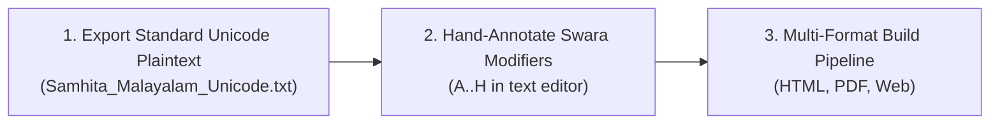

# Revitalizing Jaimineeya Samaveda in Malayalam Script: Typographic Innovation, Custom Font Engineering, and a Unified Multi-Format Publishing Pipeline

> **By the Jaimineeya Samaveda Digitization Project**  
> *Published: August 2026*  
> *Repository: [github.com/sekharnarayanaswamy-del/jaimineeyasamavedam](https://github.com/sekharnarayanaswamy-del/jaimineeyasamavedam)*

---

## 1. Executive Summary & The Sacred Heritage

The **Jaimineeya Shakha** of the *Samaveda* (*Jaiminīya Sāmavedam*) is one of the most ancient, musically intricate, and endangered oral traditions of Vedic chanting. While the Kauthuma and Ranayaniya traditions are more well known and established across India, the authentic musical recitation of the Jaimineeya tradition has been preserved almost exclusively through the guru-shishya lineages of **Tamil Nadu and by the Namboodiri tradition of Kerala**. This shakha was nearing extinction in Tamilnadu and was salvaged at the instance of Kanchi Mahaperiyava by Brahmasri Makarabhushanam Iyengar (Guruji) who set up the Thogur Jaimineeya Samaveda Patashala nearly fifty years ago. Through the efforts of Guruji, a set of his direct and indirect disciples went through formal, rigorous Vedic studies lasting twelve years which has helped to rescue this precious tradition from the brink. In addition to this, Guruji has published many works in Grantha and Devanagari drawing from manuscripts originally in Grantha.   

The Jaimineeya Samaveda employs a sophisticated system of Yugma and Ayugma swaras (Dharalakshanam of Sabhapati) for phonetic encoding of its Samagana. There was a migration of Jaimini Sama vedins from the Kaveri delta like Anbil, Tiruchi to Kerala around 250-300 years ago. These brahmins are today settled mainly in Kodunthirapully Agraharam in Palakkad. Brahmasri Sahasranama Iyer has very meticulously written by hand the Samhita and Aranyam portions using a special scheme: Malayalam mantrakshara, Grantha/mixed Grantha Malayalam swara markers and a set of swara modifier mnemonics to help easy recitation. The efficacy of his method is borne out by the passage of time that even today the young and old in the village use the paper copies of his manuscript to chant. 

As part of our overall digitization efforts of Jaimineeya Samaveda, we have now implemented the digital **"Kodunthirapully Paddhati"**. We believe this effort will support the living tradition of Sama Veda chanting in the Agraharam in today's digital world. To overcome the technical challenges of mixed Grantha/Malayalam typography and complex visual mnemonics, we engineered the **JaimineeyaSwara** font and built an automated multi-format publishing pipeline delivering:

- 📄 **Publication quality Jaimineeya Samaveda in Malayalam (PDF):** [`Samam_Malayalam.pdf`](https://github.com/sekharnarayanaswamy-del/jaimineeyasamavedam/blob/format-mantras/data/output/pdf/Malayalam/Samam_Malayalam.pdf) with sub-point kerning, authentic manuscript ligatures, and vector-perfect typography.
- 🌐 **Interactive Web Edition (HTML5):** An easy to navigate Website with advanced search and hyperlink features.
- 📝 **Universal Unicode Plaintext (.txt):** With standard Grantha codepoints and intuitive modifier mnemonics to enable ongoing curation and scholarship.

---

## 2. The Typographic & Technical Challenge

Transliterating Jaimineeya Samavedam from traditional palm-leaf manuscripts and Devanagari baselines into digital Malayalam presented three fundamental hurdles:

### Hurdle 1: The Grantha-Malayalam Hybrid Conundrum
Traditional Kerala Jaimineeya manuscripts write the base sacred text (*Mantrakshara*) in **Malayalam script**, while the overhead pitch markers (*Svaras*) are rendered in archaic **Grantha script** with specific regional overrides:
- **Vedic *Pla* (പ്ല):** A custom composite base glyph combining Grantha *Pa* with a Malayalam subscript *La*, distinct from standard classical Grantha.
- **Manuscript *Sha* (ശ):** The manuscript reference specifically employs the Malayalam base letter **ശ** (`U+0D36`) coupled with detached Grantha vowel arms (of *Shi* 𑌶𑌿, *Shii* 𑌶𑍀, and *Shaa* ശാ) rather than standard Grantha *Śa* (𑌶).

Standard system fonts lack these ligature forms, resulting in missing glyph boxes (`[?]`) or unsightly broken dotted circles (`◌`).

### Hurdle 2: Multi-Syllable Spanning Swara Modifiers
Several crucial musical modifiers in the Jaimineeya tradition—such as **Modifier (A) Syllable Spanning Arc** and **Modifier (D) Chevron Roof**—do not belong to a single syllable. They visually and musically **span across the boundary between two adjacent words** (e.g. bridging `ഹോ` and `ബാ` / `ഹോ` and `ഇഴാ`).

Standard typesetting engines provide no native mechanism for anchoring a glyph at the right edge of one syllable and stretching it over the whitespace to the next.

### Hurdle 3: Multi-Format Visual Uniformity
Publishing across Web, Print PDF, and Plaintext required maintaining identical visual conventions and color hierarchies across all platforms:
- **Mantrakshara (Base Text):** Deep Typography Black (`#0f172a`).
- **Swara Pitch Markers:** Vedic Sacred Red (`#c62828`).
- **Swara Modifiers:** Performance Dark Blue (`#002171`).

---

## 3. Engineering Innovations

### Innovation 1: The `JaimineeyaSwara.ttf` Custom OpenType Font
To establish absolute typographic control, we engineered a dedicated OpenType font, **`JaimineeyaSwara.ttf`**, containing:
- **19 Ayugma Pure Grantha Bases (`A01`–`A19`):** Full coverage of *Avaroham* (𑌕), *Anvangulyam* (𑌖), *Udgamam* (𑌚), *Yanam* (𑌟), *Namanam* (𑌣), *Aavarttam* (𑌤), *Utthanam* (𑌥), *Kshepanam* (𑌪), *Plutam* (), *Tra* (), and *Kra* ().
- **10 Custom Manuscript Ligatures (`LIG-01`–`LIG-10`):** Including *Shaa* (``), *Shi* (``), *Shii* (``), *Sha-Virama* (``), *Plaa* (``), *Pli* (``), *Plii* (``), *Shruu* (``), *Shrr* (``), and *Nna+U* (``).
- **8 Canonical Vedic Swara Modifiers (`MOD-A`–`MOD-H`):** Built with zero-advance bounding boxes for clean dynamic overlay.

### Innovation 2: The Canonical 8 Vedic Swara Modifiers & Inline Marks

| ID / Mark | Shortcut | Modifier Name | Glyph Codepoint | Visual Position | Lakshana Role |
| :--- | :---: | :--- | :---: | :---: | :--- |
| **MOD-A** | `(A)` / `(⁀)` | **Syllable Spanning Arc (Tie)** | `\uE004` / `U+2040` | Stacked Above (2 Syllables) | Overhead curved arch spanning across two words for connected tone transition. |
| **MOD-B** | `(B)` / `(∧)` | **Peak Elevation Caret** | `\uE005` / `U+2227` | Stacked Above (2 Syllables) | Elevated melodic peak over syllable transition. |
| **MOD-C** | `(C)` / `(·)` | **Shoulder Pause Dot** | `\uE001` / `U+00B7` | Upper-Right Shoulder | High pause dot attached to the upper shoulder of the preceding syllable. |
| **MOD-D** | `(D)` / `(Ʌ)` | **Chevron Roof** | `\uE006` / `U+0245` | Stacked Above (2 Syllables) | Roof-tone modulation spanning across words. |
| **MOD-E** | `(E)` / `(┃)` | **Phrasing Heavy Danda** | `\uE002` / `U+2503` | Inline | Structural major cadence division. |
| **MOD-F** | `(F)` / `(╷)` | **Light Vertical Line** | `\uE002` / `U+2577` | Inline | Minor phrasing tone separator. |
| **MOD-G** | `(G)` / `(\)` | **Descending Tone Slash** | `\uE003` / `U+005C` | Stacked Below | Downward falling pitch attached to the bottom-center of the preceding consonant. |
| **MOD-H** | `(H)` / `(|)` | **Overhead Swarita** | `\uE00C` / `U+007C` | Stacked Above | Vertical upper tone stroke situated directly on top of the base syllable. |
| **Dot (`.`)** | `.` / `(.)` | **Pause Dot** | `\uE001` / `.` | **Inline** | Stobha and breath pause indicator. |
| **Underbar (`_`)** | `_` / `(_)` | **Elongation / Low Line** | `\uE007` / `_` | **Inline** | Tone elongation or rhythmic phrasing gap. |
| **Comma (`,`)** | `,` / `(,)` | **Low Comma** | `\uE00A` / `,` | **Inline** | Minor cadence pause / breath comma. |

---

## 4. The 3-Step Scholar Proofreading Workflow



1. **Step 1: Automated Transliteration Baseline:** The Devanagari Samhita text is transliterated to Malayalam base letters with Grantha swaras and English verse numerals (`॥ 1 ॥`).
2. **Step 2: Scholar Annotation in Plaintext:** The editor opens `Samhita_Malayalam_Unicode.txt` in any standard text editor and inserts intuitive modifier notations:
   ```text
   ഹോ(𑌖)(A) ബാ(𑌪𑍍𑌲) മാ(𑌕)(B) യാ ഓ(𑌤)(C) ഗ്നാ(𑌤) ബാ(𑌪𑍍𑌲)(G) ദാ(𑌚𑌿)(H)
   ```
3. **Step 3: Multi-Format Compilation:** Running `python src/render_pdf.py` instantly parses the annotations and updates the HTML portal, the LuaLaTeX print edition, and the live catalog.

---

## 5. Live Typographic Previews & Verification

### The High-Resolution Glyph Inventory


### The Interactive HTML Review Catalog
Scholars and developers can inspect all 8 modifiers, 19 Ayugma bases, and 229 full corpus markers in real time via [`glyph_table.html`](glyph_table.html).

---

## 6. Open Source & Project Links

All font source files, templates, renderers, and transliteration scripts are open-source under permissive licenses:
- 💻 **GitHub Repository:** [https://github.com/sekharnarayanaswamy-del/jaimineeyasamavedam](https://github.com/sekharnarayanaswamy-del/jaimineeyasamavedam)
- 📄 **Digital publishing of Jaimineeya Samaveda in Malayalam (PDF):** [`Samam_Malayalam.pdf`](https://github.com/sekharnarayanaswamy-del/jaimineeyasamavedam/blob/format-mantras/data/output/pdf/Malayalam/Samam_Malayalam.pdf)
- 🔤 **Custom Font:** [`fonts/JaimineeyaSwara.ttf`](https://github.com/sekharnarayanaswamy-del/jaimineeyasamavedam/blob/format-mantras/fonts/JaimineeyaSwara.ttf)
- 📖 **Specification & Developer Guide:** [`Malayalam_JSV/spec.md`](https://github.com/sekharnarayanaswamy-del/jaimineeyasamavedam/blob/format-mantras/Malayalam_JSV/spec.md)
- 🎨 **Interactive Glyph Table:** [`data/output/malayalam/glyph_table.html`](https://github.com/sekharnarayanaswamy-del/jaimineeyasamavedam/blob/format-mantras/data/output/malayalam/glyph_table.html)
- 🌐 **Malayalam Digital Static Website:** *(Work in progress)*
- ⚙️ **Rendering Engine:** [`src/render_pdf.py`](https://github.com/sekharnarayanaswamy-del/jaimineeyasamavedam/blob/format-mantras/src/render_pdf.py)
- 📑 **HTML Template:** [`templates/html/Malayalam_main_html.template`](https://github.com/sekharnarayanaswamy-del/jaimineeyasamavedam/blob/format-mantras/templates/html/Malayalam_main_html.template)
