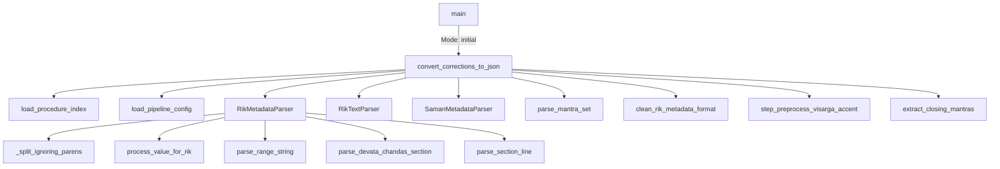
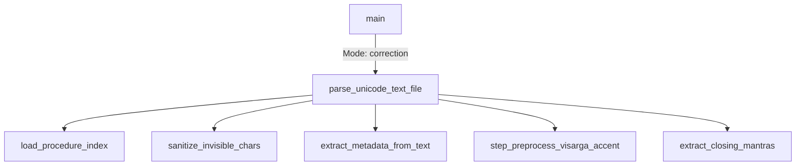
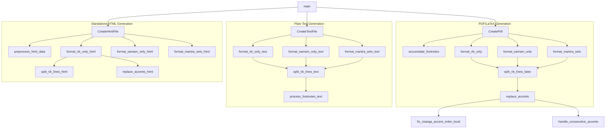
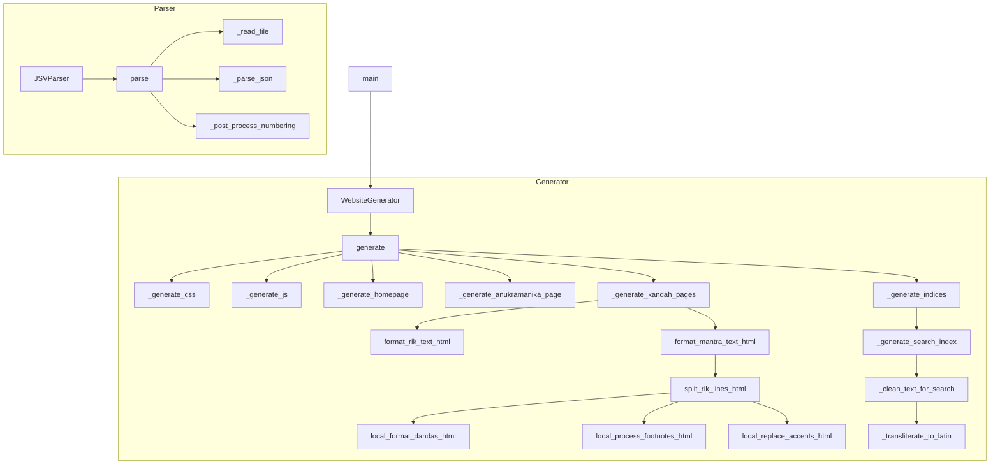
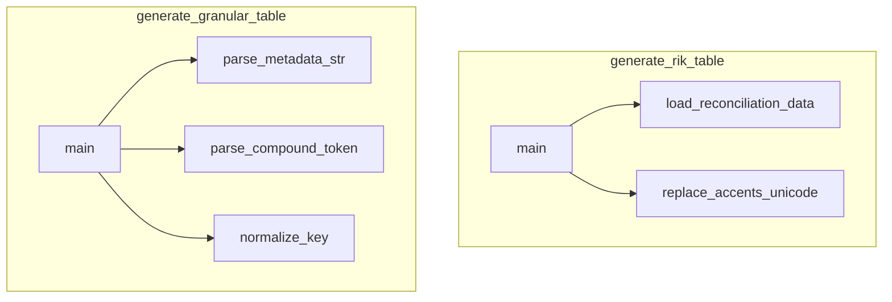
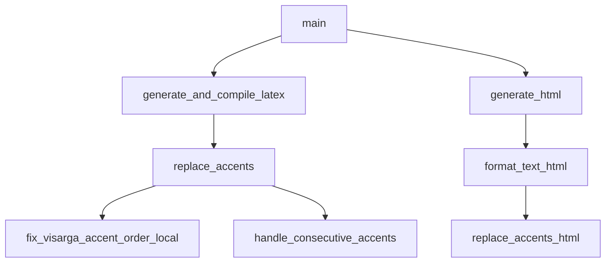
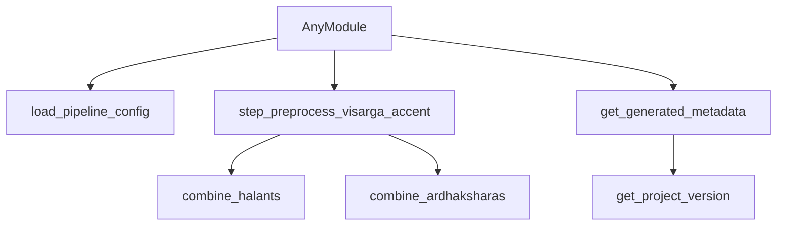
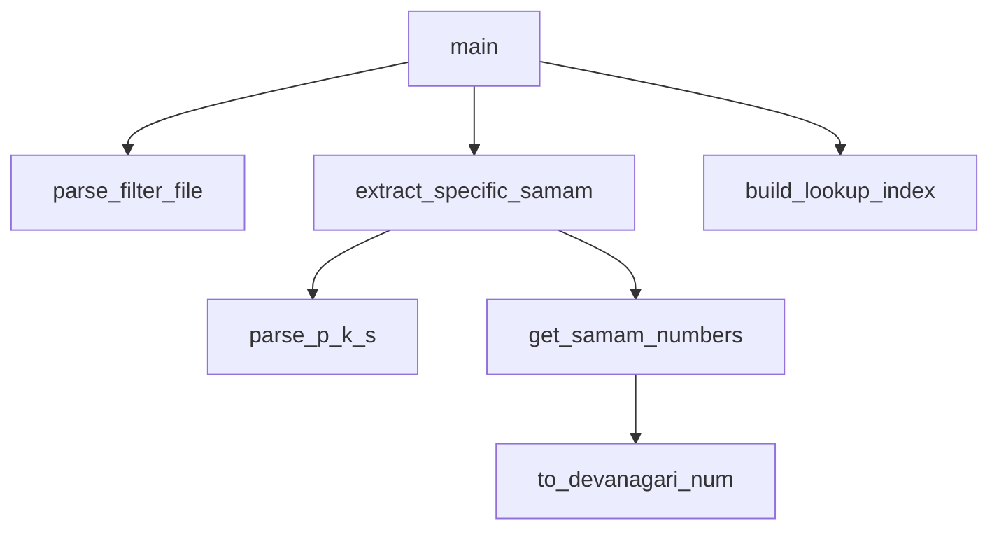
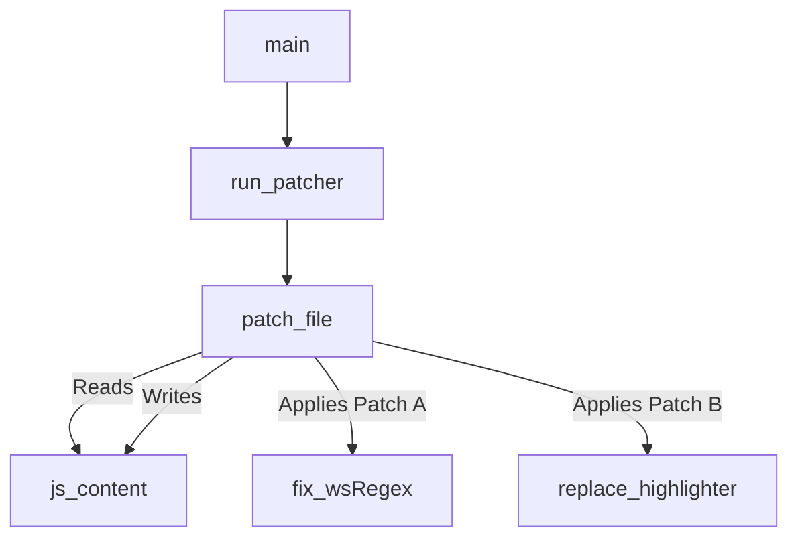
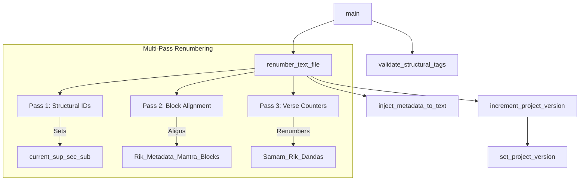

# Jaimineeya Samavedam (JSV) Pipeline - Developer Guide

This document provides a comprehensive technical overview of the Jaimineeya Samavedam (JSV) generation pipeline. It details the core Python scripts within the `src/` directory, explaining their functionality, inter-module interactions, and the individual functions within them.

## Architectural Overview

The JSV pipeline follows a linear data transformation pattern: **Ingestion -> Parsing -> Curation -> Rendering/Exporting**.

---

## Core Modules Documentation

### 1. `generate_json.py`
**Purpose**: The foundational ingestion and parsing engine of the pipeline. It reads unstructured and semi-structured text inputs and compiles them into a structured Abstract Syntax Tree (AST) represented as a JSON file.

#### Function-Level Interactions

**Initial Parsing Mode (`--input-mode initial`)**

**Correction Parsing Mode (`--input-mode correction`)**

#### Detailed Components
- **`convert_corrections_to_json()`**: Main orchestrator for "initial" mode. Processes raw sources (text, rik metadata, samam metadata) and assembles the JSON AST.
- **`parse_unicode_text_file()`**: Main orchestrator for "correction" mode. Reconstructs the JSON AST from a unified unicode file.
- **`RikMetadataParser`**:
  - `load_data()`: Reads `rishi_devata_chandas_for_rik.txt`.
  - `parse_section_line()`: Tokenizes Devata and Chandas attributes per line.
  - `process_value_for_rik()`: Handles specific Rik overrides.
- **`RikTextParser`**:
  - `load_data()`: Scans raw Vedic text, identifying section boundaries and Rik markers.
  - `get_text_by_rik_id()`: Fetches isolated Rik texts.
- **`SamanMetadataParser`**:
  - `load_data()`: Parses `sama_rishi_chandas_out.txt`.
  - `get_next_samam()`: Iterates through sequence yielding `(rik_id, title, metadata)`.
- **`parse_mantra_set()`**: Utility to separate mantra text by line breaks.
- **`sanitize_invisible_chars()`**: Removes hidden Unicode formatting characters (like Zero-Width Joiners).
- **`devanagari_to_int()`**: Helper function converting Devanagari numerals to Python integers.

---

### 2. `render_pdf.py`
**Purpose**: The multi-format rendering engine. While primarily used for LaTeX/PDF generation, it also orchestrates the creation of Unicode text and standalone HTML versions of the data using specific templates and formatters.

#### Function-Level Interactions

#### Detailed Components
- **`CreatePdf()`**: Orchestrates LaTeX template rendering and invokes the LaTeX compiler (XeLaTeX). Supports standard swara-below stacking or Kodunthirapully (`-kpully`) swara-above stacking.
- **`CreateTextFile()`**: Generates `.txt` files with Vedic text and metadata.
- **`CreateHtmlFile()`**: Generates standalone `.html` files (distinct from the full website generation), supporting standard swara-below and `-kpully` swara-above layouts.
- **`-kpully` / `--kpully` CLI Mode**: Renders Devanagari Samam with swara marks positioned directly **above** the mantra text (in PDF via `\stackon` and in HTML via flex `column-reverse`), whereas standard mode positions swaras below.
- **`accumulate_footnotes()`**: Aggregates footprint mappings defined in the AST.
- **`format_*()` Functions**: Specialized delegates for PDF, Text, and HTML modes (e.g., `format_rik_only_text`, `format_samam_only_html`).
- **`split_rik_lines_*()`**: Format-specific line splitters that maintain structural integrity for LaTeX, HTML, or Plain Text.
- **`replace_accents()`**: Maps Unicode swaras to LaTeX macros.
  - Calls `handle_consecutive_accents` for LaTeX kerning.
- **`replace_accents_html()`**: Maps Unicode swaras to HTML classes.
  - Calls `handle_consecutive_trikamba_html` for HTML specific spacing.
- **`fix_visarga_accent_order_local()`**: Handles rendering edge cases for overlapping markers (primarily for LaTeX).
- **`process_footnotes_*()`**: Injects footnote markers according to the target format.

---

### 3. `generate_website.py`
**Purpose**: Generates interactive HTML versions of the texts, builds a searchable lunr.js index, and applies standard web typographies.

#### Function-Level Interactions

#### Detailed Components
- **`JSVParser`**:
  - `parse()`: Loads the JSON AST or reads fallback raw files.
  - `_post_process_numbering()`: Normalizes chapter and verse numerics.
- **`WebsiteGenerator`**:
  - `generate()`: Central loop for emitting static files (`.css`, `.js`, `.html`).
  - `_generate_kandah_pages()`: Emits specific HTML files for each Khanda/Section, invoking content formatters.
  - `_generate_search_index()`: Builds a compressed JSON search index map containing titles and verse fragments.
  - `_clean_text_for_search()` / `_strip_diacritics()`: Normalizes Vedic text (removes accents/swaras) so search queries can match robustly.
- **Formatting Utilities**:
  - `format_rik_text_html()` & `format_mantra_text_html()`: Translates textual content into span-wrapped HTML.
  - `split_rik_lines_html()`: Separates strings for HTML block rendering.
  - `local_replace_accents_html()`: Maps Unicode swaras to CSS classes.
    - Calls `local_handle_consecutive_trikamba` for spacing.
    - Calls `_fix_visarga_accent_with_zwj` for font compatibility (Noto Sans Devanagari).

---

### 4. `generate_rik_table.py` & `generate_granular_table.py`
**Purpose**: Flattening tools turning JSON ASTs into CSV/XLSX spreadsheets for auditing and specific data consumption models.

#### Function-Level Interactions

#### Detailed Components
- **`generate_rik_table.main()`**: Iterates through the AST extracting top-level Rik text sequences.
- **`generate_granular_table.main()`**: Dives deeper to resolve nested $n:1$ relationships between Samams and underlying Riks, calculating a `Global_Rik_Num`.
- **`parse_metadata_str()` / `parse_compound_token()`**: Analyzes raw metadata strings in the AST to extract explicitly declared references.
- **`replace_accents_unicode()`**: Normalizes unicode sequences for CSV export.
- **`normalize_key()`**: Generates consistent lookup keys based on Section IDs.

---

### 5. `generate_Rik_for_samhita.py`
**Purpose**: Generates specialized mappings bridging Purvarchika and Uttararchika texts of the Samaveda.

#### Function-Level Interactions

#### Detailed Components
- **`generate_and_compile_latex()`**: Dedicated routine compiling mapping documents into standalone LaTeX/PDF files.
- **`generate_html()`**: Dedicated routine outputting mapping documents as static HTML.
- **`remove_mantra_spaces()` / `eliminate_trailing_whitespace()`**: Specialized whitespace trimmers optimizing layout density.
- **`fix_visarga_accent_order_local()`**: Localized fix analogous to `render_pdf.py` for ensuring rendering stability.

---

### 6. `utils.py`
**Purpose**: Centralized helper library serving shared string manipulation and configuration needs.

#### Function-Level Interactions

#### Detailed Components
- **`load_pipeline_config()`**: Parses `pipeline_config.yaml` to obtain target directories and source paths.
- **`step_preprocess_visarga_accent()`**: The primary normalizer used across the pipeline to convert English colons `:` into Devanagari Visargas `ः` and standardize basic accent formatting. Format-specific scripts (like `generate_website.py`) then apply additional rendering fixes (like ZWJ insertion) on top of this base normalization.
- **`combine_halants()` / `combine_ardhaksharas()`**: Standardizes specific Unicode ligature behaviors.
- **`get_generated_metadata()` / `get_project_version()`**: Fetches build version parameters for header injection.
- **`parse_mantra_for_latex()`**: Generic wrapper preparing texts for PDF consumption.

---

### 7. `curate_jsv.py`
**Purpose**: Handles filtering, auditing, and extracting targeted subsets (using P-K-S addressing).

#### Function-Level Interactions

#### Detailed Components
- **`parse_filter_file()`**: Reads a list of targeted Samams to retain or drop.
- **`extract_specific_samam()`**: Iterates the AST, pruning out nodes that do not match the filter criteria.
- **`build_lookup_index()`**: Generates a fast memory map for evaluating Parva-Kandah-Samam IDs.
- **`parse_p_k_s()`**: Tokenizes strings like `1.2.5` into respective components.
- **`to_devanagari_num()`**: Local conversion tool generating Devanagari numbering representations.

---

### 8. `patch_highlight_js.py`
**Purpose**: A post-processing script that patches the generated `main.js` files in the website output directories. It applies specific visual fixes and replaces the default search highlighter with a more robust, permissive version.

#### Function-Level Interactions

#### Detailed Components
- **`run_patcher()`**: Iterates through the `samhita` and `aaranam` subdirectories in the `docs/` folder.
- **`patch_file()`**: Performs two independent regex-based patches on the JavaScript source:
  - **Patch A**: Fixes `wsRegex` initialization by replacing `new RegExp` calls with optimized regex literals.
  - **Patch B**: Swaps the internal `highlightText` function with a permissive version that handles Vedic accents, swara markers, and HTML tags during search matching.

---

### 9. `src/tools/renumber_sooktam.py`
**Purpose**: The primary structural renumbering tool for JSV text files. It performs a multi-pass sweep of the raw Vedic text to ensure all SuperSections, Sections, SubSections, Samams, and Riks are sequentially numbered according to the pipeline configuration.

#### Function-Level Interactions

#### Detailed Components
- **`validate_structural_tags()`**: Performs a pre-flight integrity check to ensure all `# Start` and `# End` tags (SuperSection, Section, etc.) are correctly paired and nested. **Renumbering is aborted if structural errors are found.**
- **`renumber_text_file()`**: The core renumbering engine:
  - **Pass 1**: Renumbers higher-level structural IDs (SuperSection, Section, SubSection).
  - **Pass 2**: Ensures that Rik Metadata and Mantra blocks are aligned to their parent SubSection ID.
  - **Pass 3**: Sweeps the text to renumber verse markers (between `॥` or `┃`) using Devanagari numerals.
- **`inject_metadata_to_text()`**: Updates the `# [JSV METADATA]` header with the new version and timestamp.
- **`increment_project_version()`**: Bumps the patch version in `src/VERSION`.
- **`int_to_devanagari()`**: Utility to convert Arabic numerals to Devanagari digits.

---

## Pipeline Configuration (`pipeline_config.yaml`)

The pipeline is centralized around `src/pipeline_config.yaml`. This file defines global paths, default CLI options, and type-specific (Samhita vs. Aaranam) source mappings.

### Script Linkages
All scripts load this configuration via `utils.load_pipeline_config()`. The mappings are as follows:

| Script | YAML Key | Primary Usage |
| :--- | :--- | :--- |
| `generate_json.py` | `generate_json` | Input text paths, metadata source locations, and procedure index paths. |
| `generate_rik_table.py` | `generate_rik_table` | Default input/output paths for CSV and reconciliation Excel files. |
| `generate_website.py` | `generate_website` | Output directories, audio source locations, and primary website fonts. |
| `render_pdf.py` | `render` | LaTeX/HTML template paths, PDF color modes, and advanced rendering flags. |
| `curate_jsv.py` | `curate_jsv` | Source JSON files and filter list locations. |
| `renumber_sooktam.py` | `renumber_sooktam` | Default renumbering start indices and increment behaviors. |
