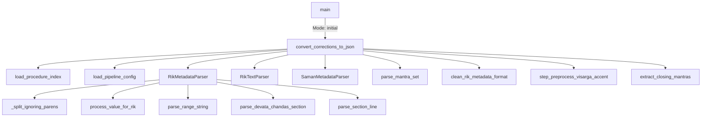
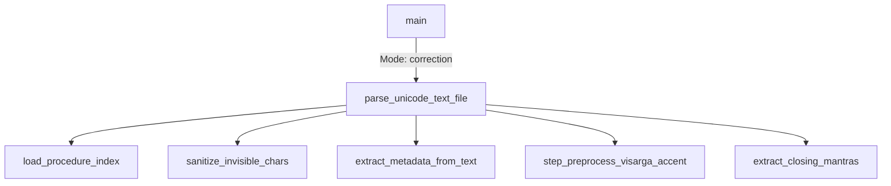
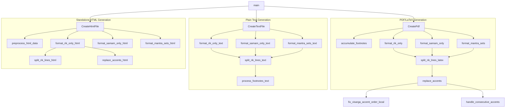
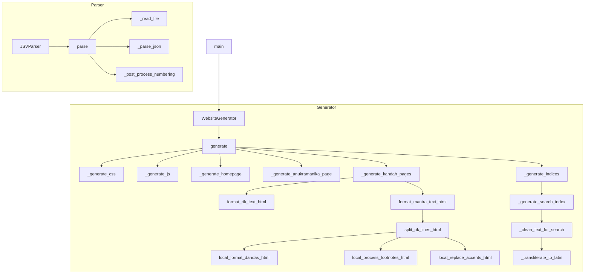
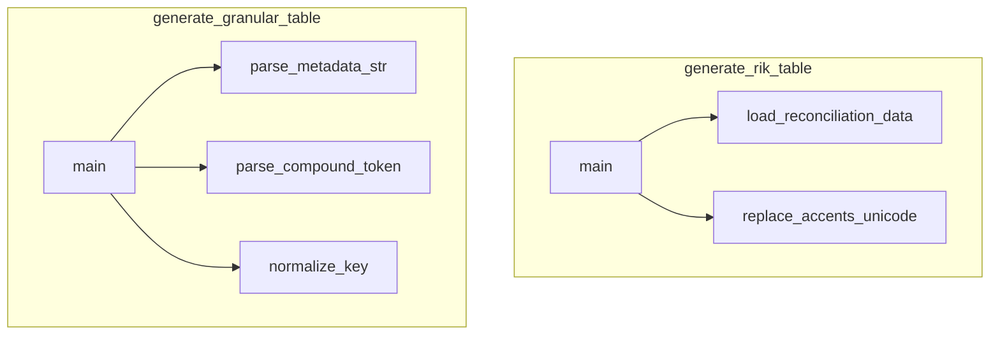
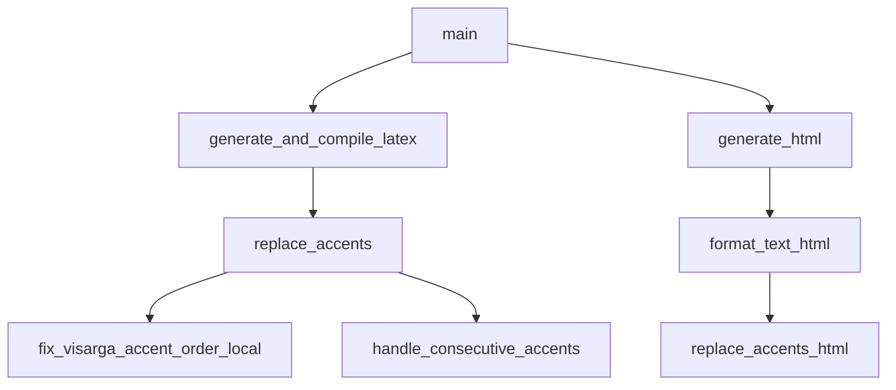
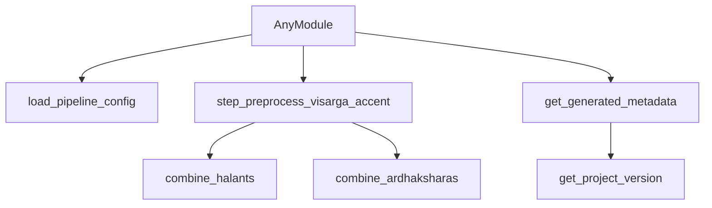
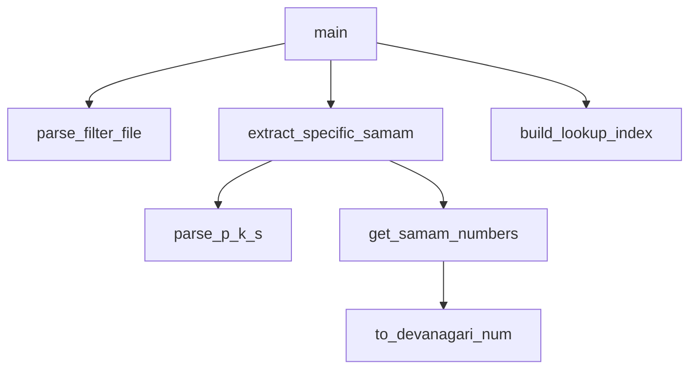
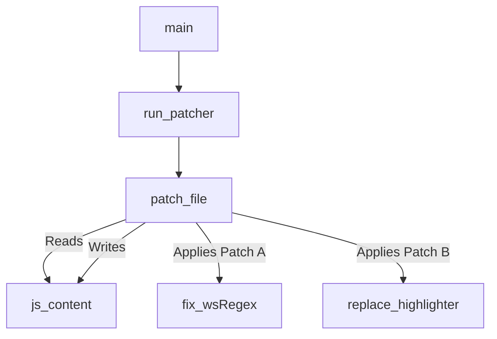
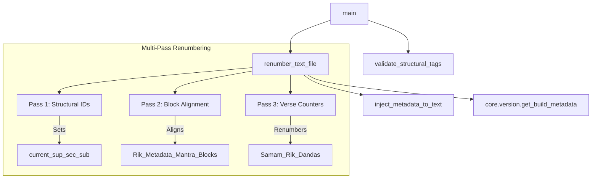

# Jaimineeya Samavedam (JSV) Pipeline - Developer Guide

This document provides a comprehensive technical overview of the Jaimineeya Samavedam (JSV) generation pipeline. It details the core Python scripts within the `src/` directory, explaining their functionality, inter-module interactions, and the individual functions within them.

## Architectural Overview

The JSV pipeline follows a linear data transformation pattern: **Ingestion -> Parsing -> Curation -> Rendering/Exporting**.

---

## Core Modules Documentation

### 1. `generate_json.py`
**Purpose**: The foundational ingestion and parsing engine of the pipeline. It reads unstructured and semi-structured text inputs and compiles them into a structured Abstract Syntax Tree (AST) represented as a JSON file.

#### Function-Level Interactions

**Initial Parsing Mode (`--input-mode initial`)**

```mermaid
graph TD
    main -->|Mode: initial| convert_corrections_to_json
    convert_corrections_to_json --> load_procedure_index
    convert_corrections_to_json --> load_pipeline_config
    convert_corrections_to_json --> RikMetadataParser
    convert_corrections_to_json --> RikTextParser
    convert_corrections_to_json --> SamanMetadataParser
    convert_corrections_to_json --> parse_mantra_set
    convert_corrections_to_json --> clean_rik_metadata_format
    convert_corrections_to_json --> step_preprocess_visarga_accent
    convert_corrections_to_json --> extract_closing_mantras
    
    RikMetadataParser --> _split_ignoring_parens
    RikMetadataParser --> process_value_for_rik
    RikMetadataParser --> parse_range_string
    RikMetadataParser --> parse_devata_chandas_section
    RikMetadataParser --> parse_section_line
```

**Correction Parsing Mode (`--input-mode correction`)**

```mermaid
graph TD
    main -->|Mode: correction| parse_unicode_text_file
    parse_unicode_text_file --> load_procedure_index
    parse_unicode_text_file --> sanitize_invisible_chars
    parse_unicode_text_file --> extract_metadata_from_text
    parse_unicode_text_file --> step_preprocess_visarga_accent
    parse_unicode_text_file --> extract_closing_mantras
```

#### Detailed Components
- **`convert_corrections_to_json()`**: Main orchestrator for "initial" mode. Processes raw sources (text, rik metadata, samam metadata) and assembles the JSON AST.
- **`parse_unicode_text_file()`**: Main orchestrator for "correction" mode. Reconstructs the JSON AST from a unified unicode file.
- **`RikMetadataParser`**:
  - `load_data()`: Reads `rishi_devata_chandas_for_rik.txt`.
  - `parse_section_line()`: Tokenizes Devata and Chandas attributes per line.
  - `process_value_for_rik()`: Handles specific Rik overrides.
- **`RikTextParser`**:
  - `load_data()`: Scans raw Vedic text, identifying section boundaries and Rik markers.
  - `get_text_by_rik_id()`: Fetches isolated Rik texts.
- **`SamanMetadataParser`**:
  - `load_data()`: Parses `sama_rishi_chandas_out.txt`.
  - `get_next_samam()`: Iterates through sequence yielding `(rik_id, title, metadata)`.
- **`parse_mantra_set()`**: Utility to separate mantra text by line breaks.
- **`sanitize_invisible_chars()`**: Removes hidden Unicode formatting characters (like Zero-Width Joiners).
- **`devanagari_to_int()`**: Helper function converting Devanagari numerals to Python integers.

---

### 2. `render_pdf.py`
**Purpose**: The multi-format rendering engine. While primarily used for LaTeX/PDF generation, it also orchestrates the creation of Unicode text and standalone HTML versions of the data using specific templates and formatters.

#### Function-Level Interactions

```mermaid
graph TD
    main --> CreatePdf
    main --> CreateTextFile
    main --> CreateHtmlFile
    
    subgraph PDF/LaTeX Generation
        CreatePdf --> accumulate_footnotes
        CreatePdf --> format_rik_only
        CreatePdf --> format_samam_only
        CreatePdf --> format_mantra_sets
        format_rik_only --> split_rik_lines_latex
        format_samam_only --> split_rik_lines_latex
        format_mantra_sets --> split_rik_lines_latex
        split_rik_lines_latex --> replace_accents
    end

    subgraph Plain Text Generation
        CreateTextFile --> format_rik_only_text
        CreateTextFile --> format_samam_only_text
        CreateTextFile --> format_mantra_sets_text
        format_rik_only_text --> split_rik_lines_text
        format_samam_only_text --> split_rik_lines_text
        format_mantra_sets_text --> split_rik_lines_text
        split_rik_lines_text --> process_footnotes_text
    end

    subgraph Standalone HTML Generation
        CreateHtmlFile --> preprocess_html_data
        CreateHtmlFile --> format_rik_only_html
        CreateHtmlFile --> format_samam_only_html
        CreateHtmlFile --> format_mantra_sets_html
        format_rik_only_html --> split_rik_lines_html
        format_rik_only_html --> replace_accents_html
    end
    
    replace_accents --> fix_visarga_accent_order_local
    replace_accents --> handle_consecutive_accents
```

#### Detailed Components
- **Decoupled Architecture (No YAML Dependency)**: `render_pdf.py` is a standalone rendering engine that does not parse or depend on any `.yaml` files. All settings are passed via CLI flags or fall back to predictable defaults (`templates/pdf/`, `templates/html/`, `templates/text/`).
- **`CreatePdf()`**: Orchestrates LaTeX template rendering and invokes the LaTeX compiler (XeLaTeX). Supports standard swara-below stacking or Kodunthirapully (`-kpully`) swara-above stacking.
- **`CreateTextFile()`**: Generates `.txt` files with Vedic text and metadata.
- **`CreateHtmlFile()`**: Generates standalone `.html` files (distinct from the full website generation), supporting standard swara-below and `-kpully` swara-above layouts.
- **`-kpully` / `--kpully` CLI Mode**: Renders Devanagari Samam with swara marks positioned directly **above** the mantra text (in PDF via `\stackon` and in HTML via flex `column-reverse`), whereas standard mode positions swaras below.
- **`accumulate_footnotes()`**: Aggregates footprint mappings defined in the AST.
- **`format_*()` Functions**: Specialized delegates for PDF, Text, and HTML modes (e.g., `format_rik_only_text`, `format_samam_only_html`).
- **`split_rik_lines_*()`**: Format-specific line splitters that maintain structural integrity for LaTeX, HTML, or Plain Text.
- **`replace_accents()`**: Maps Unicode swaras to LaTeX macros.
  - Calls `handle_consecutive_accents` for LaTeX kerning.
- **`replace_accents_html()`**: Maps Unicode swaras to HTML classes.
  - Calls `handle_consecutive_trikamba_html` for HTML specific spacing.
- **`fix_visarga_accent_order_local()`**: Handles rendering edge cases for overlapping markers (primarily for LaTeX).
- **`process_footnotes_*()`**: Injects footnote markers according to the target format.


---

### 3. `generate_website.py`
**Purpose**: Generates interactive HTML versions of the texts, builds a searchable lunr.js index, and applies standard web typographies.

#### Function-Level Interactions

```mermaid
graph TD
    main --> WebsiteGenerator
    
    subgraph Parser
        JSVParser --> parse
        parse --> _read_file
        parse --> _parse_json
        parse --> _post_process_numbering
    end
    
    subgraph Generator
        WebsiteGenerator --> generate
        generate --> _generate_css
        generate --> _generate_js
        generate --> _generate_homepage
        generate --> _generate_anukramanika_page
        generate --> _generate_kandah_pages
        generate --> _generate_indices
        
        _generate_kandah_pages --> format_rik_text_html
        _generate_kandah_pages --> format_mantra_text_html
        
        format_mantra_text_html --> split_rik_lines_html
        split_rik_lines_html --> local_format_dandas_html
        split_rik_lines_html --> local_process_footnotes_html
        split_rik_lines_html --> local_replace_accents_html
        
        _generate_indices --> _generate_search_index
        _generate_search_index --> _clean_text_for_search
        _clean_text_for_search --> _transliterate_to_latin
    end
```

#### Detailed Components
- **`JSVParser`**:
  - `parse()`: Loads the JSON AST or reads fallback raw files.
  - `_post_process_numbering()`: Normalizes chapter and verse numerics.
- **`WebsiteGenerator`**:
  - `generate()`: Central loop for emitting static files (`.css`, `.js`, `.html`).
  - `_generate_kandah_pages()`: Emits specific HTML files for each Khanda/Section, invoking content formatters.
  - `_generate_search_index()`: Builds a compressed JSON search index map containing titles and verse fragments.
  - `_clean_text_for_search()` / `_strip_diacritics()`: Normalizes Vedic text (removes accents/swaras) so search queries can match robustly.
- **Formatting Utilities**:
  - `format_rik_text_html()` & `format_mantra_text_html()`: Translates textual content into span-wrapped HTML.
  - `split_rik_lines_html()`: Separates strings for HTML block rendering.
  - `local_replace_accents_html()`: Maps Unicode swaras to CSS classes.
    - Calls `local_handle_consecutive_trikamba` for spacing.
    - Calls `_fix_visarga_accent_with_zwj` for font compatibility (Noto Sans Devanagari).

---

### 4. `generate_rik_table.py` & `generate_granular_table.py`
**Purpose**: Flattening tools turning JSON ASTs into CSV/XLSX spreadsheets for auditing and specific data consumption models.

#### Function-Level Interactions

```mermaid
graph TD
    subgraph generate_rik_table
        main1[main] --> load_reconciliation_data
        main1 --> replace_accents_unicode
    end
    
    subgraph generate_granular_table
        main2[main] --> parse_metadata_str
        main2 --> parse_compound_token
        main2 --> normalize_key
    end
```

#### Detailed Components
- **`generate_rik_table.main()`**: Iterates through the AST extracting top-level Rik text sequences.
- **`generate_granular_table.main()`**: Dives deeper to resolve nested $n:1$ relationships between Samams and underlying Riks, calculating a `Global_Rik_Num`.
- **`parse_metadata_str()` / `parse_compound_token()`**: Analyzes raw metadata strings in the AST to extract explicitly declared references.
- **`replace_accents_unicode()`**: Normalizes unicode sequences for CSV export.
- **`normalize_key()`**: Generates consistent lookup keys based on Section IDs.

---

### 5. `generate_Rik_for_samhita.py`
**Purpose**: Generates specialized mappings bridging Purvarchika and Uttararchika texts of the Samaveda.

#### Function-Level Interactions

```mermaid
graph TD
    main --> generate_and_compile_latex
    main --> generate_html
    
    generate_and_compile_latex --> replace_accents
    replace_accents --> fix_visarga_accent_order_local
    replace_accents --> handle_consecutive_accents
    
    generate_html --> format_text_html
    format_text_html --> replace_accents_html
```

#### Detailed Components
- **`generate_and_compile_latex()`**: Dedicated routine compiling mapping documents into standalone LaTeX/PDF files.
- **`generate_html()`**: Dedicated routine outputting mapping documents as static HTML.
- **`remove_mantra_spaces()` / `eliminate_trailing_whitespace()`**: Specialized whitespace trimmers optimizing layout density.
- **`fix_visarga_accent_order_local()`**: Localized fix analogous to `render_pdf.py` for ensuring rendering stability.

---

### 6. `utils.py`
**Purpose**: Centralized helper library serving shared string manipulation and configuration needs.

#### Function-Level Interactions

```mermaid
graph TD
    AnyModule --> load_pipeline_config
    AnyModule --> step_preprocess_visarga_accent
    AnyModule --> get_generated_metadata
    
    step_preprocess_visarga_accent --> combine_halants
    step_preprocess_visarga_accent --> combine_ardhaksharas
    
    get_generated_metadata --> get_project_version
```

#### Detailed Components
- **`load_pipeline_config()`**: Parses `pipeline_config.yaml` to obtain target directories and source paths.
- **`step_preprocess_visarga_accent()`**: The primary normalizer used across the pipeline to convert English colons `:` into Devanagari Visargas `ः` and standardize basic accent formatting. Format-specific scripts (like `generate_website.py`) then apply additional rendering fixes (like ZWJ insertion) on top of this base normalization.
- **`combine_halants()` / `combine_ardhaksharas()`**: Standardizes specific Unicode ligature behaviors.
- **`get_generated_metadata()` / `get_project_version()`**: Fetches build version parameters for header injection.
- **`parse_mantra_for_latex()`**: Generic wrapper preparing texts for PDF consumption.

---

### 7. `curate_jsv.py`
**Purpose**: Handles filtering, auditing, and extracting targeted subsets (using P-K-S addressing).

#### Function-Level Interactions

```mermaid
graph TD
    main --> parse_filter_file
    main --> extract_specific_samam
    main --> build_lookup_index
    
    extract_specific_samam --> parse_p_k_s
    extract_specific_samam --> get_samam_numbers
    get_samam_numbers --> to_devanagari_num
```

#### Detailed Components
- **`parse_filter_file()`**: Reads a list of targeted Samams to retain or drop.
- **`extract_specific_samam()`**: Iterates the AST, pruning out nodes that do not match the filter criteria.
- **`build_lookup_index()`**: Generates a fast memory map for evaluating Parva-Kandah-Samam IDs.
- **`parse_p_k_s()`**: Tokenizes strings like `1.2.5` into respective components.
- **`to_devanagari_num()`**: Local conversion tool generating Devanagari numbering representations.

---

### 8. `patch_highlight_js.py`
**Purpose**: A post-processing script that patches the generated `main.js` files in the website output directories. It applies specific visual fixes and replaces the default search highlighter with a more robust, permissive version.

#### Function-Level Interactions

```mermaid
graph TD
    main --> run_patcher
    run_patcher --> patch_file
    patch_file -->|Reads| js_content
    patch_file -->|Applies Patch A| fix_wsRegex
    patch_file -->|Applies Patch B| replace_highlighter
    patch_file -->|Writes| js_content
```

#### Detailed Components
- **`run_patcher()`**: Iterates through the `samhita` and `aaranam` subdirectories in the `docs/` folder.
- **`patch_file()`**: Performs two independent regex-based patches on the JavaScript source:
  - **Patch A**: Fixes `wsRegex` initialization by replacing `new RegExp` calls with optimized regex literals.
  - **Patch B**: Swaps the internal `highlightText` function with a permissive version that handles Vedic accents, swara markers, and HTML tags during search matching.

---

### 9. `src/ingest/renumber.py` (Unified Ingestion & Renumbering Tool)
**Purpose**: The canonical structural and verse renumbering tool for JSV text files. It consolidates all functionality from legacy scripts (`renumber_sooktam.py` and `renumber_sections.py`) into a single native module and rich CLI. It performs a multi-pass sweep of the raw Vedic text to ensure all SuperSections, Sections, SubSections, Samams, and Riks are sequentially numbered according to configuration presets or custom CLI overrides.

*(Note: `src/tools/renumber_sooktam.py` and `src/tools/renumber_sections.py` are preserved as backward-compatibility wrappers delegating to this unified engine.)*

#### Function-Level Interactions

```mermaid
graph TD
    main --> validate_structural_tags
    main --> renumber_text_file
    
    subgraph Multi-Pass Renumbering
        renumber_text_file --> Pass1[Pass 1: Structural IDs]
        renumber_text_file --> Pass2[Pass 2: Block Alignment]
        renumber_text_file --> Pass3[Pass 3: Verse Counters]
        
        Pass1 -->|Sets| current_sup_sec_sub
        Pass2 -->|Aligns| Rik_Metadata_Mantra_Blocks
        Pass3 -->|Renumbers| Samam_Rik_Dandas
    end

    renumber_text_file --> inject_metadata_to_text
    renumber_text_file --> core_version[core.version.get_build_metadata]
```

#### Detailed Components
- **`validate_structural_tags()`**: Performs pre-flight integrity check ensuring all `# Start of` and `# End of` tags (`SuperSection Title`, `Section Title`, `SubSection Title`, `Rik Metadata`, `Rik Text`, `Mantra Sets`, `Footnote`) are paired and balanced. Returns `(is_valid, errors)`. **Renumbering is aborted if errors are detected.**
- **`renumber_text_file()`**: The unified multi-pass renumbering orchestrator:
  - **Pass 1**: Renumbers higher-level structural IDs (`supersection_N`, `section_N`, `subsection_N`), honoring `--preserve-super`, `--preserve-all`, and `--reset-per-super`.
  - **Pass 2**: Multi-directional block alignment synchronizing Rik Metadata, Rik Text, and Mantra Sets to their associated subsection ID.
  - **Pass 3**: Sweeps the text to renumber verse markers (between `॥` or `┃`) using Devanagari numerals, with section reset control (`--contiguous-samams`).
- **`inject_metadata_to_text()`**: Updates the `# [JSV METADATA]` header with version and generation timestamp.
- **Unified CLI Options**:
  - Target: `input_file`, `-o, --output`
  - Presets: `-t, --type` (`samhita`, `aaranam`, `collection`)
  - Starting indices: `--start-super`, `--start-sec`, `--start-sub`
  - Resets & Continuity: `--reset-per-super`, `--no-reset-per-super`, `--contiguous-samams`
  - Preserves: `--preserve-super`, `--preserve-all`
  - Versioning: `--jsv-version`, `--increment`, `--no-increment`, `--no-renumber` (inject-only)
  - Execution: `--dry-run`, `--backup`, `--no-backup`

---

## Pipeline Configuration (`pipeline_config.yaml`)

The pipeline is centralized around `src/pipeline_config.yaml`. This file defines global paths, named render profiles, corpus editions, default CLI options, and type-specific (Samhita vs. Aaranam) source mappings.

### 1. Centralized Build Profiles
Instead of ad-hoc flags, `src/run_pipeline.py` consumes configured profiles from `pipeline_config.yaml`:
* **`fast_preview`** (`active_profile: "fast_preview"`): High-speed curation mode (~5s) generating HTML and plain text in Kodunthirapully mode (`kpully: true`), skipping slow PDF LaTeX compilation.
* **`standard`**: Standard publication set (PDF + HTML) for Samhita and Aaranam.
* **`chanting`**: Practitioner chanting editions without RDC metadata.
* **`full_release`**: Comprehensive release suite covering all corpora and layout modes.

### 2. Script Linkages
Scripts requiring centralized project parameters load this configuration via `utils.load_pipeline_config()`. The mappings are:

| Script | YAML Key | Primary Usage |
| :--- | :--- | :--- |
| `run_pipeline.py` | `active_profile`, `render_profiles` | Resolves target corpora, render modes, format filters, and kpully flags. |
| `generate_json.py` | `generate_json` | Input text paths, metadata source locations, and procedure index paths. |
| `generate_rik_table.py` | `generate_rik_table` | Default input/output paths for CSV and reconciliation Excel files. |
| `generate_website.py` | `generate_website` | Output directories, audio source locations, and primary website fonts. |
| `curate_jsv.py` | `curate_jsv` | Source JSON files and filter list locations. |
| `renumber_sooktam.py` | `renumber_sooktam` | Default renumbering start indices and increment behaviors. |

*(Note: `render_pdf.py` does NOT use YAML; it is invoked directly via CLI flags from `run_pipeline.py` or terminal.)*

---

## 3-Tier Versioning & Numbering Scheme

The project enforces three strictly decoupled versioning tiers:

1. **Tier 1: Engine Version** (`engine_version: "4.0.0"` in `src/pipeline_config.yaml`)  
   Tracks underlying architecture, AST schemas, parser logic, and rendering engines.
2. **Tier 2: Corpus Editions** (`editions:` block in `src/pipeline_config.yaml` and synced in `src/VERSION`)  
   Tracks independent liturgical text maturity per corpus:
   - `samhita`: `"3.28"`
   - `aaranam`: `"1.14"`
   - `collections`: `"2.05"`
3. **Tier 3: Active Run / Manifest Version** (`run_manifest.json` in each corpus folder)  
   Tracks live execution artifacts with UTC timestamps, git commit hashes, and domain metrics (Pathas, Khandas, Samas).

> **Text vs. Presentation Principle**: Template/formatting changes (`templates/*_main*template`, CSS, modifier geometry) are captured automatically by **Tier 1 (Git commit / dirty tag)** and **Tier 3 (render checksums)**. They do **NOT** bump the **Tier 2 Corpus Edition**, which is reserved strictly for liturgical text alterations. For the full specification, see [`VERSIONING_AND_WORKFLOW.md`](file:///c:/Users/sekha/OneDrive/Documents/GitHub/jaimineeyasamavedam/VERSIONING_AND_WORKFLOW.md).

---

## Source Text Subfolder Locations & Stage-Numbered Layout

Canonical source texts are maintained in dedicated subfolders:
* **Golden Baselines**:
  - Samhita (Devanagari): `data/baselines/golden/Devanagari/samhita/input/Samhita_Devanagari_Unicode.txt`
  - Samhita (Malayalam): `data/baselines/golden/Malayalam/samhita/input/Samam_Malayalam_Unicode.txt`
  - Aaranam: `data/baselines/golden/Devanagari/aaranam/input/Aaranam_latest.txt`
  - Collections: `data/baselines/golden/Devanagari/collection/input/`
* **Stage-Numbered Corpus Workspace** (`data/corpora/<corpus>/`):
  - `01_input/` -> Source texts & metadata
  - `02_ast/` -> JSON ASTs
  - `03_reconciliation/` -> Cross-tables & CSVs
  - `04_curated/` -> Filtered collections
  - `05_renders/` -> Output renders in strict `pdf/`, `html/`, `txt/` subdirectories (zero loose files at root)
  - `06_reports/` -> Structural & continuity reports

---

## Validation & Golden Promotion (`src/tools/validate_run.py`)

Validation of active runs against golden anchors is fully automated:
* **Track A (Engine Invariance)**: Verifies domain metrics (6 Pathas, 59 Khandas) and AST schema integrity.
* **Track B (Semantic Curation Diff)**: Compares active AST verses against golden baseline anchors, highlighting word-level differences.
* **Promotion**:
  ```powershell
  python src/tools/validate_run.py <corpus> --promote
  ```
  Safely promotes verified active run assets and renders to `data/baselines/golden/`.

