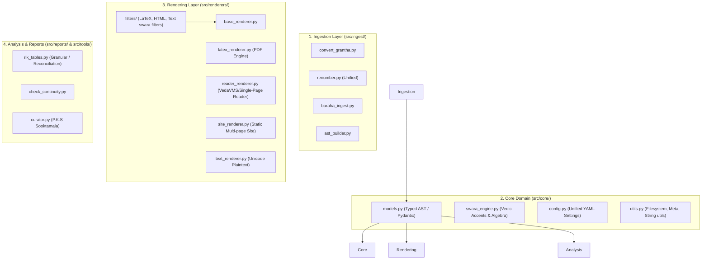

# Jaimineeya Samaveda Pipeline — Comprehensive Refactoring Specification

**Document Version**: 1.0.0  
**Target Scope**: `src/`, `src/tools/`, `templates/`, rendering engines, and data pipeline  
**Historical Context Span**: January 2026 – September 2026  

---

## 1. Executive Summary & Historical Context (Jan–Apr 2026 to Present)

The Jaimineeya Samaveda (JSV) software suite originated in late 2025/early 2026 as a focused toolchain designed to accomplish two core goals:
1. Parse unified Devanagari text files (`Samhita_corrected.txt`) into a clean JSON Abstract Syntax Tree (AST).
2. Render publication-grade XeLaTeX/LuaLaTeX PDFs with precise Vedic accent notation and footnote typography.

### Historical Evolution & Complexity Accumulation
Between **January and April 2026**, foundational capabilities expanded rapidly:
- **January 2026**: Initial JSON generation (`generate_json_for_samhita.py`), footnoting mechanisms, and baseline directory organization (`7f255931 Baseline Version 2.1`).
- **February 2026**: Multi-corpus support (Samhita, Aaranam, Prakruti), dynamic document titles, initial deprecation of ad-hoc scripts into `deprecated/` (`92d49ca7`), Visarga-accent order fixes, and Excel-based reconciliation loops (`apply_excel_corrections.py`, `generate_granular_table.py`).
- **March 2026**: Sooktamala collection curation (`curate_jsv.py`), custom P.K.S (Parva.Kandah.Samam) indexing, multi-line Rik table extraction (`generate_rik_table.py`), and closing mantra integration.
- **April 2026**: Static site generation overhaul (`generate_website.py`), client-side lunr search with multi-field scoring and highlight preservation, Prayoga ritual procedure linking (`--procedures`), and complex renumbering rules (`renumber_sooktam.py`).
- **July–September 2026**: Malayalam script transformation pipeline (`src/malayalam/`), Kodunthirapully (`-kpully`) swara-above layouts, and Baraha DOCX ingestion for external Vedic texts (`tu_baraha.docx`, `baraha_reader.py`, `build_reader.py`).

### The Core Problem: Architectural Sprawl
While each feature successfully met immediate liturgical and publication requirements, complexity accumulated without systematic refactoring:
- **`render_pdf.py` grew to 4,639 lines**, combining LaTeX compilation, Jinja environment bootstrapping, dozens of domain-specific text filters, standalone HTML readers, plain-text export, and embedded Baraha workarounds.
- **Divergent HTML Rendering Engines**: Three independent mechanisms now render HTML—`generate_website.py` (static site in `docs/`), `render_pdf.py` (standalone HTML via Jinja), and `build_reader.py` (interactive VedaVMS reader).
- **Untyped, Polymorphic JSON ASTs**: The AST schema varies across corpora (Samhita vs. Aaranam vs. Collections vs. Baraha `content_lines`), with no schema validation or type guarantees.
- **Scattered Scripts in `src/` and `src/tools/`**: Over 20 standalone scripts exist in `src/`, with unclear boundaries between active tools, reporting scripts, and curation helpers.

---

## 2. Architectural Audit & Systemic Bottlenecks

### 2.1 The Rendering Monolith (`src/render_pdf.py` — 4,639 LOC)
- **Multi-Format Coupling**: LaTeX generation (`CreatePdf`), plain-text generation (`CreateTextFile`), and HTML generation (`CreateHtmlFile`) reside in the same file and share mutable state.
- **Embedded Filter Spaghetti**: More than 25 Jinja filters (`format_mantra_sets`, `replace_accents`, `format_rik_only`, `format_malayalam_combined`, `fix_visarga_accent_order_local`, `split_rik_lines_*`) are defined inside `render_pdf.py`.
- **Special-Case Ingestion Leaks**: Conditional checks like `is_baraha = any('content_lines' in sub ...)` force the renderer to inspect AST internals and switch rendering engines dynamically.
- **Font & Asset Bloat**: Base64 font encoding (`JaimineeyaSwara.ttf`, `AdishilaVedic.ttf`) is hardcoded directly into Python render routines.

### 2.2 AST Schema Fragmentation
- **Structural Inconsistencies**: Some JSON files use `supersections`, others use `supersection`. Some store mantras under `corrected-mantra_sets`, while Baraha files use `content_lines`.
- **Untyped Dictionary Access**: Deeply nested dictionary access (`data['supersections'][ss]['sections'][sec]['subsections'][sub]`) is prone to `KeyError` regressions whenever schemas evolve.
- **Metadata Separation**: Rishi, Devata, Chandas metadata is variously stored as strings, dictionaries, or separate reconciliation tables, requiring ad-hoc parsing across multiple scripts.

### 2.3 Web & HTML Reader Divergence
- **`generate_website.py`**: Generates a multi-page static site (`docs/`) with custom embedded JavaScript, Lunr.js search index, and parchment styling.
- **`render_pdf.py` (HTML Mode)**: Uses Jinja2 templates (`Devanagari_main_html.template`, `Malayalam_main_html.template`) to produce single-page HTML readers.
- **`build_reader.py`**: Generates a modern, responsive VedaVMS reader with interactive Suchi drawer, font switcher, and orientation management.
- **Duplication**: CSS styles, Vedic accent positioning rules, and layout logic are duplicated and frequently drift out of sync across these three targets.

### 2.4 Ingestion & Normalization Fragmentation
- `renumber_sooktam.py` (13.5 KB) and `renumber_sections.py` (3.8 KB) overlap in functionality.
- `generate_json.py` carries legacy parsing branches (`--input-mode initial` vs `--input-mode correction`) alongside Excel reconciliation logic.
- `src/tools/` contains a mix of legacy and active scripts without unified CLI interfaces or standardized logging.

### 2.5 Dataset Proliferation & Loss of Maintainer Traceability
- **File Proliferation**: Over 45 files in `data/input/` and over 80 files in `data/output/` with confusing, overlapping names (`* - Copy*`, `*latest*`, `*corrected*`, `*with_Rishi_Devata_Chandas*`, `*K1_K2*`).
- **Absence of Baselining Manifests**: While git commits occasionally mention "Baseline v2.1" or "Baseline Feb 2026", there is no automated manifest recording the exact input SHA-256 checksums, output versions, domain metrics (total Samas, Riks, Khandas), and git commit hash.
- **Maintainer Amnesia After Project Gaps**: Returning to the codebase after 2–4 months leaves developers unable to immediately determine:
  1. What is the single source of truth for Samhita or Aaranam?
  2. Were the output files in `data/output/` generated from the latest input or are they stale?
  3. What was the exact last point worked on and how to safely extend from it?

---

## 3. Target Architecture & Design Principles

### Key Architectural Principles
1. **Single Responsibility**: Each module performs one well-defined role (ingestion, AST modeling, rendering, or reporting).
2. **Canonical Typed AST**: All downstream processors consume a validated, uniform AST schema backed by Pydantic models or standard Python dataclasses.
3. **Decoupled Renderers**: `render_pdf.py` is decomposed into dedicated renderers (`latex_renderer.py`, `html_renderer.py`, `text_renderer.py`).
4. **Unified Swara Engine**: Vedic accent conversions (`(1)` -> U+0951, Visarga ordering, Kodunthirapully above/below placement, Malayalam mapping) are centralized into `src/core/swara_engine.py`.
5. **Standardized CLI & Configuration**: Every CLI tool adheres to `argparse` conventions with shared defaults loaded from `pipeline_config.yaml`.

---

## 4. Subsystem Decomposition & Refactoring Blueprint

### 4.1 Subsystem A: Core Domain & Canonical AST (`src/core/`)
- **`src/core/models.py`**:
  - `MantraVerse`: Represents a single Vedic verse, its accent notation, and delimiters (`॥ N ॥`).
  - `SubSection`: Contains `sub_id`, header, optional `RikMetadata` (Rishi, Devata, Chandas), `RikText`, and list of `MantraVerse`.
  - `Section`: Represents Kandah / Khanda with title and child subsections.
  - `SuperSection`: Represents Parva / Patha / Major division.
  - `VedicDocument`: Master container with metadata (`title`, `version`, `generated_at`, `corpus_type`).
- **`src/core/swara_engine.py`**:
  - Centralizes all Vedic accent transformation algorithms:
    - Unicode accent injection and normalization.
    - Visarga-accent order correction (`fix_visarga_accent_order`).
    - LaTeX macro generation (`\stackon`, `\stackunder`, `\trikamba`).
    - HTML CSS class generation for stacked accents.
    - Script transliteration bridges (Devanagari <-> Malayalam).

### 4.2 Subsystem B: Modular Rendering Pipeline (`src/renderers/`)
Decompose the 4,639-line `render_pdf.py` into focused, testable components:
- **`src/renderers/latex_renderer.py`**:
  - Pure LuaLaTeX/XeLaTeX generation.
  - Handles geometry, page breaks, Prayoga appendix injection, and color themes.
  - Delegates accent markup to LaTeX filters.
- **`src/renderers/html_renderer.py` (Universal Vedic HTML Viewer Engine)**:
  - Generates standalone responsive HTML readers with decoupled presentation and content layers.
  - **Viewer Shell & Runtime Abstraction**:
    - Abstract the viewer engine (responsive 2-column/drawer layout, Suchi table of contents, orientation change handling with dynamic viewport reset, font switcher, theme modes, smooth anchor navigation, search modal) from the underlying text corpus.
    - Treat Vedic texts as structured inputs (`VedicDocument` AST or JSON stream) with standardized sections, subsections, verses, swara modifiers, and metadata.
    - Provide a single reusable viewer core capable of ingesting:
      1. **JSV Corpora**: Jaimineeya Samhita, Aaranam, Sooktamala collections.
      2. **VedaVMS Corpora**: Taittiriya Upanishad, Aruna Prashnam, Udaka Shanti, Shanti Japam, etc.
    - Eliminates duplicate template code, divergent CSS breakpoints, and redundant orientation bug fixes across repositories.
- **`src/renderers/text_renderer.py`**:
  - Clean plaintext Unicode exports (Combined, Rik-only, Samam-only, Nometa).
- **`src/renderers/filters/`**:
  - `latex_filters.py`: Jinja filters for LaTeX typography.
  - `html_filters.py`: Jinja filters for web typography.
  - `text_filters.py`: Formatting helpers for plaintext.

### 4.3 Subsystem C: Static Website Generator (`src/site/` or `src/renderers/site_renderer.py`)
- Refactor `generate_website.py` to:
  - Ingest the canonical `VedicDocument` AST.
  - Extract embedded CSS/JS into clean external templates or static assets.
  - Maintain exact compatibility with GitHub Pages (`docs/samhita/`, `docs/aaranam/`).

### 4.4 Subsystem D: Unified Ingestion & Tools (`src/ingest/` and `src/tools/`)
- **Unify Renumbering**: Consolidate `renumber_sooktam.py` and `renumber_sections.py` into `src/ingest/renumber.py` with consistent CLI flags and pre-flight structural tag balance checks.
- **Decommission Legacy Baraha Ingestion**: Experimental Baraha DOCX ingestion and reader generation were evaluated from the external `vedavms` project for Devanagari HTML templates and subsequently retired. We purge `baraha_reader.py`, `transliterate.py`, `build_reader.py`, and eliminate all Baraha/Taittiriya conditional branches from `render_pdf.py`. The JSV pipeline strictly focuses on pure Jaimineeya canonical texts.
- **Curate `src/tools/`**:
  - Keep active, high-value tools: `check_continuity.py`, `convert_docx.py`, `copy_rik_ids.py`.
  - Provide unified CLI help and exit codes.

### 4.5 Subsystem E: Dataset Lifecycle, Naming Conventions, Baselining & Maintainer Traceability
To eliminate confusion after gaps of several months, this subsystem introduces strict conventions and automated traceability:

1. **Canonical Directory & Naming Structure**:
   - Master inputs are clearly designated:
     - `data/input/Samhita_master.txt` (active canonical text, mapped to `Samhita_corrected.txt`)
     - `data/input/Aaranam_master.txt` (active canonical text, mapped to `Aaranam_latest.txt`)
   - Non-canonical, duplicate, and temporary scratch files (`* - Copy*`, `broken_test.txt`, `*.pdf`) are relocated to `data/input/archive/`.
   - Generated outputs are organized into structured directories:
     - `data/output/json/` for canonical ASTs (`Samhita.json`, `Aaranam.json`, `Sooktamala.json`).
     - `data/output/tables/` for generated CSV/XLSX tables.
     - `data/output/reports/` for continuity, reconciliation, and structure summaries.

2. **Automated Baseline Manifest Engine (`src/tools/baseline.py`)**:
   - Provides deterministic baselining commands:
     - `python src/tools/baseline.py create <tag>`: Computes SHA-256 hashes for all master input/output files, captures domain metrics (1226 Samas, Riks, Khandas), Git commit hash, branch, and version from `src/VERSION`. Writes manifest to `data/baselines/manifest_<timestamp>_<tag>.json` and updates `data/baselines/LATEST.json` and `data/baselines/README.md`.
     - `python src/tools/baseline.py list`: Lists all historical baselines with dates, versions, and metrics.
     - `python src/tools/baseline.py verify`: Checks whether current files match the active baseline hashes.

3. **Maintainer Status & "Where We Left Off" Tool (`src/tools/check_status.py`)**:
   - Running `python src/tools/check_status.py` immediately outputs:
     - Current git branch (`refactor`), commit, and project version.
     - Last baseline name, date, and metrics.
     - File staleness check: Are outputs older than inputs or modified?
     - Immediate next steps / pipeline commands to execute.

4. **Dedicated Git Branching Workflow**:
   - All refactoring and restructuring work takes place on the isolated `refactor` branch.
   - Master/stable branches (`format-mantras`, `main`) remain protected until full regression verification is completed.

5. **3-Tier Versioning Architecture**:
   - **Tier 1 (Engine Version)**: Automatically derived via `git describe --tags --always --dirty` (e.g. `v4.0.0+6dec1989`). Eliminates manual editing of version files for software changes.
   - **Tier 2 (Corpus Editions)**: Independent version strings per corpus defined in `pipeline_config.yaml` (`samhita: 3.28`, `aaranam: 1.14`, `sooktamala: 2.05`). Editing Aaranam does not falsely increment Samhita.
   - **Tier 3 (Content Fingerprint)**: Cryptographic SHA-256 hash of the input file embedded in output metadata, enabling immediate staleness detection.

---

## 5. Phase-by-Phase Migration Roadmap

| Phase | Focus Area | Deliverables | Risk Level |
|---|---|---|---|
| **Phase 1** | **Core Domain & Swara Engine** | Create `src/core/models.py`, `src/core/swara_engine.py`, unit tests | Low (Additive) |
| **Phase 2** | **Filter & Render Separation** | Extract Jinja filters into `src/renderers/filters/`; decompose `render_pdf.py` | Medium |
| **Phase 3** | **Baraha Purge & Decoupling** | Purge legacy Baraha scripts (`baraha_reader.py`, `transliterate.py`); strip Baraha branches from renderer | Low |
| **Phase 4** | **Universal HTML Viewer Abstraction & Site Harmonization** | Abstract common HTML viewer (shell, responsive CSS, orientation/viewport runtime) to consume JSV and VedaVMS content as input; harmonize with static site | Low |
| **Phase 5** | **Baselining, Traceability & Tools** | Implement `src/tools/baseline.py`, `src/tools/check_status.py`, archive cleanup | Low |
| **Phase 6** | **3-Tier Versioning Engine** | Create `src/core/version.py`, git metadata injection, deprecate blind counter | Low |

---

## 6. Verification & Regression Protection Matrix

To ensure that refactoring does not alter liturgical accents, layout formatting, or metadata indexing:
1. **JSON AST Golden Test**: Diff JSON outputs (`Samhita_corrected_out.json`, `Aaranam_latest_out.json`) against current baseline before and after AST changes.
2. **Text Export Diff**: Verify character-for-character equality on generated plaintext files (`data/output/txt/...`).
3. **LaTeX Output Hash**: Compare generated `.tex` files byte-for-byte on identical inputs.
4. **HTML Search & Navigation Verification**: Verify that P.K.S jump navigation, Suchi sync, and Lunr search queries return identical matches.
5. **Baseline Integrity Check**: `python src/tools/baseline.py status` passes with 0 checksum mismatches.
6. **Automated Versioning Check**: `get_engine_version()` accurately tracks git commits and dirty working state without unintended file modifications.

