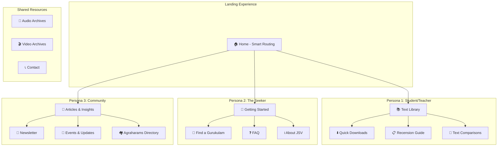

# Jaimineeya Sama Vedam Website Implementation Plan

## Overview
A WordPress-based website on Hostinger Single Plan for preserving and sharing Jaimineeya Sama Veda artifacts, designed around **three distinct visitor personas** to maximize engagement and utility.

**Domain**: jaimineeyasamavedam.org (Registrar: GoDaddy)  
**Hosting**: Hostinger Single Plan  
**CMS**: WordPress

---

## Release 1 Scope (MVP)

> [!NOTE]
> This section defines what will be included in the **first release** vs. future enhancements.

### ✅ Included in Release 1

| Feature | Scope |
|---------|-------|
| **Gurukulam Finder** | JSV gurukulams only (not all Sama Veda) |
| **Newsletter** | Placeholder page only - "Coming Soon" |
| **Recension Guide** | JSV Padhathis comparison only |
| **Text Library** | PDFs in Devanagari, Grantha, Malayalam |
| **Audio Archives** | Basic audio player with downloads |
| **Video Archives** | YouTube embeds |
| **Contact Page** | Contact form |

### 🔮 Future Releases

| Feature | Target Release |
|---------|---------------|
| All Sama Veda gurukulams in finder | Release 2 |
| Active newsletter with MailPoet | Release 2 |
| Kauthuma/Ranayaniya comparison | Release 2 |
| Interactive text comparison tool | Release 2 |
| Front-end content submission forms | Release 2 |

---


## Visitor Personas


### Persona 1: 📚 The Student/Teacher
**Who**: Students and teachers from pathshalas looking for specific texts  
**How they arrive**: Direct link from class, word of mouth  
**Primary need**: Download books quickly, understand recensions

### Persona 2: 🔍 The Seeker  
**Who**: Curious visitors discovering via Google, Twitter, WhatsApp  
**How they arrive**: Search queries like "learn Sama Veda", social shares  
**Primary need**: Where to learn, find local community, getting started

### Persona 3: 👥 The Community Member
**Who**: Regular practitioners, scholars, community members  
**How they arrive**: Bookmarked, newsletter links, regular visits  
**Primary need**: Fresh content, articles, community updates

---

## Persona-Based Site Architecture



---

## Pages by Persona

### 📚 Persona 1: Student/Teacher Pages

#### Page: Text Library (`/texts/`)
**Purpose**: Central hub for all downloadable texts

| Feature | Description |
|---------|-------------|
| **Search Bar** | Search by mantra number, keyword, or recension |
| **Filter Sidebar** | Filter by: Samhita/Brahmana/Aranyaka, Script (Devanagari/Grantha/Malayalam) |
| **Quick Download** | One-click PDF download buttons |
| **Preview** | Inline text preview before download |

#### Page: Padhathi Guide (`/texts/padhathis/`) - Release 1
**Purpose**: Explain differences between JSV padhathis (spreading knowledge beyond PDFs)

| Section | Content |
|---------|---------|
| Overview | What are padhathis and why they matter |
| Comparison Table | Side-by-side differences between JSV padhathis |
| Visual Diagrams | Family tree of JSV traditions |
| Detailed Articles | Deep dives into specific padhathi differences |

> [!NOTE]
> **Release 2**: Will expand to include Kauthuma & Ranayaniya comparisons

#### Page: Text Comparison Tool (`/texts/compare/`)
**Purpose**: Interactive comparison of recension variants

```
┌─────────────────────────────────────────────────────────┐
│ Compare Recensions                                      │
├─────────────────────────────────────────────────────────┤
│ Select Mantra: [Dropdown or Search]                     │
│                                                         │
│ ┌─────────────────┐  ┌─────────────────┐               │
│ │ Jaiminiya       │  │ Kauthuma        │               │
│ │ [Mantra text]   │  │ [Mantra text]   │               │
│ │                 │  │                 │               │
│ │ Differences     │  │ highlighted     │               │
│ └─────────────────┘  └─────────────────┘               │
│                                                         │
│ [Highlight Differences] [Download Comparison PDF]       │
└─────────────────────────────────────────────────────────┘
```

---

### 🔍 Persona 2: The Seeker Pages

#### Page: Getting Started (`/learn/`)
**Purpose**: Clear pathway for newcomers

| Section | Content |
|---------|---------|
| **What is Jaimineeya Sama Veda?** | 2-minute intro with video |
| **Why Learn?** | Significance and benefits |
| **Learning Paths** | Traditional vs. online options |
| **First Steps** | Recommended starting resources |
| **Prerequisites** | What background helps |

#### Page: Find a Gurukulam (`/learn/find-gurukulam/`)
**Purpose**: Connect seekers with learning centers

| Feature | Description |
|---------|-------------|
| **Interactive Map** | Google Maps integration showing all pathshalas |
| **Location Search** | "Find near me" functionality |
| **Directory List** | Filterable list by state/city |
| **Contact Info** | Direct contact for each gurukulam |
| **Programs Offered** | What each center teaches |

```
┌─────────────────────────────────────────────────────────┐
│ Find a Gurukulam Near You                               │
├─────────────────────────────────────────────────────────┤
│ [Search by City/State] or [Use My Location 📍]         │
│                                                         │
│ ┌─────────────────────────────────────────────────────┐ │
│ │                   [Interactive Map]                 │ │
│ │        📍 Chennai    📍 Kumbakonam                  │ │
│ │    📍 Thrissur           📍 Mysore                  │ │
│ └─────────────────────────────────────────────────────┘ │
│                                                         │
│ Results:                                                │
│ ├── 🏫 XYZ Veda Pathashala, Chennai                    │
│ │   Programs: Full-time, Weekend | Contact: xxx        │
│ ├── 🏫 ABC Gurukulam, Kumbakonam                       │
│ │   Programs: Residential | Contact: xxx               │
└─────────────────────────────────────────────────────────┘
```

#### Page: FAQ (`/faq/`)
**Purpose**: Answer common seeker questions

| Question Category | Examples |
|-------------------|----------|
| **Learning** | How long to learn? Can adults learn? |
| **Practice** | How to practice at home? Online resources? |
| **Community** | How to connect with other learners? |
| **Tradition** | What is the difference between recensions? |

---

### 👥 Persona 3: Community Pages

#### Page: Articles & Insights (`/articles/`)
**Purpose**: Fresh content for regular visitors

| Content Type | Frequency |
|--------------|-----------|
| **Explanatory Articles** | Monthly - Deep dives on specific topics |
| **Scholar Interviews** | Quarterly - Conversations with experts |
| **Historical Pieces** | Occasional - History of JSV tradition |
| **Practice Tips** | Monthly - For practitioners |

#### Page: Newsletter (`/newsletter/`)
**Purpose**: Email subscription for community updates

| Feature | Description |
|---------|-------------|
| **Sign-up Form** | Name, Email, Interests |
| **Archive** | Past newsletters readable online |
| **Frequency Options** | Weekly digest vs. monthly summary |

#### Page: Events & Updates (`/community/updates/`)
**Purpose**: What's happening in JSV gurukulams

| Content | Source |
|---------|--------|
| **Daily Schedule** | What's being taught this week |
| **Upcoming Events** | Upakarma, special poojas, etc. |
| **Photo Gallery** | Recent activities |
| **Video Updates** | Short clips from gurukulams |

#### Page: Agraharams Directory (`/community/agraharams/`)
**Purpose**: Comprehensive directory of JSV communities

| Information | Details |
|-------------|---------|
| **Agraharam Name** | Traditional and modern names |
| **Location** | Full address with map |
| **Padhathi** | Which padhathi is followed |
| **Key Contacts** | Community leaders, priests |
| **History** | Brief history of the agraharam |
| **Current Activities** | Active learning, events |

---

## Homepage: Smart Routing

The homepage should quickly direct each persona to relevant content:

```
┌─────────────────────────────────────────────────────────────────┐
│                    जैमिनीय सामवेद                               │
│              Jaimineeya Sama Vedam                              │
├─────────────────────────────────────────────────────────────────┤
│                                                                 │
│  ┌─────────────────┐ ┌─────────────────┐ ┌─────────────────┐   │
│  │ 📚 DOWNLOAD     │ │ 🔍 LEARN        │ │ 👥 COMMUNITY    │   │
│  │ TEXTS           │ │ SAMA VEDA       │ │ UPDATES         │   │
│  │                 │ │                 │ │                 │   │
│  │ Quick access to │ │ New here?       │ │ Articles, news  │   │
│  │ books & PDFs    │ │ Start your      │ │ & events        │   │
│  │                 │ │ journey         │ │                 │   │
│  │ [Browse Texts]  │ │ [Get Started]   │ │ [Read More]     │   │
│  └─────────────────┘ └─────────────────┘ └─────────────────┘   │
│                                                                 │
├─────────────────────────────────────────────────────────────────┤
│  📰 Latest Updates                        🎵 Featured Audio    │
│  • New article: Understanding Gana...     • Purvarchika Day 1  │
│  • Event: Upakarma 2025 schedule          • Uttararchika...    │
└─────────────────────────────────────────────────────────────────┘
```

---

## Updated Plugin Recommendations

| Plugin | Purpose | Persona |
|--------|---------|---------|
| **SearchWP** | Enhanced search for texts | 📚 Student |
| **Download Monitor** | Track PDF downloads with analytics | 📚 Student |
| **TablePress** | Recension comparison tables | 📚 Student |
| **WP Google Maps** | Interactive gurukulam finder | 🔍 Seeker |
| **Ultimate FAQ** | Structured FAQ page | 🔍 Seeker |
| **MailPoet** | Newsletter management | 👥 Community |
| **The Events Calendar** | Community events | 👥 Community |
| **Business Directory Plugin** | Agraharams directory | 👥 Community |

---

## Content Strategy by Persona

| Persona | Content Priority | Update Frequency |
|---------|------------------|------------------|
| 📚 Student/Teacher | Texts, Downloads, Recensions | As available |
| 🔍 Seeker | Getting Started, FAQ, Gurukulam Directory | Quarterly review |
| 👥 Community | Articles, Newsletter, Events | Weekly/Monthly |

---

## SEO Strategy by Persona

| Persona | Target Keywords |
|---------|-----------------|
| 📚 Student | "sama veda pdf download", "jaiminiya samhita", "sama veda devanagari" |
| 🔍 Seeker | "learn sama veda", "sama veda classes near me", "how to learn vedas" |
| 👥 Community | "sama veda tradition", "jaiminiya sama veda agraharam", "veda gurukulam news" |

---

## Design Mockup


---

## Technical Setup (Unchanged)

### Phase 1: Domain Configuration (GoDaddy → Hostinger)
1. Get Hostinger nameservers from hPanel
2. Update nameservers in GoDaddy (24-48 hours propagation)

### Phase 2: WordPress Installation
1. Use Hostinger Auto-Installer
2. Configure admin credentials

### Phase 3: Theme & Plugin Setup
1. Install Flavor flavor theme (or Flavor flavor flavor)
2. Install persona-specific plugins
3. Configure Google Analytics via Site Kit

---

## Verification Plan

| Test | Verification |
|------|--------------|
| Student flow | Search → Find text → Download PDF in <3 clicks |
| Seeker flow | Homepage → Getting Started → Find Gurukulam works |
| Community flow | Newsletter signup works, articles render properly |
| Mobile | All 3 flows work on mobile |

---

## Decisions Confirmed ✅

| Decision | Choice |
|----------|--------|
| Platform | Hostinger + WordPress |
| Gurukulam Finder | JSV gurukulams only (Release 1) |
| Newsletter | Placeholder page for Release 1 |
| Recension/Padhathi Guide | JSV padhathis only (Release 1) |

---

## Next Steps

1. Create detailed wireframes for each persona's key pages
2. Document WordPress setup with specific plugin configurations
3. Create content templates for articles and newsletters
4. Design front-end submission forms for community contributors
